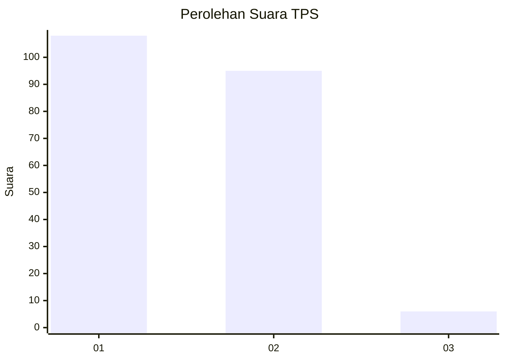
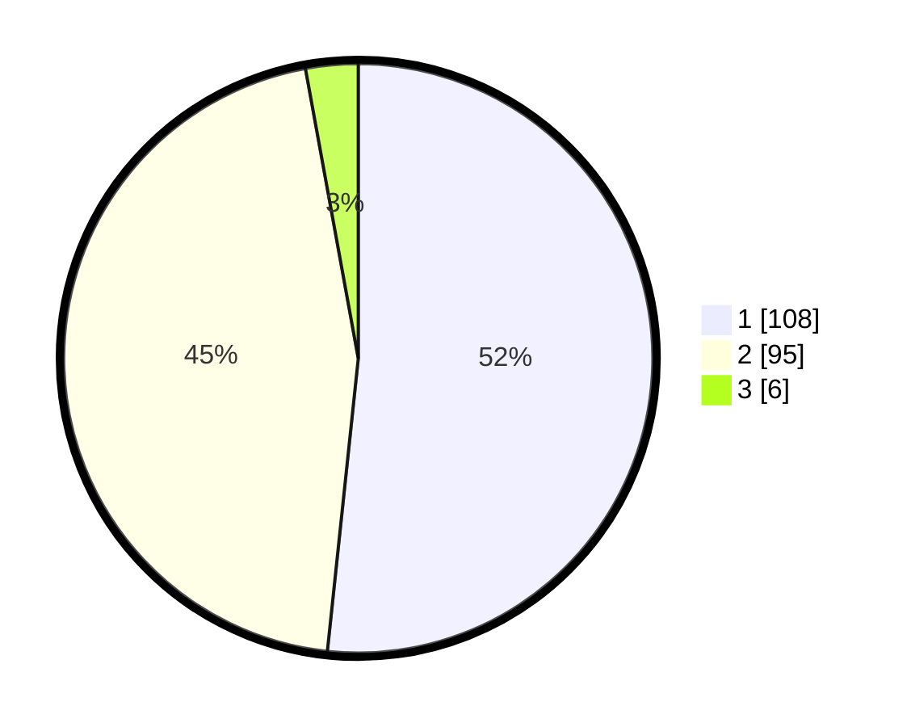

# Hasil

## Grafik

## Tabel

| No. | Nama Paslon    | Suara | Suara (raw) | Persentase |
|:--- |:-------------- | -----:| -----------:| ----------:|
| 1   | ANIES MUHAIMIN | 108   | [108][p-1]  | 51,67      |
| 2   | PRABOWO GIBRAN | 95    | [95][p-2]   | 45,45      |
| 3   | GANJAR MAHFUD  | 6     | [6][p-3]    | 2,87       |

[p-1]: https://github.com/gigit-pemilu/pemilu-2024-11-aceh/blob/main/pilpres/hitung-suara/sub/11-aceh/sub/74-kota-langsa/sub/04-langsa-lama/sub/2010-seulalah-baru/sub/005-tps/sub/paslon-1.txt
[p-2]: https://github.com/gigit-pemilu/pemilu-2024-11-aceh/blob/main/pilpres/hitung-suara/sub/11-aceh/sub/74-kota-langsa/sub/04-langsa-lama/sub/2010-seulalah-baru/sub/005-tps/sub/paslon-2.txt
[p-3]: https://github.com/gigit-pemilu/pemilu-2024-11-aceh/blob/main/pilpres/hitung-suara/sub/11-aceh/sub/74-kota-langsa/sub/04-langsa-lama/sub/2010-seulalah-baru/sub/005-tps/sub/paslon-3.txt

## Foto C Plano

https://sirekap-obj-formc.kpu.go.id/1aff/pemilu/ppwp/11/74/04/20/10/1174042010005-20240220-125752--296f306f-9e1e-401f-93c3-896f230da749.jpg

https://sirekap-obj-formc.kpu.go.id/1aff/pemilu/ppwp/11/74/04/20/10/1174042010005-20240220-130146--74c3c66b-029c-40a6-8fb6-1d654182e09b.jpg

https://sirekap-obj-formc.kpu.go.id/1aff/pemilu/ppwp/11/74/04/20/10/1174042010005-20240220-130245--fa08f22c-b93b-4a6d-a953-4d4b98c6214f.jpg

## Metadata

| Key        | Value               |
| ---------- | ------------------- |
| Time Stamp | 2024-02-20 17:00:00 |

## DATA PEMILIH TETAP

Jumlah pemilih dalam DPT: **402**.
 * L: **771**.
 * P: **251**.

## DATA PENGGUNA HAK PILIH

Jumlah pengguna hak pilih dalam DPT: **213**.
 * L: **96**.
 * P: **115**.

Jumlah pengguna hak pilih dalam DPTb: **6**.
 * L: **200**.
 * P: **0**.

Jumlah pengguna hak pilih dalam DPK: **244**.
 * L: **0**.
 * P: **2**.

Jumlah pengguna hak pilih: **461**.
 * L: **309**.
 * P: **611**.

## JUMLAH SUARA SAH DAN TIDAK SAH

JUMLAH SELURUH SUARA SAH: **209**.

JUMLAH SUARA TIDAK SAH: **4**.

JUMLAH SELURUH SUARA SAH DAN SUARA TIDAK SAH: **213**.

