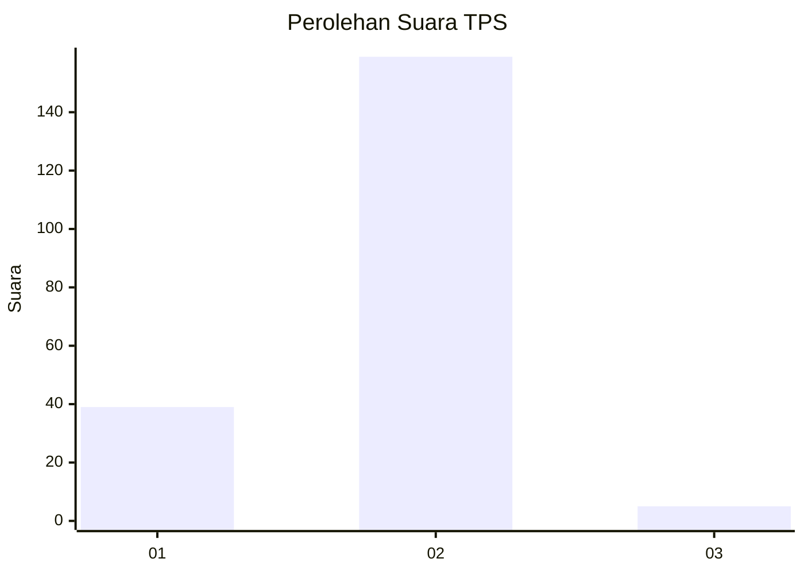
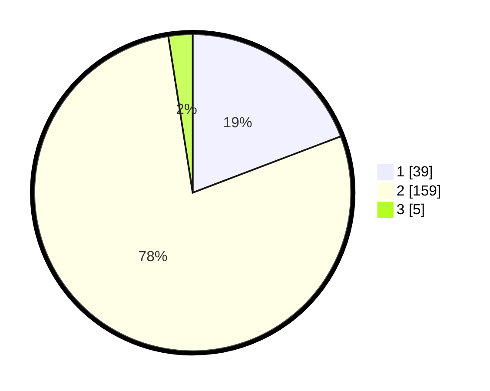

# Hasil

## Grafik

## Tabel

| No. | Nama Paslon    | Suara | Suara (raw) | Persentase |
|:--- |:-------------- | -----:| -----------:| ----------:|
| 1   | ANIES MUHAIMIN | 39    | [39][p-1]   | 19,21      |
| 2   | PRABOWO GIBRAN | 159   | [159][p-2]  | 78,33      |
| 3   | GANJAR MAHFUD  | 5     | [5][p-3]    | 2,46       |

[p-1]: https://github.com/gigit-pemilu/pemilu-2024-11-aceh/blob/main/pilpres/hitung-suara/sub/11-aceh/sub/74-kota-langsa/sub/04-langsa-lama/sub/2011-sukajadi-kebun-ireng/sub/001-tps/sub/paslon-1.txt
[p-2]: https://github.com/gigit-pemilu/pemilu-2024-11-aceh/blob/main/pilpres/hitung-suara/sub/11-aceh/sub/74-kota-langsa/sub/04-langsa-lama/sub/2011-sukajadi-kebun-ireng/sub/001-tps/sub/paslon-2.txt
[p-3]: https://github.com/gigit-pemilu/pemilu-2024-11-aceh/blob/main/pilpres/hitung-suara/sub/11-aceh/sub/74-kota-langsa/sub/04-langsa-lama/sub/2011-sukajadi-kebun-ireng/sub/001-tps/sub/paslon-3.txt

## Foto C Plano

https://sirekap-obj-formc.kpu.go.id/cf97/pemilu/ppwp/11/74/04/20/11/1174042011001-20240215-015929--8c14374c-34a7-4c66-9d7b-1277c131ae0b.jpg

https://sirekap-obj-formc.kpu.go.id/cf97/pemilu/ppwp/11/74/04/20/11/1174042011001-20240215-020132--ccf0d9b7-a7ba-44ff-a979-87d47efedc79.jpg

https://sirekap-obj-formc.kpu.go.id/cf97/pemilu/ppwp/11/74/04/20/11/1174042011001-20240215-020231--edf1944f-2e8d-41c9-8787-c3e27aaf1ce2.jpg

## Metadata

| Key        | Value               |
| ---------- | ------------------- |
| Time Stamp | 2024-02-20 17:00:00 |

