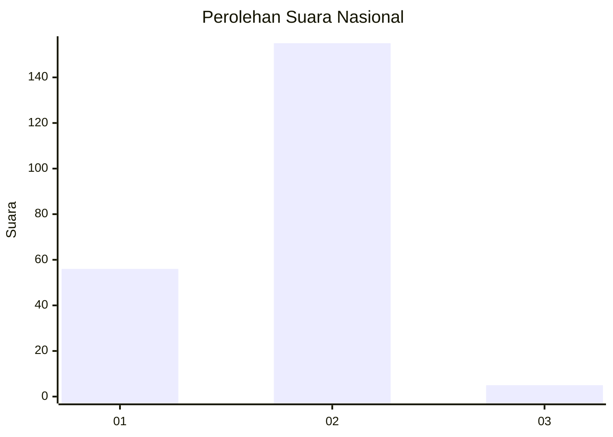
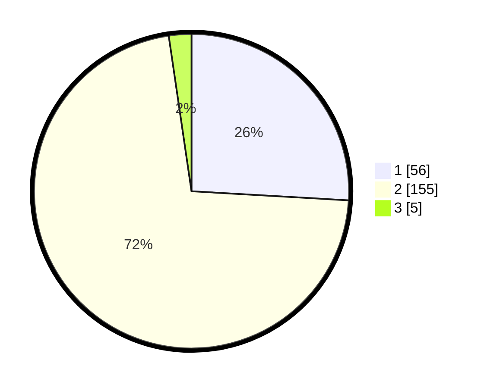

# Hasil

## Grafik

## Tabel

| No. | Nama Paslon    | Suara | Suara (raw) | Persentase |
|:--- |:-------------- | -----:| -----------:| ----------:|
| 1   | ANIES MUHAIMIN | 56    | [56][p-1]   | 25,93      |
| 2   | PRABOWO GIBRAN | 155   | [155][p-2]  | 71,76      |
| 3   | GANJAR MAHFUD  | 5     | [5][p-3]    | 2,31       |

[p-1]: https://github.com/gigit-pemilu/pemilu-2024/blob/main/pilpres/hitung-suara/sub/11-aceh/sub/74-kota-langsa/sub/04-langsa-lama/sub/2011-sukajadi-kebun-ireng/sub/002-tps/sub/paslon-1.txt
[p-2]: https://github.com/gigit-pemilu/pemilu-2024/blob/main/pilpres/hitung-suara/sub/11-aceh/sub/74-kota-langsa/sub/04-langsa-lama/sub/2011-sukajadi-kebun-ireng/sub/002-tps/sub/paslon-2.txt
[p-3]: https://github.com/gigit-pemilu/pemilu-2024/blob/main/pilpres/hitung-suara/sub/11-aceh/sub/74-kota-langsa/sub/04-langsa-lama/sub/2011-sukajadi-kebun-ireng/sub/002-tps/sub/paslon-3.txt

## Foto C Plano

https://sirekap-obj-formc.kpu.go.id/6413/pemilu/ppwp/11/74/04/20/11/1174042011002-20240215-031500--3c2a5887-2add-4bd6-a7f8-200af775f7cc.jpg

https://sirekap-obj-formc.kpu.go.id/6413/pemilu/ppwp/11/74/04/20/11/1174042011002-20240215-031633--bb401081-8743-4410-9535-fd42160da792.jpg

https://sirekap-obj-formc.kpu.go.id/6413/pemilu/ppwp/11/74/04/20/11/1174042011002-20240215-031823--e1aa48de-61d4-4fb0-b988-a00914dd4d53.jpg

## Metadata

| Key        | Value               |
| ---------- | ------------------- |
| Time Stamp | 2024-02-19 19:00:00 |

