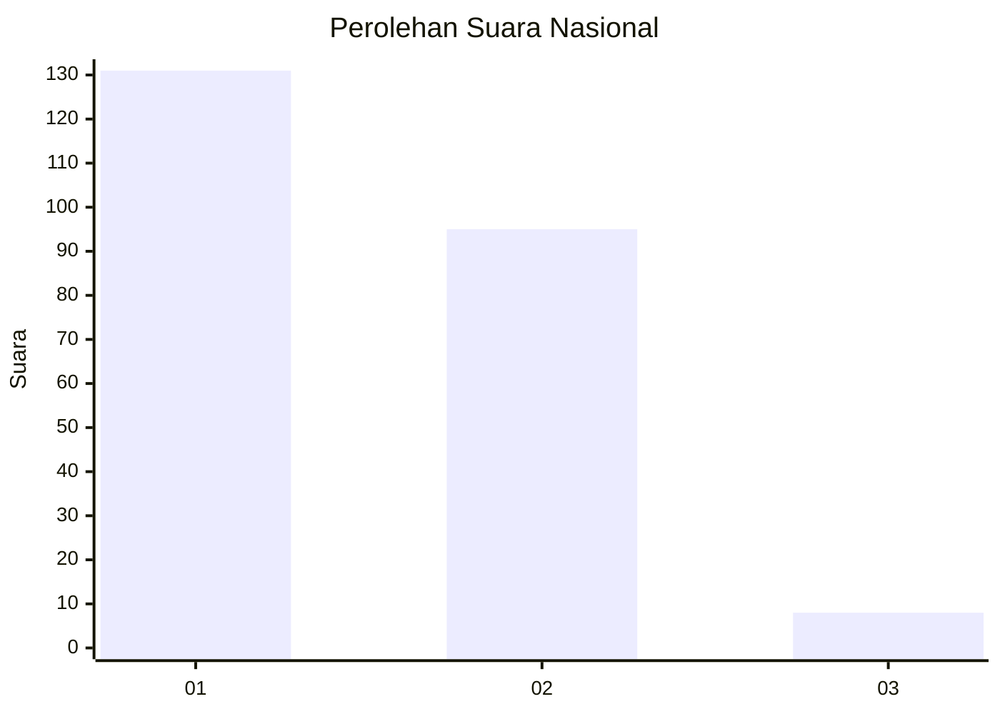
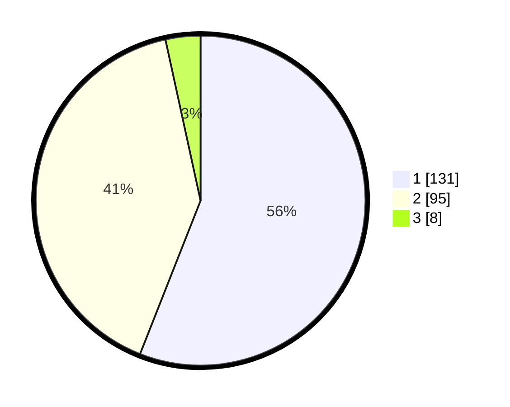

# Hasil

## Grafik

## Tabel

| No. | Nama Paslon    | Suara | Suara (raw) | Persentase |
|:--- |:-------------- | -----:| -----------:| ----------:|
| 1   | ANIES MUHAIMIN | 131   | [131][p-1]  | 55,98      |
| 2   | PRABOWO GIBRAN | 95    | [95][p-2]   | 40,60      |
| 3   | GANJAR MAHFUD  | 8     | [8][p-3]    | 3,42       |

[p-1]: https://github.com/gigit-pemilu/pemilu-2024/blob/main/pilpres/hitung-suara/sub/11-aceh/sub/74-kota-langsa/sub/04-langsa-lama/sub/2013-meurandeh-dayah/sub/001-tps/sub/paslon-1.txt
[p-2]: https://github.com/gigit-pemilu/pemilu-2024/blob/main/pilpres/hitung-suara/sub/11-aceh/sub/74-kota-langsa/sub/04-langsa-lama/sub/2013-meurandeh-dayah/sub/001-tps/sub/paslon-2.txt
[p-3]: https://github.com/gigit-pemilu/pemilu-2024/blob/main/pilpres/hitung-suara/sub/11-aceh/sub/74-kota-langsa/sub/04-langsa-lama/sub/2013-meurandeh-dayah/sub/001-tps/sub/paslon-3.txt

## Foto C Plano

https://sirekap-obj-formc.kpu.go.id/f55a/pemilu/ppwp/11/74/04/20/13/1174042013001-20240214-193925--f3d8ac0f-0154-41df-83b2-aa0eaa007c11.jpg

https://sirekap-obj-formc.kpu.go.id/f55a/pemilu/ppwp/11/74/04/20/13/1174042013001-20240214-193701--4d894066-e1f7-4fb0-9132-77c3c3c78c39.jpg

https://sirekap-obj-formc.kpu.go.id/f55a/pemilu/ppwp/11/74/04/20/13/1174042013001-20240214-193945--4cdd2a5c-80c4-43a0-921d-7e9d7e0f4d96.jpg

## Metadata

| Key        | Value               |
| ---------- | ------------------- |
| Time Stamp | 2024-02-20 17:00:00 |

