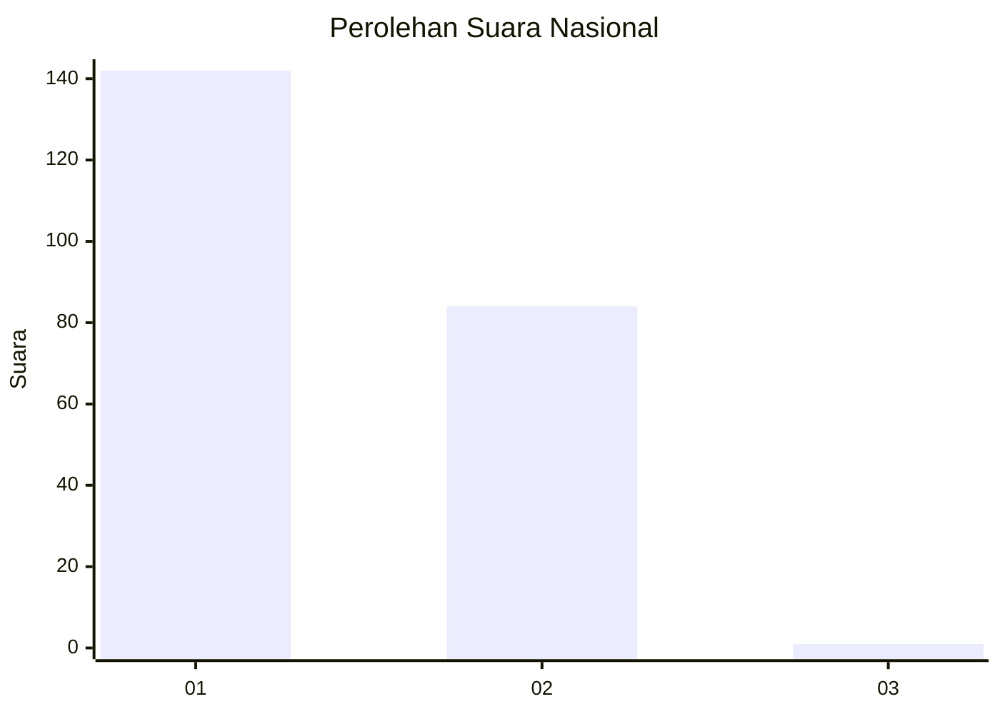
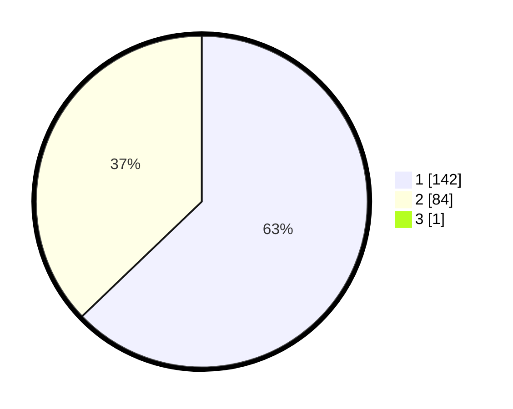

# Hasil

## Grafik

## Tabel

| No. | Nama Paslon    | Suara | Suara (raw) | Persentase |
|:--- |:-------------- | -----:| -----------:| ----------:|
| 1   | ANIES MUHAIMIN | 142   | [142][p-1]  | 62,56      |
| 2   | PRABOWO GIBRAN | 84    | [84][p-2]   | 37,00      |
| 3   | GANJAR MAHFUD  | 1     | [1][p-3]    | 0,44       |

[p-1]: https://github.com/gigit-pemilu/pemilu-2024/blob/main/pilpres/hitung-suara/sub/11-aceh/sub/74-kota-langsa/sub/04-langsa-lama/sub/2013-meurandeh-dayah/sub/002-tps/sub/paslon-1.txt
[p-2]: https://github.com/gigit-pemilu/pemilu-2024/blob/main/pilpres/hitung-suara/sub/11-aceh/sub/74-kota-langsa/sub/04-langsa-lama/sub/2013-meurandeh-dayah/sub/002-tps/sub/paslon-2.txt
[p-3]: https://github.com/gigit-pemilu/pemilu-2024/blob/main/pilpres/hitung-suara/sub/11-aceh/sub/74-kota-langsa/sub/04-langsa-lama/sub/2013-meurandeh-dayah/sub/002-tps/sub/paslon-3.txt

## Foto C Plano

https://sirekap-obj-formc.kpu.go.id/0ddb/pemilu/ppwp/11/74/04/20/13/1174042013002-20240218-170842--a7a1ba05-a90b-49e7-9677-4aabf2013e55.jpg

https://sirekap-obj-formc.kpu.go.id/0ddb/pemilu/ppwp/11/74/04/20/13/1174042013002-20240218-170932--743bbd2d-20e1-4a38-8cf5-9b7c0bdb36c5.jpg

https://sirekap-obj-formc.kpu.go.id/0ddb/pemilu/ppwp/11/74/04/20/13/1174042013002-20240218-171213--28f5868d-a55a-491f-bf1d-9d0d8069fcaf.jpg

## Metadata

| Key        | Value               |
| ---------- | ------------------- |
| Time Stamp | 2024-02-19 15:00:00 |

## DATA PEMILIH TETAP

Jumlah pemilih dalam DPT: **330**.
 * L: **745**.
 * P: **425**.

## DATA PENGGUNA HAK PILIH

Jumlah pengguna hak pilih dalam DPT: **222**.
 * L: **120**.
 * P: **622**.

Jumlah pengguna hak pilih dalam DPTb: **202**.
 * L: **300**.
 * P: **892**.

Jumlah pengguna hak pilih dalam DPK: **22**.
 * L: **808**.
 * P: **652**.

Jumlah pengguna hak pilih: **22**.
 * L: **233**.
 * P: **762**.

## JUMLAH SUARA SAH DAN TIDAK SAH

JUMLAH SELURUH SUARA SAH: **227**.

JUMLAH SUARA TIDAK SAH: **8**.

JUMLAH SELURUH SUARA SAH DAN SUARA TIDAK SAH: **235**.

