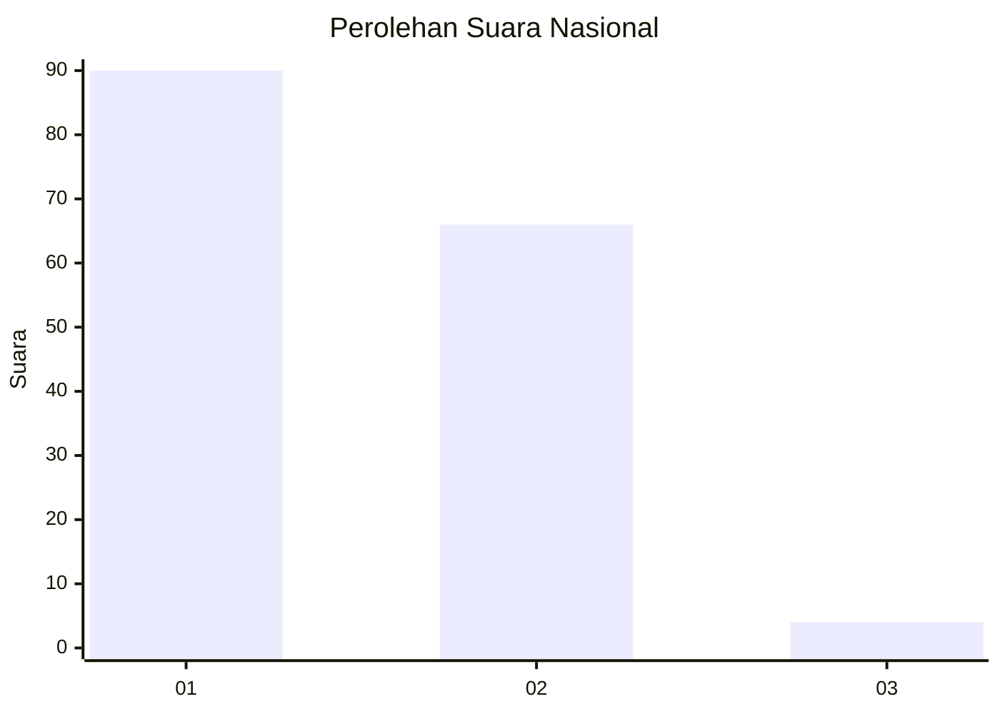
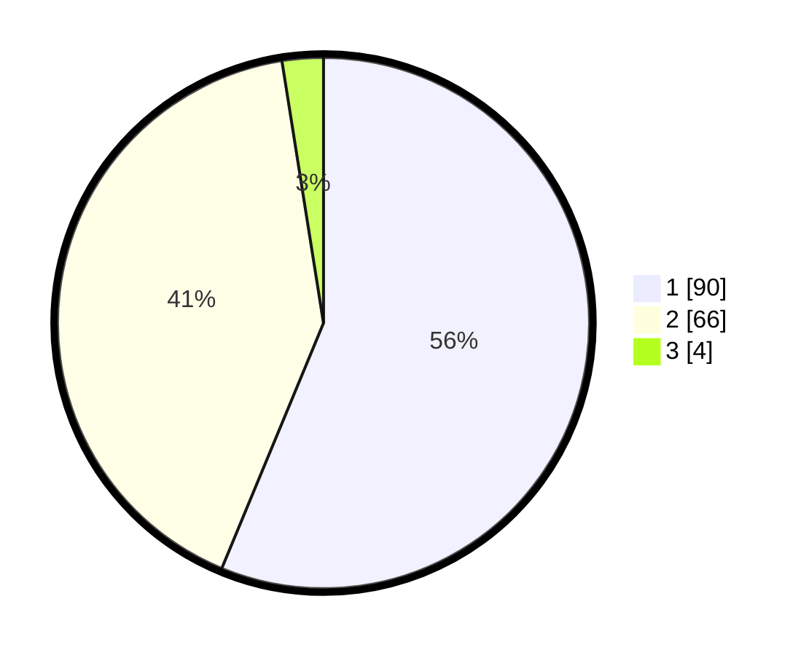

# Hasil

## Grafik

## Tabel

| No. | Nama Paslon    | Suara | Suara (raw) | Persentase |
|:--- |:-------------- | -----:| -----------:| ----------:|
| 1   | ANIES MUHAIMIN | 90    | [90][p-1]   | 56,25      |
| 2   | PRABOWO GIBRAN | 66    | [66][p-2]   | 41,25      |
| 3   | GANJAR MAHFUD  | 4     | [4][p-3]    | 2,50       |

[p-1]: https://github.com/gigit-pemilu/pemilu-2024/blob/main/pilpres/hitung-suara/sub/11-aceh/sub/74-kota-langsa/sub/04-langsa-lama/sub/2013-meurandeh-dayah/sub/004-tps/sub/paslon-1.txt
[p-2]: https://github.com/gigit-pemilu/pemilu-2024/blob/main/pilpres/hitung-suara/sub/11-aceh/sub/74-kota-langsa/sub/04-langsa-lama/sub/2013-meurandeh-dayah/sub/004-tps/sub/paslon-2.txt
[p-3]: https://github.com/gigit-pemilu/pemilu-2024/blob/main/pilpres/hitung-suara/sub/11-aceh/sub/74-kota-langsa/sub/04-langsa-lama/sub/2013-meurandeh-dayah/sub/004-tps/sub/paslon-3.txt

## Foto C Plano

https://sirekap-obj-formc.kpu.go.id/deb8/pemilu/ppwp/11/74/04/20/13/1174042013004-20240215-000422--3088983a-8d09-477b-9124-526ea9ae57ed.jpg

https://sirekap-obj-formc.kpu.go.id/deb8/pemilu/ppwp/11/74/04/20/13/1174042013004-20240214-155729--6a21c0e9-d91b-44a8-9099-44f29a2e8fb0.jpg

https://sirekap-obj-formc.kpu.go.id/deb8/pemilu/ppwp/11/74/04/20/13/1174042013004-20240214-155824--e1ff33cc-6775-4c35-b024-a612cebd9e24.jpg

## Metadata

| Key        | Value               |
| ---------- | ------------------- |
| Time Stamp | 2024-02-15 04:00:24 |

