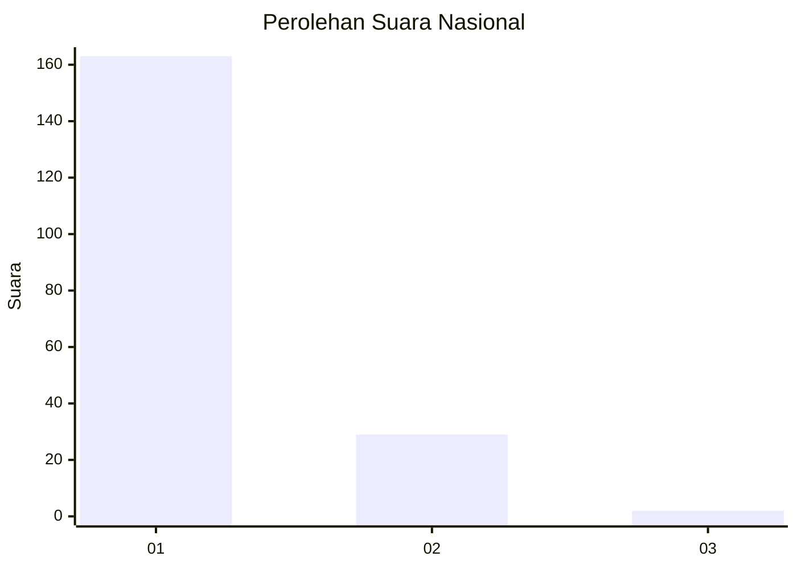
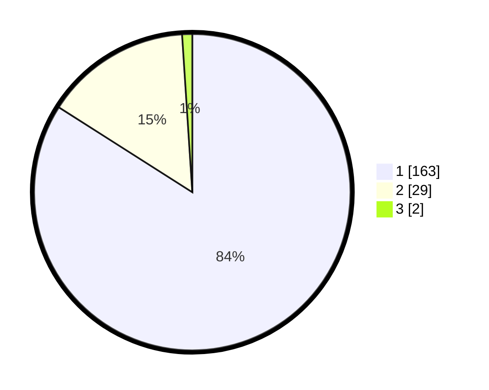

# Hasil

## Grafik

## Tabel

| No. | Nama Paslon    | Suara | Suara (raw) | Persentase |
|:--- |:-------------- | -----:| -----------:| ----------:|
| 1   | ANIES MUHAIMIN | 163   | [163][p-1]  | 84,02      |
| 2   | PRABOWO GIBRAN | 29    | [29][p-2]   | 14,95      |
| 3   | GANJAR MAHFUD  | 2     | [2][p-3]    | 1,03       |

[p-1]: https://github.com/gigit-pemilu/pemilu-2024/blob/main/pilpres/hitung-suara/sub/11-aceh/sub/74-kota-langsa/sub/04-langsa-lama/sub/2015-batee-puteh/sub/002-tps/sub/paslon-1.txt
[p-2]: https://github.com/gigit-pemilu/pemilu-2024/blob/main/pilpres/hitung-suara/sub/11-aceh/sub/74-kota-langsa/sub/04-langsa-lama/sub/2015-batee-puteh/sub/002-tps/sub/paslon-2.txt
[p-3]: https://github.com/gigit-pemilu/pemilu-2024/blob/main/pilpres/hitung-suara/sub/11-aceh/sub/74-kota-langsa/sub/04-langsa-lama/sub/2015-batee-puteh/sub/002-tps/sub/paslon-3.txt

## Foto C Plano

https://sirekap-obj-formc.kpu.go.id/d8b1/pemilu/ppwp/11/74/04/20/15/1174042015002-20240223-160623--b70e758d-d11d-4cd5-b0a1-da84a0ad91aa.jpg

https://sirekap-obj-formc.kpu.go.id/d8b1/pemilu/ppwp/11/74/04/20/15/1174042015002-20240223-160707--cda4a0db-da27-4df7-b6aa-6b98c4f38b61.jpg

https://sirekap-obj-formc.kpu.go.id/d8b1/pemilu/ppwp/11/74/04/20/15/1174042015002-20240223-160753--100b3c36-7aca-4933-9f99-56794afd75a2.jpg

## Metadata

| Key        | Value               |
| ---------- | ------------------- |
| Time Stamp | 2024-02-24 22:31:28 |

## DATA PEMILIH TETAP

Jumlah pemilih dalam DPT: **261**.
 * L: **137**.
 * P: **124**.

## DATA PENGGUNA HAK PILIH

Jumlah pengguna hak pilih dalam DPT: **155**.
 * L: **92**.
 * P: **107**.

Jumlah pengguna hak pilih dalam DPTb: **805**.
 * L: **2**.
 * P: **807**.

Jumlah pengguna hak pilih dalam DPK: **0**.
 * L: **0**.
 * P: **0**.

Jumlah pengguna hak pilih: **50**.
 * L: **44**.
 * P: **105**.

## JUMLAH SUARA SAH DAN TIDAK SAH

JUMLAH SELURUH SUARA SAH: **194**.

JUMLAH SUARA TIDAK SAH: **5**.

JUMLAH SELURUH SUARA SAH DAN SUARA TIDAK SAH: **0**.

