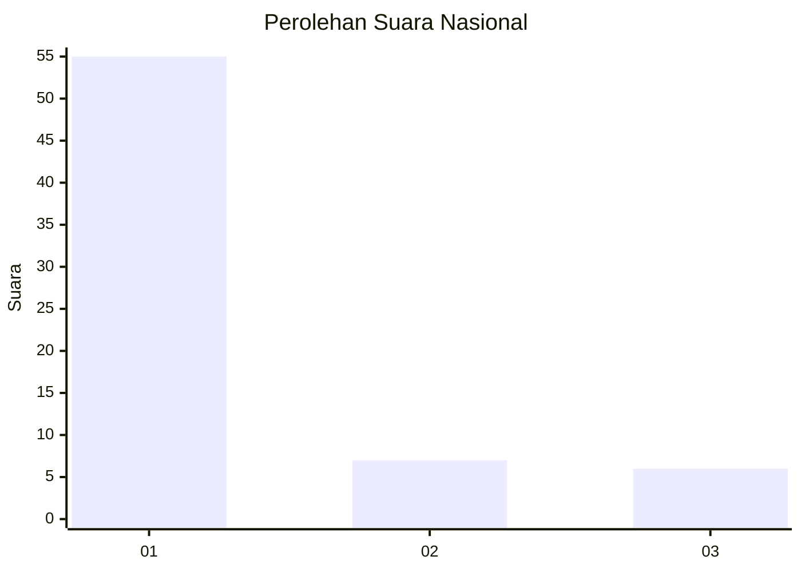
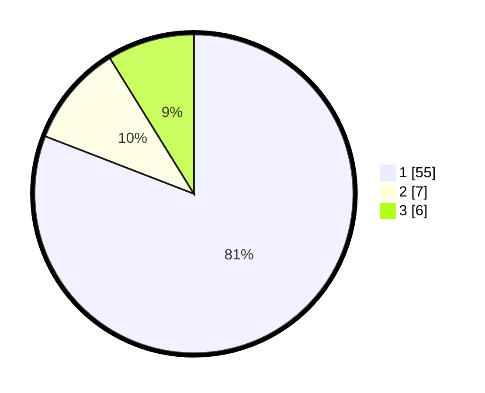

# Hasil

## Grafik

## Tabel

| No. | Nama Paslon    | Suara | Suara (raw) | Persentase |
|:--- |:-------------- | -----:| -----------:| ----------:|
| 1   | ANIES MUHAIMIN | 55    | [55][p-1]   | 80,88      |
| 2   | PRABOWO GIBRAN | 7     | [7][p-2]    | 10,29      |
| 3   | GANJAR MAHFUD  | 6     | [6][p-3]    | 8,82       |

[p-1]: https://github.com/gigit-pemilu/pemilu-2024/blob/main/pilpres/hitung-suara/sub/11-aceh/sub/74-kota-langsa/sub/04-langsa-lama/sub/2015-batee-puteh/sub/004-tps/sub/paslon-1.txt
[p-2]: https://github.com/gigit-pemilu/pemilu-2024/blob/main/pilpres/hitung-suara/sub/11-aceh/sub/74-kota-langsa/sub/04-langsa-lama/sub/2015-batee-puteh/sub/004-tps/sub/paslon-2.txt
[p-3]: https://github.com/gigit-pemilu/pemilu-2024/blob/main/pilpres/hitung-suara/sub/11-aceh/sub/74-kota-langsa/sub/04-langsa-lama/sub/2015-batee-puteh/sub/004-tps/sub/paslon-3.txt

## Foto C Plano

https://sirekap-obj-formc.kpu.go.id/62c7/pemilu/ppwp/11/74/04/20/15/1174042015004-20240223-175344--08a7415a-f4c2-4343-a09f-278a897c0a40.jpg

https://sirekap-obj-formc.kpu.go.id/62c7/pemilu/ppwp/11/74/04/20/15/1174042015004-20240223-175636--9e9fe1c5-3fff-4dda-8f77-2074dbd45a68.jpg

https://sirekap-obj-formc.kpu.go.id/62c7/pemilu/ppwp/11/74/04/20/15/1174042015004-20240223-205835--c2ec5a13-63f0-485d-b48b-481ffad886e6.jpg

## Metadata

| Key        | Value               |
| ---------- | ------------------- |
| Time Stamp | 2024-02-24 22:31:28 |

## DATA PEMILIH TETAP

Jumlah pemilih dalam DPT: **225**.
 * L: **307**.
 * P: **118**.

## DATA PENGGUNA HAK PILIH

Jumlah pengguna hak pilih dalam DPT: **177**.
 * L: **76**.
 * P: **101**.

Jumlah pengguna hak pilih dalam DPTb: **0**.
 * L: **500**.
 * P: **0**.

Jumlah pengguna hak pilih dalam DPK: **8**.
 * L: **5**.
 * P: **3**.

Jumlah pengguna hak pilih: **107**.
 * L: **81**.
 * P: **104**.

## JUMLAH SUARA SAH DAN TIDAK SAH

JUMLAH SELURUH SUARA SAH: **775**.

JUMLAH SUARA TIDAK SAH: **557**.

JUMLAH SELURUH SUARA SAH DAN SUARA TIDAK SAH: **777**.

