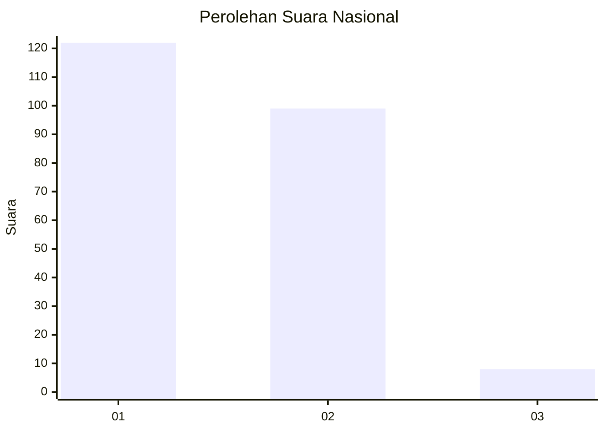
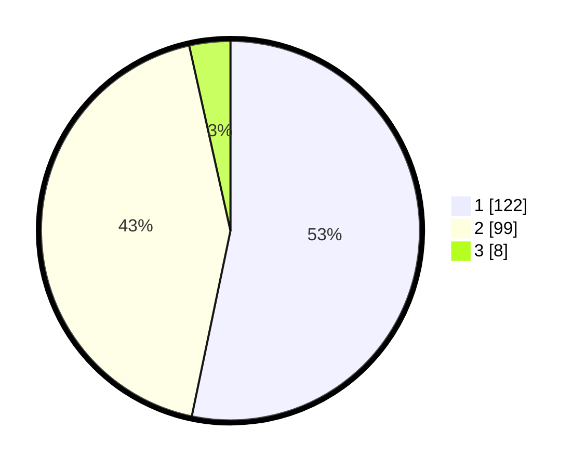

# Hasil

## Grafik

## Tabel

| No. | Nama Paslon    | Suara | Suara (raw) | Persentase |
|:--- |:-------------- | -----:| -----------:| ----------:|
| 1   | ANIES MUHAIMIN | 122   | [122][p-1]  | 53,28      |
| 2   | PRABOWO GIBRAN | 99    | [99][p-2]   | 43,23      |
| 3   | GANJAR MAHFUD  | 8     | [8][p-3]    | 3,49       |

[p-1]: https://github.com/gigit-pemilu/pemilu-2024/blob/main/pilpres/hitung-suara/sub/11-aceh/sub/74-kota-langsa/sub/05-langsa-baro/sub/2001-timbang-langsa/sub/002-tps/sub/paslon-1.txt
[p-2]: https://github.com/gigit-pemilu/pemilu-2024/blob/main/pilpres/hitung-suara/sub/11-aceh/sub/74-kota-langsa/sub/05-langsa-baro/sub/2001-timbang-langsa/sub/002-tps/sub/paslon-2.txt
[p-3]: https://github.com/gigit-pemilu/pemilu-2024/blob/main/pilpres/hitung-suara/sub/11-aceh/sub/74-kota-langsa/sub/05-langsa-baro/sub/2001-timbang-langsa/sub/002-tps/sub/paslon-3.txt

## Foto C Plano

https://sirekap-obj-formc.kpu.go.id/8b5f/pemilu/ppwp/11/74/05/20/01/1174052001002-20240228-160819--3d0b18ff-597f-4876-a27d-387dfec9d520.jpg

https://sirekap-obj-formc.kpu.go.id/8b5f/pemilu/ppwp/11/74/05/20/01/1174052001002-20240228-161113--379e2280-89d5-4a74-bd11-6d9d0bfbe65f.jpg

https://sirekap-obj-formc.kpu.go.id/8b5f/pemilu/ppwp/11/74/05/20/01/1174052001002-20240228-161419--5949567d-5c9e-4293-b223-eba858ebb64c.jpg

## Metadata

| Key        | Value               |
| ---------- | ------------------- |
| Time Stamp | 2024-03-10 23:00:00 |

## DATA PEMILIH TETAP

Jumlah pemilih dalam DPT: **280**.
 * L: **130**.
 * P: **150**.

## DATA PENGGUNA HAK PILIH

Jumlah pengguna hak pilih dalam DPT: **219**.
 * L: **96**.
 * P: **123**.

Jumlah pengguna hak pilih dalam DPTb: **7**.
 * L: **4**.
 * P: **3**.

Jumlah pengguna hak pilih dalam DPK: **0**.
 * L: **0**.
 * P: **0**.

Jumlah pengguna hak pilih: **226**.
 * L: **100**.
 * P: **126**.

## JUMLAH SUARA SAH DAN TIDAK SAH

JUMLAH SELURUH SUARA SAH: **223**.

JUMLAH SUARA TIDAK SAH: **3**.

JUMLAH SELURUH SUARA SAH DAN SUARA TIDAK SAH: **226**.

