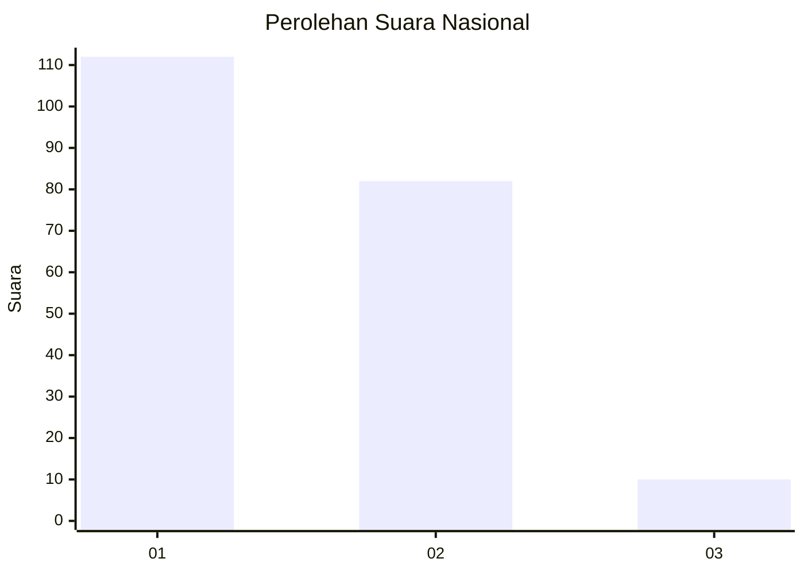
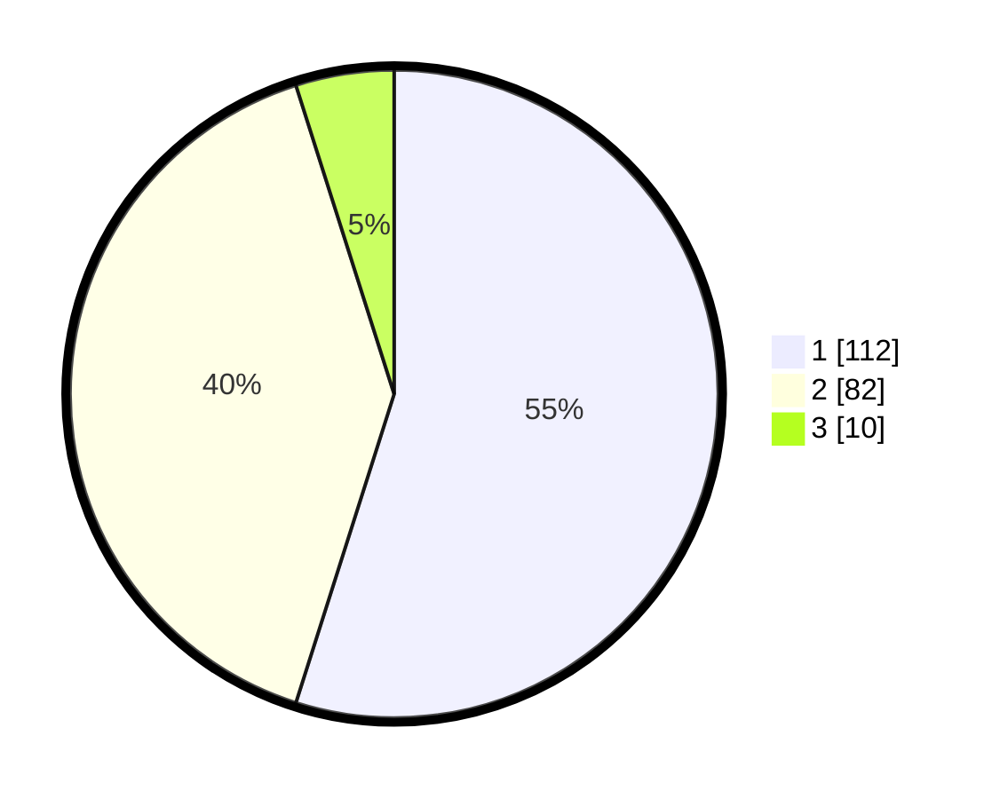

# Hasil

## Grafik

## Tabel

| No. | Nama Paslon    | Suara | Suara (raw) | Persentase |
|:--- |:-------------- | -----:| -----------:| ----------:|
| 1   | ANIES MUHAIMIN | 112   | [112][p-1]  | 54,90      |
| 2   | PRABOWO GIBRAN | 82    | [82][p-2]   | 40,20      |
| 3   | GANJAR MAHFUD  | 10    | [10][p-3]   | 4,90       |

[p-1]: https://github.com/gigit-pemilu/pemilu-2024/blob/main/pilpres/hitung-suara/sub/11-aceh/sub/74-kota-langsa/sub/05-langsa-baro/sub/2001-timbang-langsa/sub/005-tps/sub/paslon-1.txt
[p-2]: https://github.com/gigit-pemilu/pemilu-2024/blob/main/pilpres/hitung-suara/sub/11-aceh/sub/74-kota-langsa/sub/05-langsa-baro/sub/2001-timbang-langsa/sub/005-tps/sub/paslon-2.txt
[p-3]: https://github.com/gigit-pemilu/pemilu-2024/blob/main/pilpres/hitung-suara/sub/11-aceh/sub/74-kota-langsa/sub/05-langsa-baro/sub/2001-timbang-langsa/sub/005-tps/sub/paslon-3.txt

## Foto C Plano

https://sirekap-obj-formc.kpu.go.id/32b6/pemilu/ppwp/11/74/05/20/01/1174052001005-20240228-162746--89c25118-3120-4a04-b39c-3c53a678984e.jpg

https://sirekap-obj-formc.kpu.go.id/32b6/pemilu/ppwp/11/74/05/20/01/1174052001005-20240228-163040--72c0fd66-25a8-4a3d-807a-7415b0ea6feb.jpg

https://sirekap-obj-formc.kpu.go.id/32b6/pemilu/ppwp/11/74/05/20/01/1174052001005-20240228-163152--87b577db-93ab-4128-bfb0-2dd5bd22f282.jpg

## Metadata

| Key        | Value               |
| ---------- | ------------------- |
| Time Stamp | 2024-03-10 23:00:00 |

## DATA PEMILIH TETAP

Jumlah pemilih dalam DPT: **288**.
 * L: **143**.
 * P: **145**.

## DATA PENGGUNA HAK PILIH

Jumlah pengguna hak pilih dalam DPT: **202**.
 * L: **98**.
 * P: **104**.

Jumlah pengguna hak pilih dalam DPTb: **5**.
 * L: **3**.
 * P: **2**.

Jumlah pengguna hak pilih dalam DPK: **0**.
 * L: **0**.
 * P: **0**.

Jumlah pengguna hak pilih: **207**.
 * L: **101**.
 * P: **106**.

## JUMLAH SUARA SAH DAN TIDAK SAH

JUMLAH SELURUH SUARA SAH: **204**.

JUMLAH SUARA TIDAK SAH: **3**.

JUMLAH SELURUH SUARA SAH DAN SUARA TIDAK SAH: **207**.

