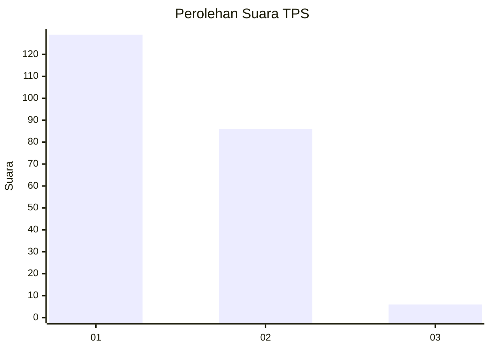
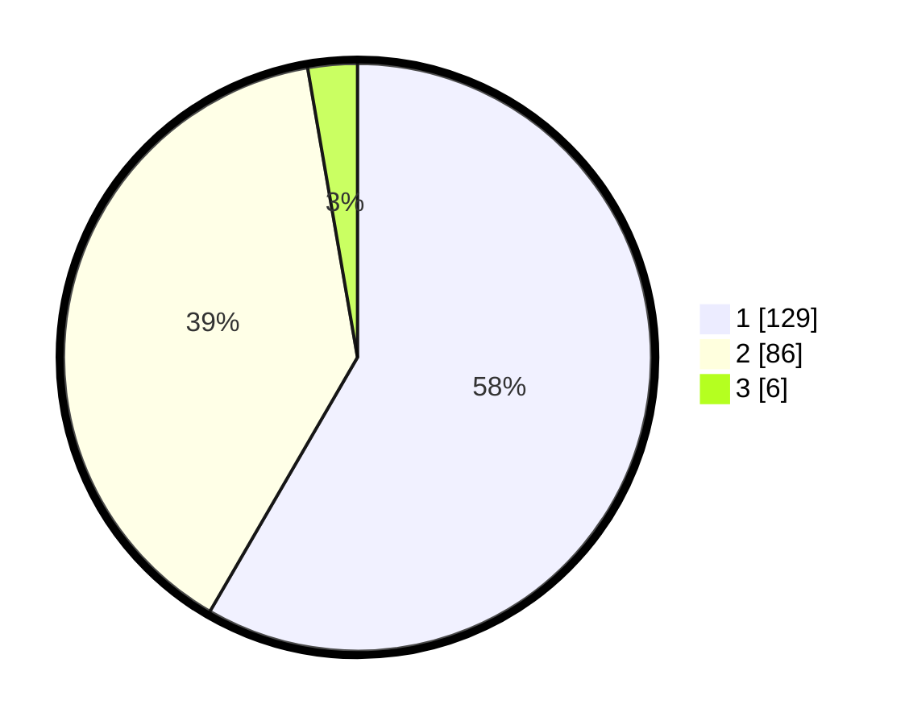

# Hasil

## Grafik

## Tabel

| No. | Nama Paslon    | Suara | Suara (raw) | Persentase |
|:--- |:-------------- | -----:| -----------:| ----------:|
| 1   | ANIES MUHAIMIN | 129   | [129][p-1]  | 58,37      |
| 2   | PRABOWO GIBRAN | 86    | [86][p-2]   | 38,91      |
| 3   | GANJAR MAHFUD  | 6     | [6][p-3]    | 2,71       |

[p-1]: https://github.com/gigit-pemilu/pemilu-2024-11-aceh/blob/main/pilpres/hitung-suara/sub/11-aceh/sub/74-kota-langsa/sub/05-langsa-baro/sub/2004-paya-bujok-seuleumak/sub/007-tps/sub/paslon-1.txt
[p-2]: https://github.com/gigit-pemilu/pemilu-2024-11-aceh/blob/main/pilpres/hitung-suara/sub/11-aceh/sub/74-kota-langsa/sub/05-langsa-baro/sub/2004-paya-bujok-seuleumak/sub/007-tps/sub/paslon-2.txt
[p-3]: https://github.com/gigit-pemilu/pemilu-2024-11-aceh/blob/main/pilpres/hitung-suara/sub/11-aceh/sub/74-kota-langsa/sub/05-langsa-baro/sub/2004-paya-bujok-seuleumak/sub/007-tps/sub/paslon-3.txt

## Foto C Plano

https://sirekap-obj-formc.kpu.go.id/3cec/pemilu/ppwp/11/74/05/20/04/1174052004007-20240228-152309--202a8bb3-94e2-486e-bf10-40e0e56bb897.jpg

https://sirekap-obj-formc.kpu.go.id/3cec/pemilu/ppwp/11/74/05/20/04/1174052004007-20240228-152632--8f7c6d0f-6ad5-4f0e-a941-51c66c476a28.jpg

https://sirekap-obj-formc.kpu.go.id/3cec/pemilu/ppwp/11/74/05/20/04/1174052004007-20240228-152908--252038d4-8fe0-4629-8208-91c2655c11a3.jpg

## Metadata

| Key        | Value               |
| ---------- | ------------------- |
| Time Stamp | 2024-02-28 16:00:00 |

## DATA PEMILIH TETAP

Jumlah pemilih dalam DPT: **557**.
 * L: **0**.
 * P: **5**.

## DATA PENGGUNA HAK PILIH

Jumlah pengguna hak pilih dalam DPT: **217**.
 * L: **95**.
 * P: **123**.

Jumlah pengguna hak pilih dalam DPTb: **4**.
 * L: **2**.
 * P: **2**.

Jumlah pengguna hak pilih dalam DPK: **2**.
 * L: **0**.
 * P: **2**.

Jumlah pengguna hak pilih: **223**.
 * L: **97**.
 * P: **126**.

## JUMLAH SUARA SAH DAN TIDAK SAH

JUMLAH SELURUH SUARA SAH: **221**.

JUMLAH SUARA TIDAK SAH: **2**.

JUMLAH SELURUH SUARA SAH DAN SUARA TIDAK SAH: **223**.

