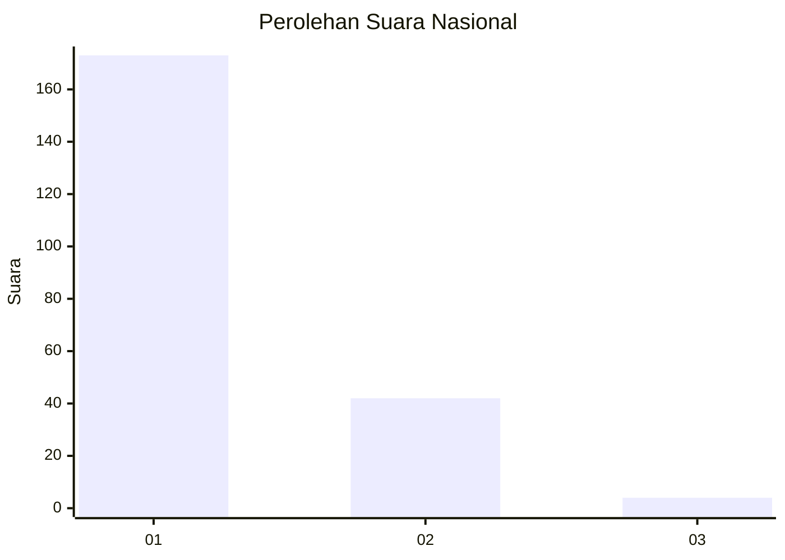
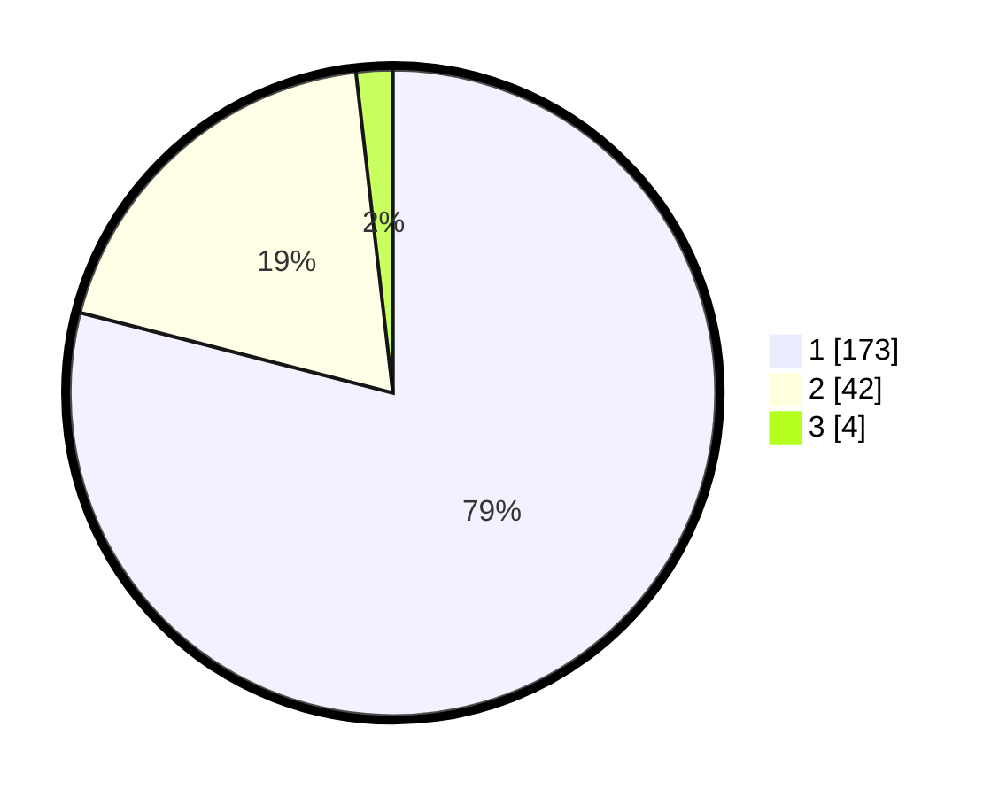

# Hasil

## Grafik

## Tabel

| No. | Nama Paslon    | Suara | Suara (raw) | Persentase |
|:--- |:-------------- | -----:| -----------:| ----------:|
| 1   | ANIES MUHAIMIN | 173   | [173][p-1]  | 79,00      |
| 2   | PRABOWO GIBRAN | 42    | [42][p-2]   | 19,18      |
| 3   | GANJAR MAHFUD  | 4     | [4][p-3]    | 1,83       |

[p-1]: https://github.com/gigit-pemilu/pemilu-2024/blob/main/pilpres/hitung-suara/sub/11-aceh/sub/74-kota-langsa/sub/05-langsa-baro/sub/2004-paya-bujok-seuleumak/sub/009-tps/sub/paslon-1.txt
[p-2]: https://github.com/gigit-pemilu/pemilu-2024/blob/main/pilpres/hitung-suara/sub/11-aceh/sub/74-kota-langsa/sub/05-langsa-baro/sub/2004-paya-bujok-seuleumak/sub/009-tps/sub/paslon-2.txt
[p-3]: https://github.com/gigit-pemilu/pemilu-2024/blob/main/pilpres/hitung-suara/sub/11-aceh/sub/74-kota-langsa/sub/05-langsa-baro/sub/2004-paya-bujok-seuleumak/sub/009-tps/sub/paslon-3.txt

## Foto C Plano

https://sirekap-obj-formc.kpu.go.id/aed6/pemilu/ppwp/11/74/05/20/04/1174052004009-20240214-191244--311e48c9-fe89-4771-8fe2-6c0293f0c171.jpg

https://sirekap-obj-formc.kpu.go.id/aed6/pemilu/ppwp/11/74/05/20/04/1174052004009-20240214-192834--a8a435fb-b0ba-4e11-8ca7-ac72bd2e3400.jpg

https://sirekap-obj-formc.kpu.go.id/aed6/pemilu/ppwp/11/74/05/20/04/1174052004009-20240214-192502--f570ad96-4c6d-45bd-b6f5-467ee0e89632.jpg

## Metadata

| Key        | Value               |
| ---------- | ------------------- |
| Time Stamp | 2024-02-19 19:00:00 |

