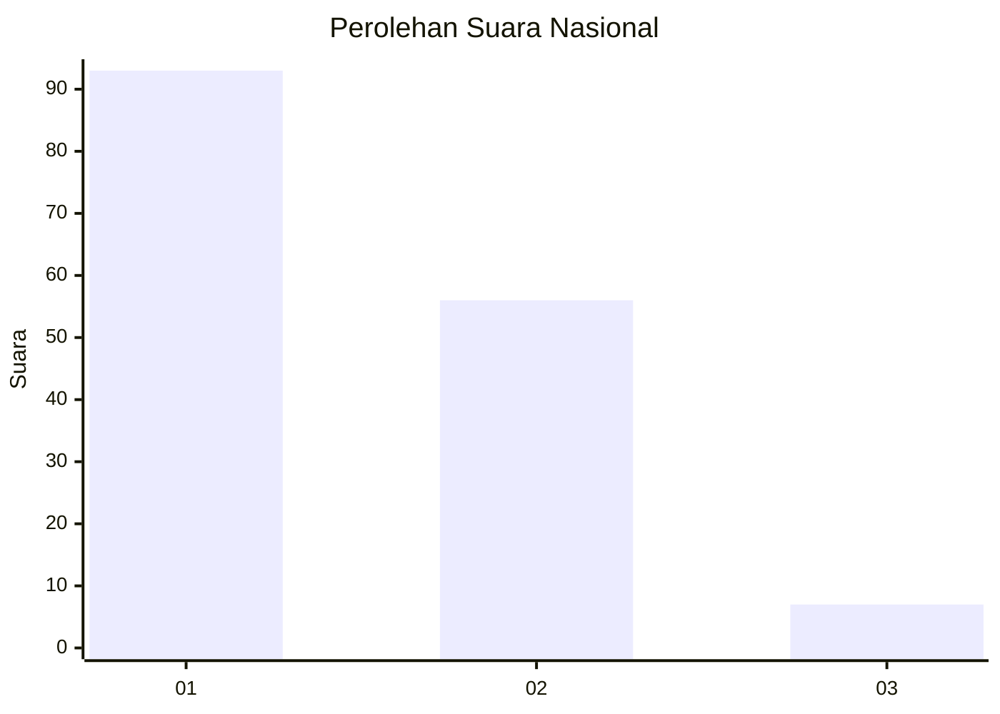
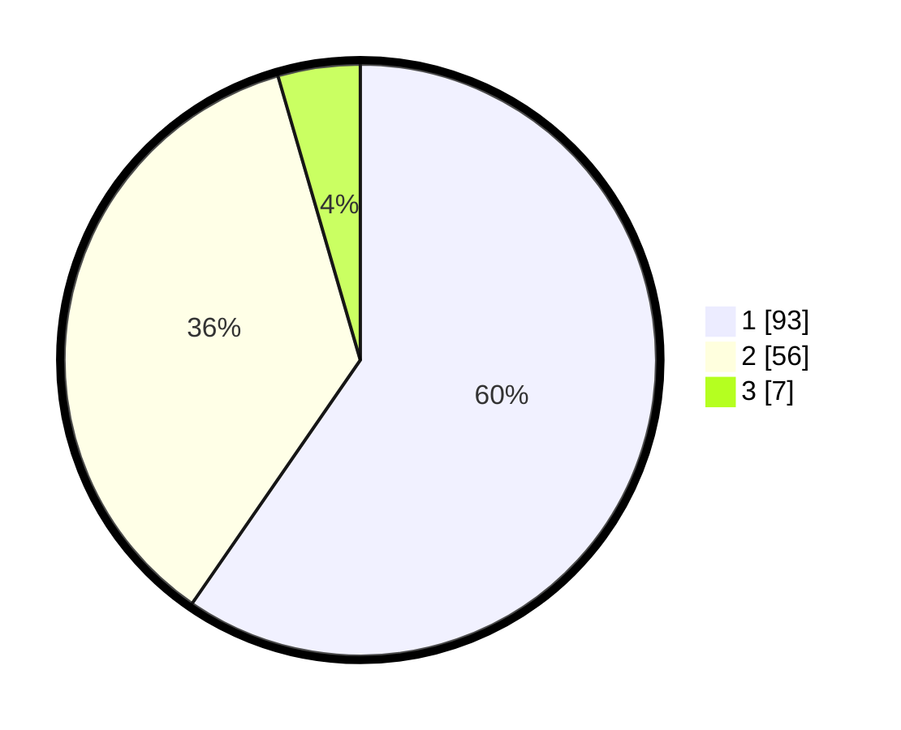

# Hasil

## Grafik

## Tabel

| No. | Nama Paslon    | Suara | Suara (raw) | Persentase |
|:--- |:-------------- | -----:| -----------:| ----------:|
| 1   | ANIES MUHAIMIN | 93    | [93][p-1]   | 59,62      |
| 2   | PRABOWO GIBRAN | 56    | [56][p-2]   | 35,90      |
| 3   | GANJAR MAHFUD  | 7     | [7][p-3]    | 4,49       |

[p-1]: https://github.com/gigit-pemilu/pemilu-2024/blob/main/pilpres/hitung-suara/sub/11-aceh/sub/74-kota-langsa/sub/05-langsa-baro/sub/2004-paya-bujok-seuleumak/sub/011-tps/sub/paslon-1.txt
[p-2]: https://github.com/gigit-pemilu/pemilu-2024/blob/main/pilpres/hitung-suara/sub/11-aceh/sub/74-kota-langsa/sub/05-langsa-baro/sub/2004-paya-bujok-seuleumak/sub/011-tps/sub/paslon-2.txt
[p-3]: https://github.com/gigit-pemilu/pemilu-2024/blob/main/pilpres/hitung-suara/sub/11-aceh/sub/74-kota-langsa/sub/05-langsa-baro/sub/2004-paya-bujok-seuleumak/sub/011-tps/sub/paslon-3.txt

## Foto C Plano

https://sirekap-obj-formc.kpu.go.id/047f/pemilu/ppwp/11/74/05/20/04/1174052004011-20240214-193535--c509a031-0260-477a-bc76-7500f76cf411.jpg

https://sirekap-obj-formc.kpu.go.id/047f/pemilu/ppwp/11/74/05/20/04/1174052004011-20240214-193722--751e1d96-b9a2-4951-b307-7816dfd7bd41.jpg

https://sirekap-obj-formc.kpu.go.id/047f/pemilu/ppwp/11/74/05/20/04/1174052004011-20240214-193851--0ae28124-886b-4663-9b51-07a9c070b7f3.jpg

## Metadata

| Key        | Value               |
| ---------- | ------------------- |
| Time Stamp | 2024-02-19 19:00:00 |

