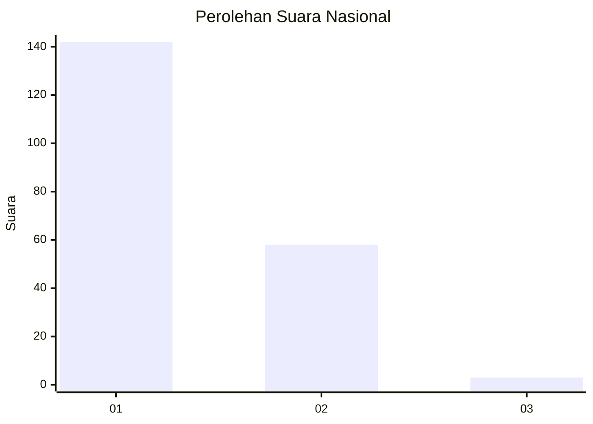
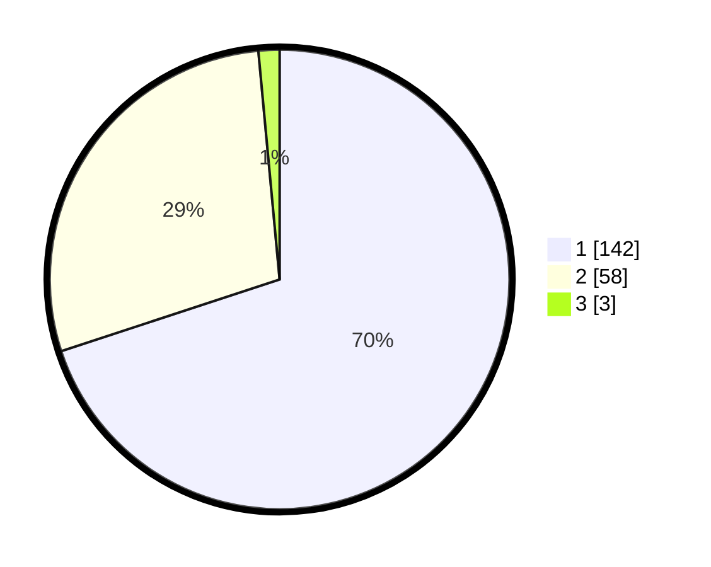

# Hasil

## Grafik

## Tabel

| No. | Nama Paslon    | Suara | Suara (raw) | Persentase |
|:--- |:-------------- | -----:| -----------:| ----------:|
| 1   | ANIES MUHAIMIN | 142   | [142][p-1]  | 69,95      |
| 2   | PRABOWO GIBRAN | 58    | [58][p-2]   | 28,57      |
| 3   | GANJAR MAHFUD  | 3     | [3][p-3]    | 1,48       |

[p-1]: https://github.com/gigit-pemilu/pemilu-2024/blob/main/pilpres/hitung-suara/sub/11-aceh/sub/74-kota-langsa/sub/05-langsa-baro/sub/2004-paya-bujok-seuleumak/sub/020-tps/sub/paslon-1.txt
[p-2]: https://github.com/gigit-pemilu/pemilu-2024/blob/main/pilpres/hitung-suara/sub/11-aceh/sub/74-kota-langsa/sub/05-langsa-baro/sub/2004-paya-bujok-seuleumak/sub/020-tps/sub/paslon-2.txt
[p-3]: https://github.com/gigit-pemilu/pemilu-2024/blob/main/pilpres/hitung-suara/sub/11-aceh/sub/74-kota-langsa/sub/05-langsa-baro/sub/2004-paya-bujok-seuleumak/sub/020-tps/sub/paslon-3.txt

## Foto C Plano

https://sirekap-obj-formc.kpu.go.id/332b/pemilu/ppwp/11/74/05/20/04/1174052004020-20240214-224639--831ddd5c-4494-4dd1-861a-ba1f21bc1d0b.jpg

https://sirekap-obj-formc.kpu.go.id/332b/pemilu/ppwp/11/74/05/20/04/1174052004020-20240214-225026--da6e48c2-e708-42a1-8171-b2dd94959cd1.jpg

https://sirekap-obj-formc.kpu.go.id/332b/pemilu/ppwp/11/74/05/20/04/1174052004020-20240214-225716--32f58041-17b6-4730-b3a8-eb021ed75249.jpg

## Metadata

| Key        | Value               |
| ---------- | ------------------- |
| Time Stamp | 2024-02-21 00:00:00 |

