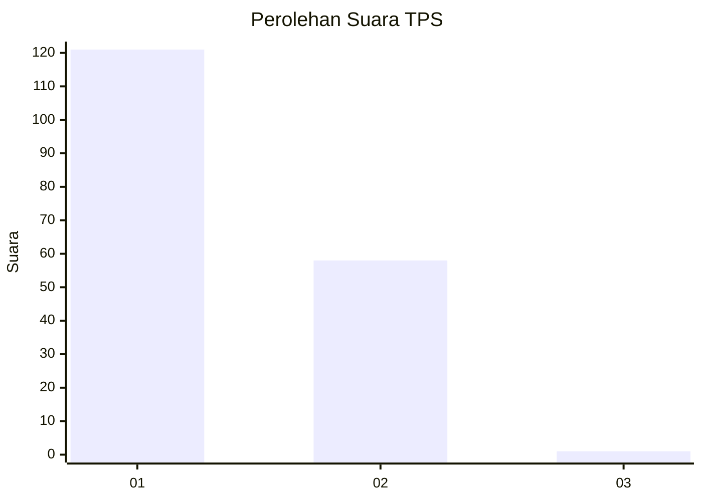
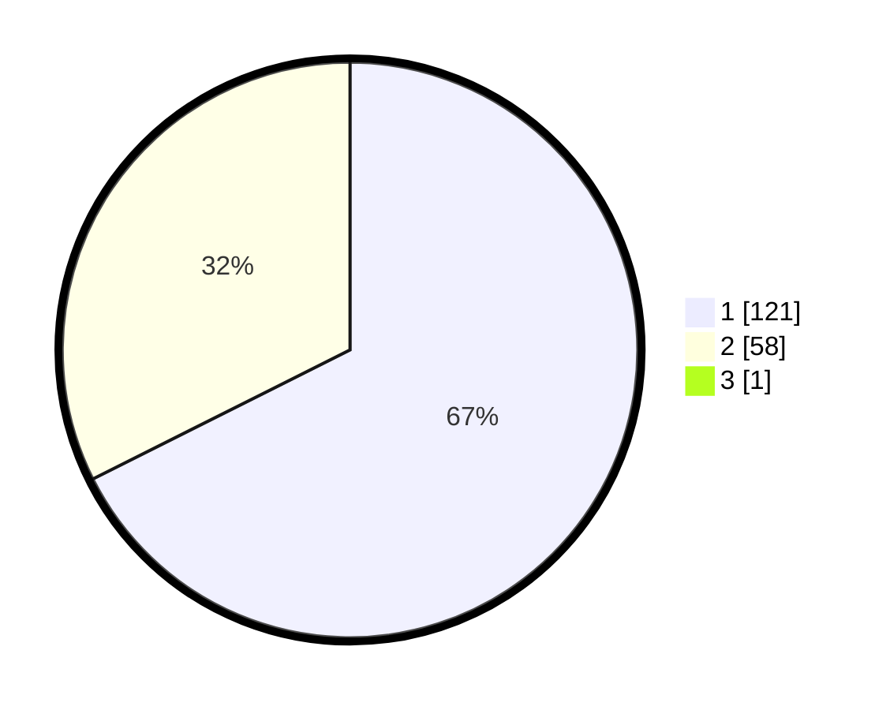

# Hasil

## Grafik

## Tabel

| No. | Nama Paslon    | Suara | Suara (raw) | Persentase |
|:--- |:-------------- | -----:| -----------:| ----------:|
| 1   | ANIES MUHAIMIN | 121   | [121][p-1]  | 67,22      |
| 2   | PRABOWO GIBRAN | 58    | [58][p-2]   | 32,22      |
| 3   | GANJAR MAHFUD  | 1     | [1][p-3]    | 0,56       |

[p-1]: https://github.com/gigit-pemilu/pemilu-2024-11-aceh/blob/main/pilpres/hitung-suara/sub/11-aceh/sub/74-kota-langsa/sub/05-langsa-baro/sub/2004-paya-bujok-seuleumak/sub/032-tps/sub/paslon-1.txt
[p-2]: https://github.com/gigit-pemilu/pemilu-2024-11-aceh/blob/main/pilpres/hitung-suara/sub/11-aceh/sub/74-kota-langsa/sub/05-langsa-baro/sub/2004-paya-bujok-seuleumak/sub/032-tps/sub/paslon-2.txt
[p-3]: https://github.com/gigit-pemilu/pemilu-2024-11-aceh/blob/main/pilpres/hitung-suara/sub/11-aceh/sub/74-kota-langsa/sub/05-langsa-baro/sub/2004-paya-bujok-seuleumak/sub/032-tps/sub/paslon-3.txt

## Foto C Plano

https://sirekap-obj-formc.kpu.go.id/206d/pemilu/ppwp/11/74/05/20/04/1174052004032-20240214-234558--dd3f17ac-22be-48c4-b77d-be004eb96303.jpg

https://sirekap-obj-formc.kpu.go.id/206d/pemilu/ppwp/11/74/05/20/04/1174052004032-20240214-232604--a40aaebf-9309-47c6-8b7d-bb4fbe71f10f.jpg

https://sirekap-obj-formc.kpu.go.id/206d/pemilu/ppwp/11/74/05/20/04/1174052004032-20240214-234818--c4557256-61fc-4cb2-bd92-58f2394d81d3.jpg

## Metadata

| Key        | Value               |
| ---------- | ------------------- |
| Time Stamp | 2024-02-21 00:00:00 |

