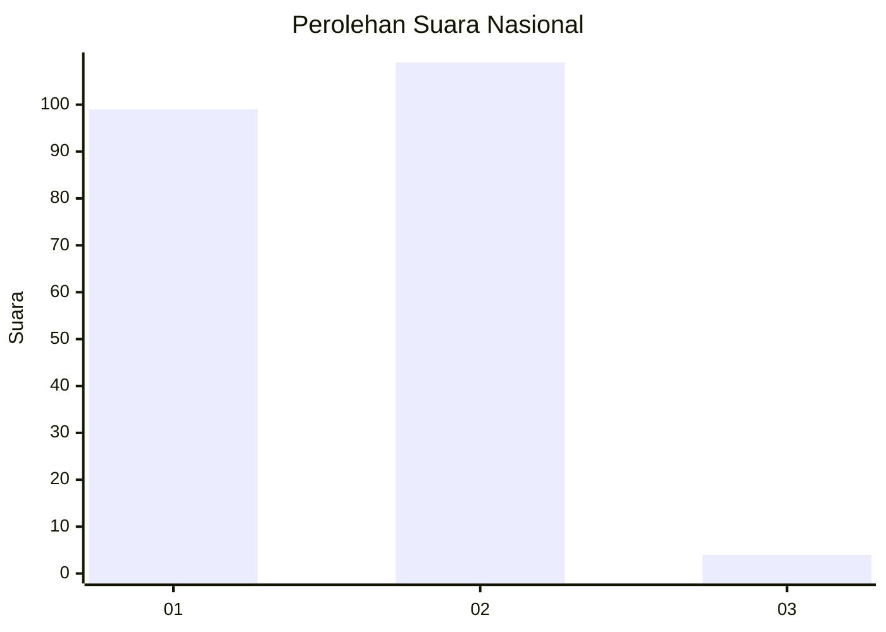
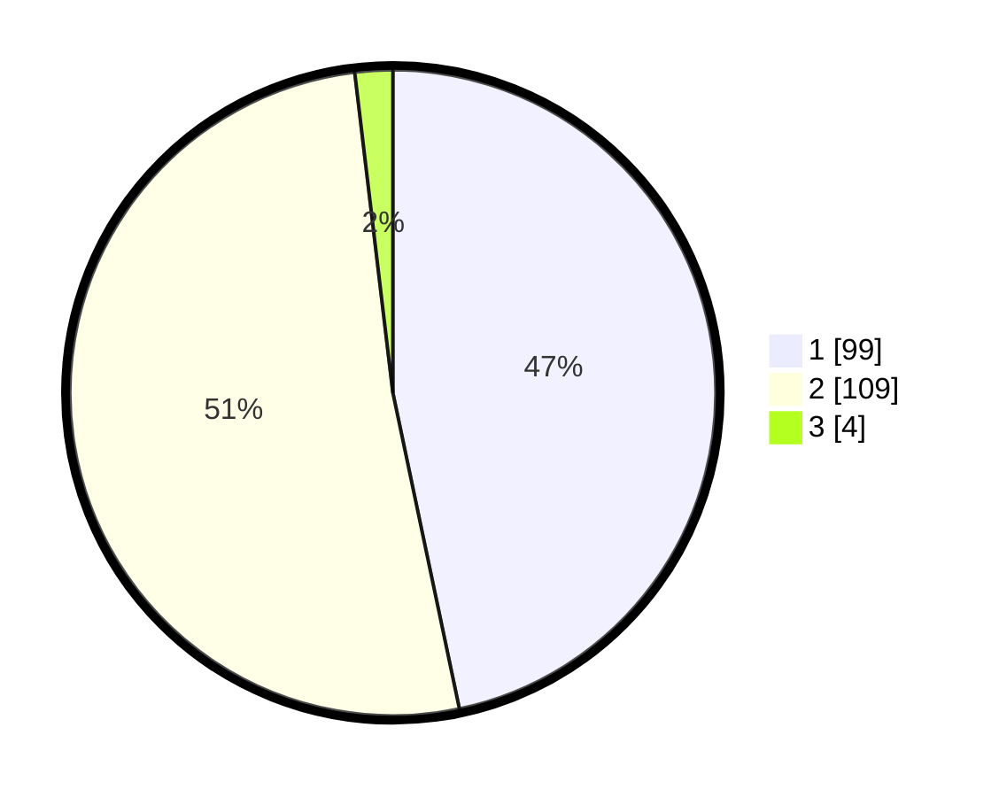

# Hasil

## Grafik

## Tabel

| No. | Nama Paslon    | Suara | Suara (raw) | Persentase |
|:--- |:-------------- | -----:| -----------:| ----------:|
| 1   | ANIES MUHAIMIN | 99    | [99][p-1]   | 46,70      |
| 2   | PRABOWO GIBRAN | 109   | [109][p-2]  | 51,42      |
| 3   | GANJAR MAHFUD  | 4     | [4][p-3]    | 1,89       |

[p-1]: https://github.com/gigit-pemilu/pemilu-2024/blob/main/pilpres/hitung-suara/sub/11-aceh/sub/74-kota-langsa/sub/05-langsa-baro/sub/2005-pondok-kelapa/sub/001-tps/sub/paslon-1.txt
[p-2]: https://github.com/gigit-pemilu/pemilu-2024/blob/main/pilpres/hitung-suara/sub/11-aceh/sub/74-kota-langsa/sub/05-langsa-baro/sub/2005-pondok-kelapa/sub/001-tps/sub/paslon-2.txt
[p-3]: https://github.com/gigit-pemilu/pemilu-2024/blob/main/pilpres/hitung-suara/sub/11-aceh/sub/74-kota-langsa/sub/05-langsa-baro/sub/2005-pondok-kelapa/sub/001-tps/sub/paslon-3.txt

## Foto C Plano

https://sirekap-obj-formc.kpu.go.id/2747/pemilu/ppwp/11/74/05/20/05/1174052005001-20240214-220939--1f28d00c-6567-465f-b01b-1c110b572c84.jpg

https://sirekap-obj-formc.kpu.go.id/2747/pemilu/ppwp/11/74/05/20/05/1174052005001-20240214-221001--103ce9bb-2d1d-407a-bd5f-9688cd4ae0a0.jpg

https://sirekap-obj-formc.kpu.go.id/2747/pemilu/ppwp/11/74/05/20/05/1174052005001-20240214-221015--e4b9067e-dd48-4b9a-8732-5e9ab6595706.jpg

## Metadata

| Key        | Value               |
| ---------- | ------------------- |
| Time Stamp | 2024-02-19 19:00:00 |

