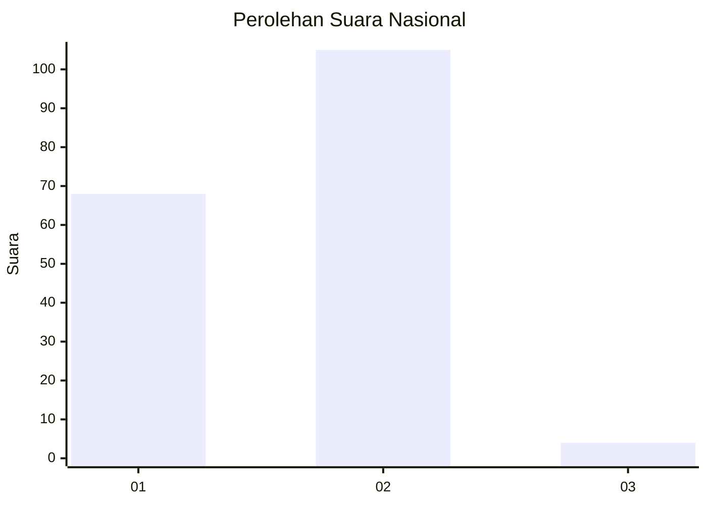
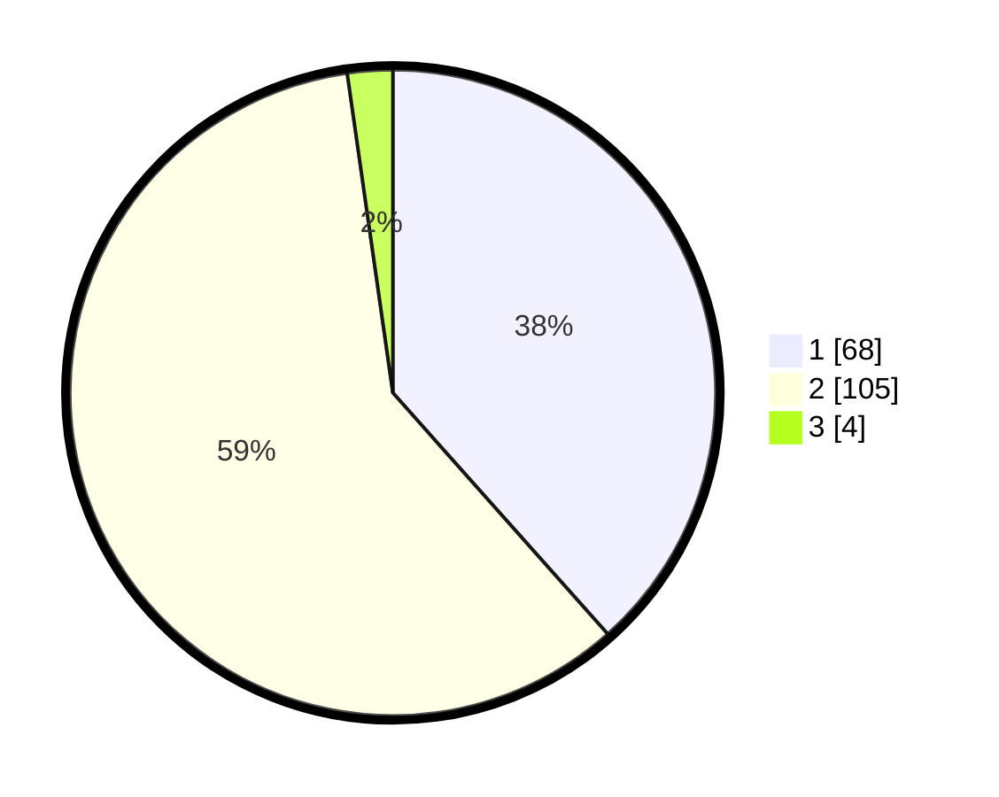

# Hasil

## Grafik

## Tabel

| No. | Nama Paslon    | Suara | Suara (raw) | Persentase |
|:--- |:-------------- | -----:| -----------:| ----------:|
| 1   | ANIES MUHAIMIN | 68    | [68][p-1]   | 38,42      |
| 2   | PRABOWO GIBRAN | 105   | [105][p-2]  | 59,32      |
| 3   | GANJAR MAHFUD  | 4     | [4][p-3]    | 2,26       |

[p-1]: https://github.com/gigit-pemilu/pemilu-2024/blob/main/pilpres/hitung-suara/sub/11-aceh/sub/74-kota-langsa/sub/05-langsa-baro/sub/2005-pondok-kelapa/sub/003-tps/sub/paslon-1.txt
[p-2]: https://github.com/gigit-pemilu/pemilu-2024/blob/main/pilpres/hitung-suara/sub/11-aceh/sub/74-kota-langsa/sub/05-langsa-baro/sub/2005-pondok-kelapa/sub/003-tps/sub/paslon-2.txt
[p-3]: https://github.com/gigit-pemilu/pemilu-2024/blob/main/pilpres/hitung-suara/sub/11-aceh/sub/74-kota-langsa/sub/05-langsa-baro/sub/2005-pondok-kelapa/sub/003-tps/sub/paslon-3.txt

## Foto C Plano

https://sirekap-obj-formc.kpu.go.id/3780/pemilu/ppwp/11/74/05/20/05/1174052005003-20240214-222233--6b54f505-39c1-4e18-bd2c-15e8fdb19240.jpg

https://sirekap-obj-formc.kpu.go.id/3780/pemilu/ppwp/11/74/05/20/05/1174052005003-20240214-222255--95b4ce2a-2ac0-4103-aa64-28a7e8fa0625.jpg

https://sirekap-obj-formc.kpu.go.id/3780/pemilu/ppwp/11/74/05/20/05/1174052005003-20240214-222311--7ace0806-7d90-433d-9c87-cdbcbb9b8bfc.jpg

## Metadata

| Key        | Value               |
| ---------- | ------------------- |
| Time Stamp | 2024-02-21 00:00:00 |

