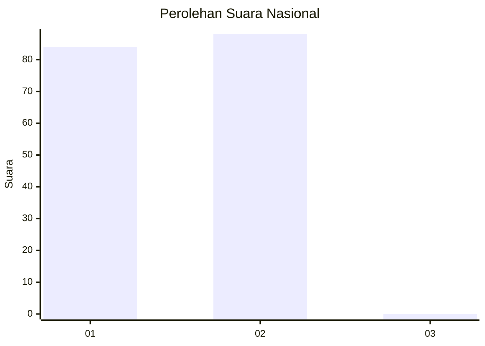
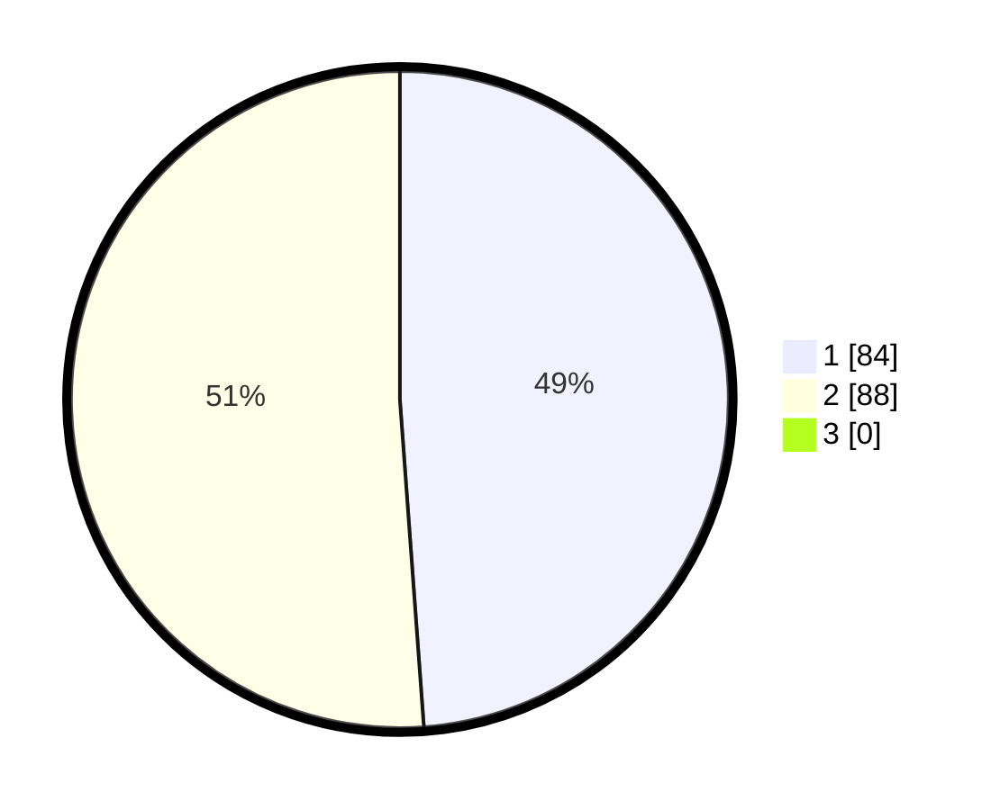

# Hasil

## Grafik

## Tabel

| No. | Nama Paslon    | Suara | Suara (raw) | Persentase |
|:--- |:-------------- | -----:| -----------:| ----------:|
| 1   | ANIES MUHAIMIN | 84    | [84][p-1]   | 48,84      |
| 2   | PRABOWO GIBRAN | 88    | [88][p-2]   | 51,16      |
| 3   | GANJAR MAHFUD  | 0     | [0][p-3]    | 0,00       |

[p-1]: https://github.com/gigit-pemilu/pemilu-2024/blob/main/pilpres/hitung-suara/sub/11-aceh/sub/74-kota-langsa/sub/05-langsa-baro/sub/2005-pondok-kelapa/sub/006-tps/sub/paslon-1.txt
[p-2]: https://github.com/gigit-pemilu/pemilu-2024/blob/main/pilpres/hitung-suara/sub/11-aceh/sub/74-kota-langsa/sub/05-langsa-baro/sub/2005-pondok-kelapa/sub/006-tps/sub/paslon-2.txt
[p-3]: https://github.com/gigit-pemilu/pemilu-2024/blob/main/pilpres/hitung-suara/sub/11-aceh/sub/74-kota-langsa/sub/05-langsa-baro/sub/2005-pondok-kelapa/sub/006-tps/sub/paslon-3.txt

## Foto C Plano

https://sirekap-obj-formc.kpu.go.id/24bf/pemilu/ppwp/11/74/05/20/05/1174052005006-20240214-225508--0aaf04c9-bdf7-47db-a0ab-713c02d1550c.jpg

https://sirekap-obj-formc.kpu.go.id/24bf/pemilu/ppwp/11/74/05/20/05/1174052005006-20240214-230931--96b8f516-0087-4eb9-bb88-4614aff12e62.jpg

https://sirekap-obj-formc.kpu.go.id/24bf/pemilu/ppwp/11/74/05/20/05/1174052005006-20240214-231101--c45d1913-ab64-4512-8fab-aa43f5ee0808.jpg

## Metadata

| Key        | Value               |
| ---------- | ------------------- |
| Time Stamp | 2024-02-21 00:00:00 |

