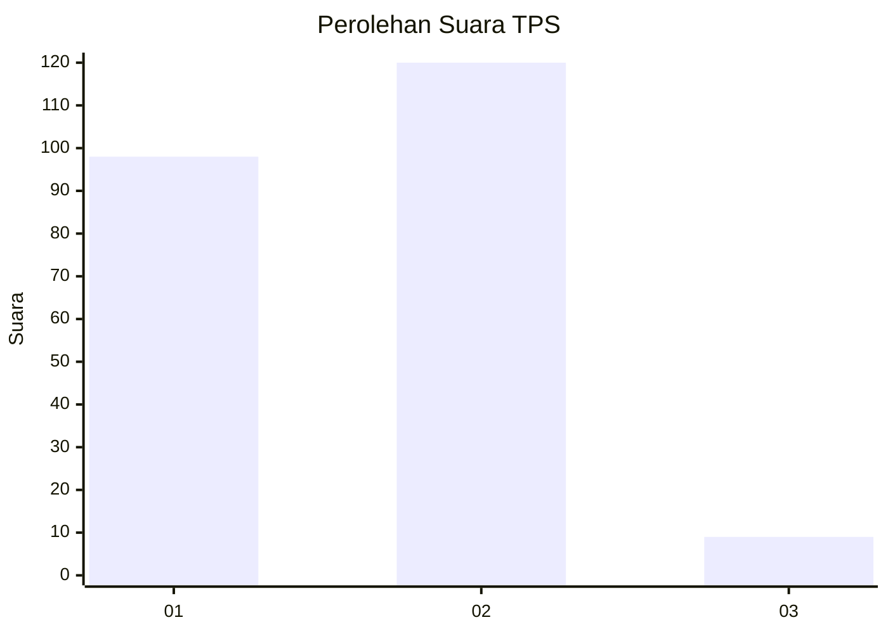
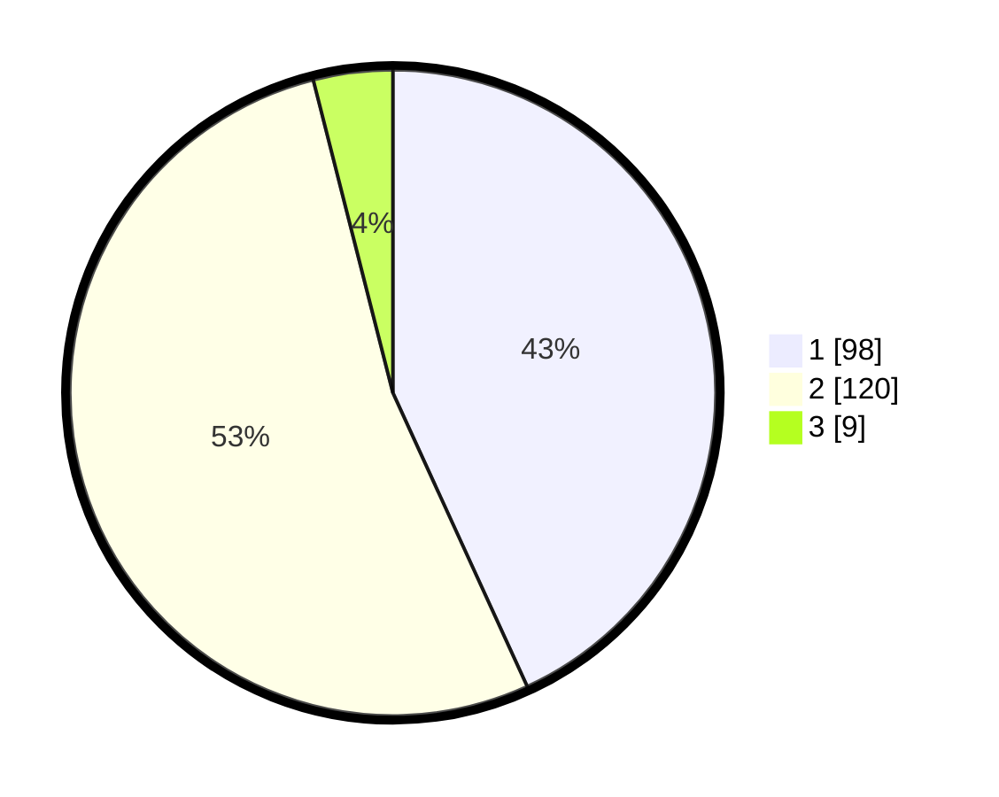

# Hasil

## Grafik

## Tabel

| No. | Nama Paslon    | Suara | Suara (raw) | Persentase |
|:--- |:-------------- | -----:| -----------:| ----------:|
| 1   | ANIES MUHAIMIN | 98    | [98][p-1]   | 43,17      |
| 2   | PRABOWO GIBRAN | 120   | [120][p-2]  | 52,86      |
| 3   | GANJAR MAHFUD  | 9     | [9][p-3]    | 3,96       |

[p-1]: https://github.com/gigit-pemilu/pemilu-2024-11-aceh/blob/main/pilpres/hitung-suara/sub/11-aceh/sub/74-kota-langsa/sub/05-langsa-baro/sub/2006-karang-anyar/sub/001-tps/sub/paslon-1.txt
[p-2]: https://github.com/gigit-pemilu/pemilu-2024-11-aceh/blob/main/pilpres/hitung-suara/sub/11-aceh/sub/74-kota-langsa/sub/05-langsa-baro/sub/2006-karang-anyar/sub/001-tps/sub/paslon-2.txt
[p-3]: https://github.com/gigit-pemilu/pemilu-2024-11-aceh/blob/main/pilpres/hitung-suara/sub/11-aceh/sub/74-kota-langsa/sub/05-langsa-baro/sub/2006-karang-anyar/sub/001-tps/sub/paslon-3.txt

## Foto C Plano

https://sirekap-obj-formc.kpu.go.id/ca6e/pemilu/ppwp/11/74/05/20/06/1174052006001-20240220-164828--ac2f73b2-13cb-4750-a84c-63b53307ca20.jpg

https://sirekap-obj-formc.kpu.go.id/ca6e/pemilu/ppwp/11/74/05/20/06/1174052006001-20240220-164939--3f2dcac4-a520-4659-89ae-700bae8dc312.jpg

https://sirekap-obj-formc.kpu.go.id/ca6e/pemilu/ppwp/11/74/05/20/06/1174052006001-20240220-165016--8ddcd1e7-175c-43f0-95fa-2bfb71092ac6.jpg

## Metadata

| Key        | Value               |
| ---------- | ------------------- |
| Time Stamp | 2024-02-22 15:00:00 |

