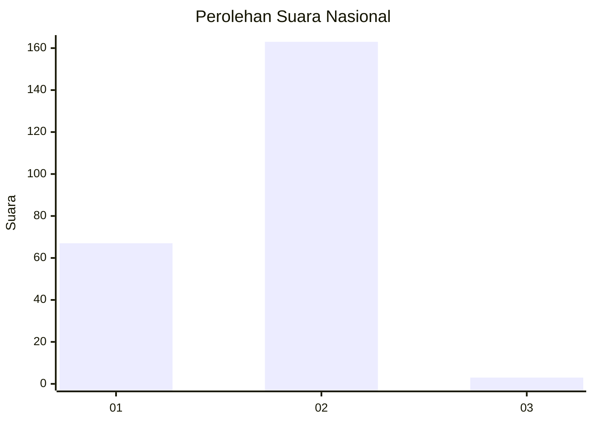
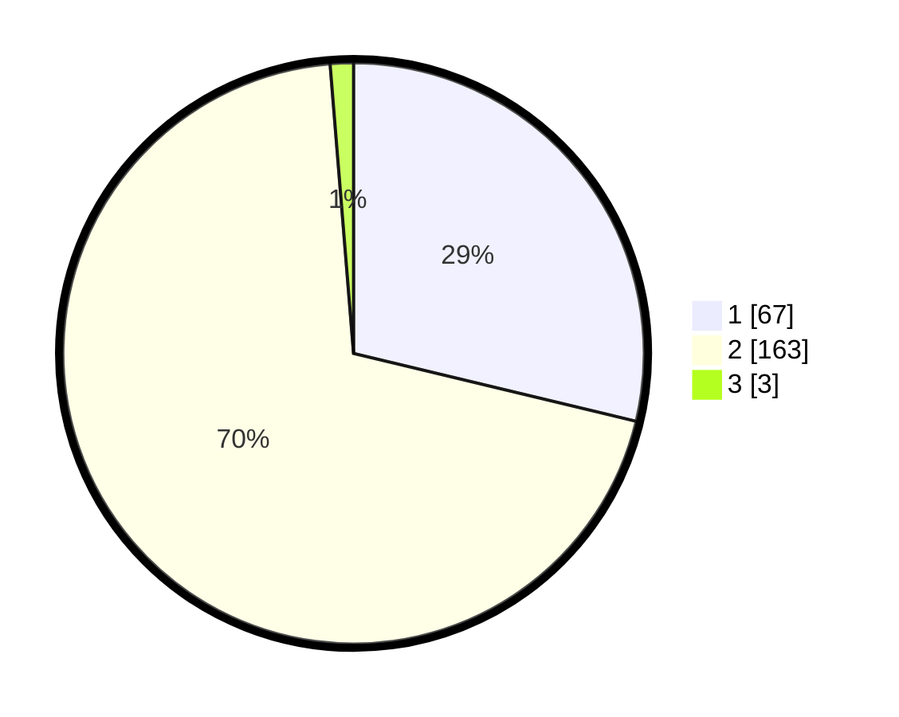

# Hasil

## Grafik

## Tabel

| No. | Nama Paslon    | Suara | Suara (raw) | Persentase |
|:--- |:-------------- | -----:| -----------:| ----------:|
| 1   | ANIES MUHAIMIN | 67    | [67][p-1]   | 28,76      |
| 2   | PRABOWO GIBRAN | 163   | [163][p-2]  | 69,96      |
| 3   | GANJAR MAHFUD  | 3     | [3][p-3]    | 1,29       |

[p-1]: https://github.com/gigit-pemilu/pemilu-2024/blob/main/pilpres/hitung-suara/sub/11-aceh/sub/74-kota-langsa/sub/05-langsa-baro/sub/2006-karang-anyar/sub/002-tps/sub/paslon-1.txt
[p-2]: https://github.com/gigit-pemilu/pemilu-2024/blob/main/pilpres/hitung-suara/sub/11-aceh/sub/74-kota-langsa/sub/05-langsa-baro/sub/2006-karang-anyar/sub/002-tps/sub/paslon-2.txt
[p-3]: https://github.com/gigit-pemilu/pemilu-2024/blob/main/pilpres/hitung-suara/sub/11-aceh/sub/74-kota-langsa/sub/05-langsa-baro/sub/2006-karang-anyar/sub/002-tps/sub/paslon-3.txt

## Foto C Plano

https://sirekap-obj-formc.kpu.go.id/8d39/pemilu/ppwp/11/74/05/20/06/1174052006002-20240220-212741--92ab97af-a36f-4cd2-80e6-56ed00b9a7e7.jpg

https://sirekap-obj-formc.kpu.go.id/8d39/pemilu/ppwp/11/74/05/20/06/1174052006002-20240220-212831--f4c7490f-ccdb-46af-8710-8deef5fb85f9.jpg

https://sirekap-obj-formc.kpu.go.id/8d39/pemilu/ppwp/11/74/05/20/06/1174052006002-20240220-212906--26b2e703-615c-488f-b96e-a8934d103d7b.jpg

## Metadata

| Key        | Value               |
| ---------- | ------------------- |
| Time Stamp | 2024-02-22 15:00:00 |

