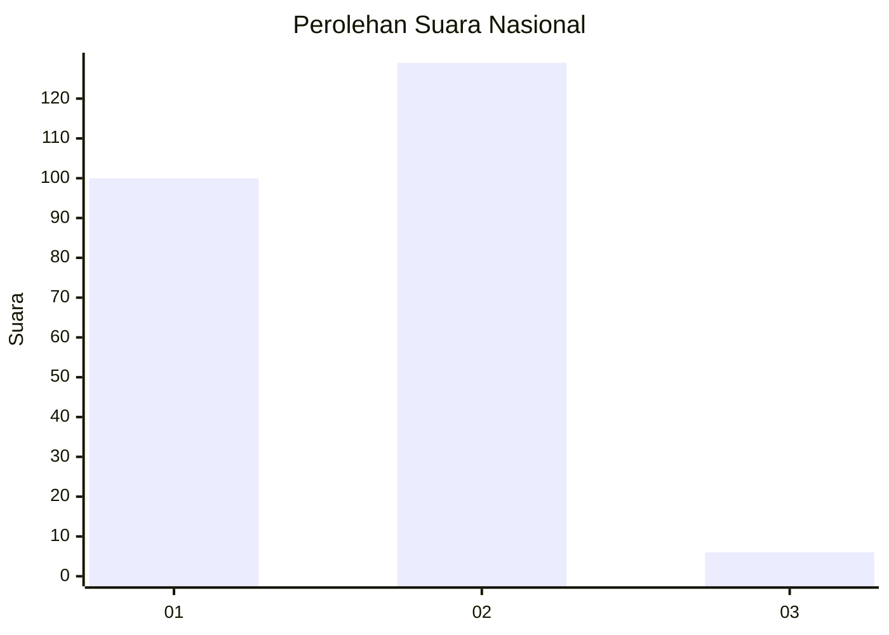
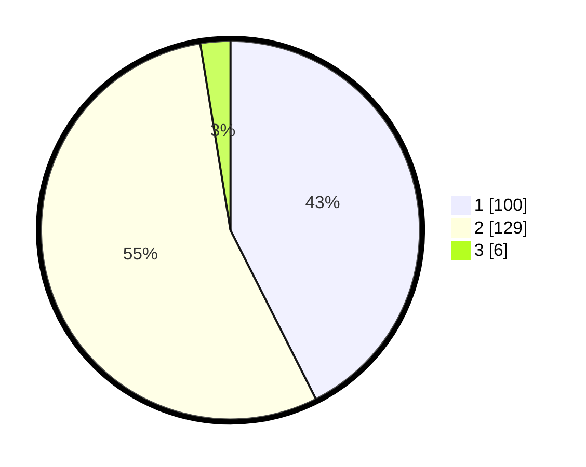

# Hasil

## Grafik

## Tabel

| No. | Nama Paslon    | Suara | Suara (raw) | Persentase |
|:--- |:-------------- | -----:| -----------:| ----------:|
| 1   | ANIES MUHAIMIN | 100   | [100][p-1]  | 42,55      |
| 2   | PRABOWO GIBRAN | 129   | [129][p-2]  | 54,89      |
| 3   | GANJAR MAHFUD  | 6     | [6][p-3]    | 2,55       |

[p-1]: https://github.com/gigit-pemilu/pemilu-2024/blob/main/pilpres/hitung-suara/sub/11-aceh/sub/74-kota-langsa/sub/05-langsa-baro/sub/2006-karang-anyar/sub/003-tps/sub/paslon-1.txt
[p-2]: https://github.com/gigit-pemilu/pemilu-2024/blob/main/pilpres/hitung-suara/sub/11-aceh/sub/74-kota-langsa/sub/05-langsa-baro/sub/2006-karang-anyar/sub/003-tps/sub/paslon-2.txt
[p-3]: https://github.com/gigit-pemilu/pemilu-2024/blob/main/pilpres/hitung-suara/sub/11-aceh/sub/74-kota-langsa/sub/05-langsa-baro/sub/2006-karang-anyar/sub/003-tps/sub/paslon-3.txt

## Foto C Plano

https://sirekap-obj-formc.kpu.go.id/b79b/pemilu/ppwp/11/74/05/20/06/1174052006003-20240220-224456--b7f20562-e169-4c76-b77d-33c2172e4c45.jpg

https://sirekap-obj-formc.kpu.go.id/b79b/pemilu/ppwp/11/74/05/20/06/1174052006003-20240220-224546--3e8b1ea0-be97-423a-88cb-e4711e019ebf.jpg

https://sirekap-obj-formc.kpu.go.id/b79b/pemilu/ppwp/11/74/05/20/06/1174052006003-20240220-224638--d7edb90b-1a40-460e-9aa8-4cef099e1e58.jpg

## Metadata

| Key        | Value               |
| ---------- | ------------------- |
| Time Stamp | 2024-02-22 15:00:00 |

