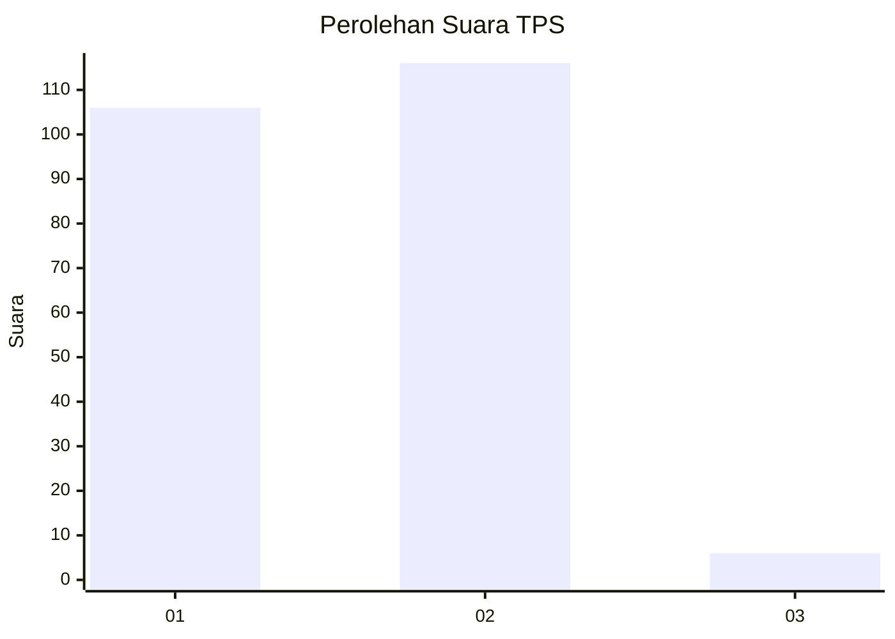
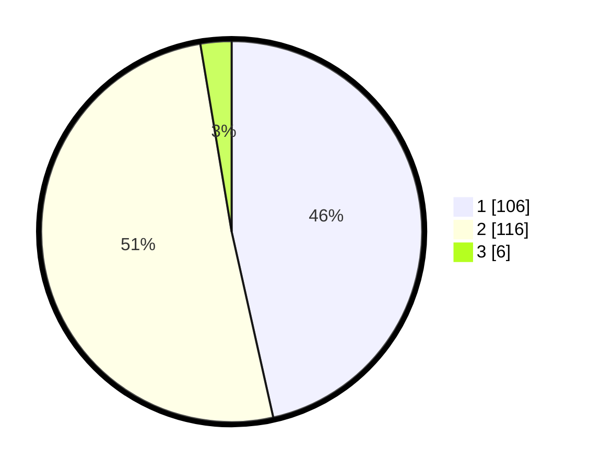

# Hasil

## Grafik

## Tabel

| No. | Nama Paslon    | Suara | Suara (raw) | Persentase |
|:--- |:-------------- | -----:| -----------:| ----------:|
| 1   | ANIES MUHAIMIN | 106   | [106][p-1]  | 46,49      |
| 2   | PRABOWO GIBRAN | 116   | [116][p-2]  | 50,88      |
| 3   | GANJAR MAHFUD  | 6     | [6][p-3]    | 2,63       |

[p-1]: https://github.com/gigit-pemilu/pemilu-2024-11-aceh/blob/main/pilpres/hitung-suara/sub/11-aceh/sub/74-kota-langsa/sub/05-langsa-baro/sub/2006-karang-anyar/sub/004-tps/sub/paslon-1.txt
[p-2]: https://github.com/gigit-pemilu/pemilu-2024-11-aceh/blob/main/pilpres/hitung-suara/sub/11-aceh/sub/74-kota-langsa/sub/05-langsa-baro/sub/2006-karang-anyar/sub/004-tps/sub/paslon-2.txt
[p-3]: https://github.com/gigit-pemilu/pemilu-2024-11-aceh/blob/main/pilpres/hitung-suara/sub/11-aceh/sub/74-kota-langsa/sub/05-langsa-baro/sub/2006-karang-anyar/sub/004-tps/sub/paslon-3.txt

## Foto C Plano

https://sirekap-obj-formc.kpu.go.id/3add/pemilu/ppwp/11/74/05/20/06/1174052006004-20240221-093548--8ab3c590-011c-4edc-911d-21b27c12d361.jpg

https://sirekap-obj-formc.kpu.go.id/3add/pemilu/ppwp/11/74/05/20/06/1174052006004-20240221-093623--36772af9-4444-4b75-85fc-b1ab8051843f.jpg

https://sirekap-obj-formc.kpu.go.id/3add/pemilu/ppwp/11/74/05/20/06/1174052006004-20240221-093652--561a3c9a-607e-4817-b733-832cd68e52fb.jpg

## Metadata

| Key        | Value               |
| ---------- | ------------------- |
| Time Stamp | 2024-02-22 15:00:00 |

