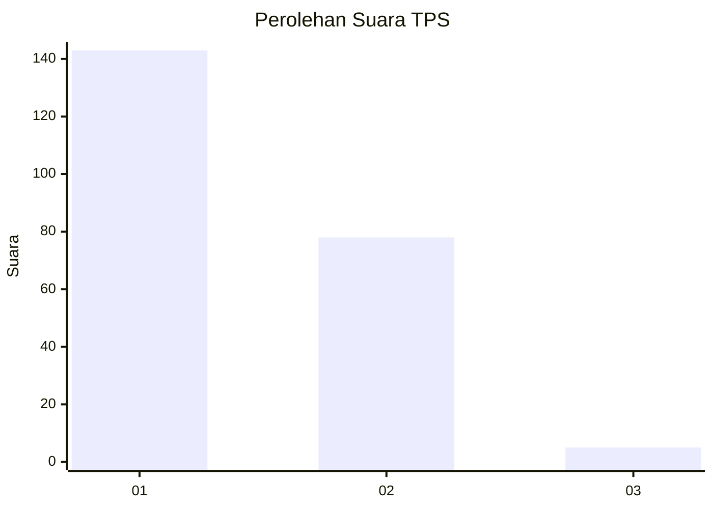
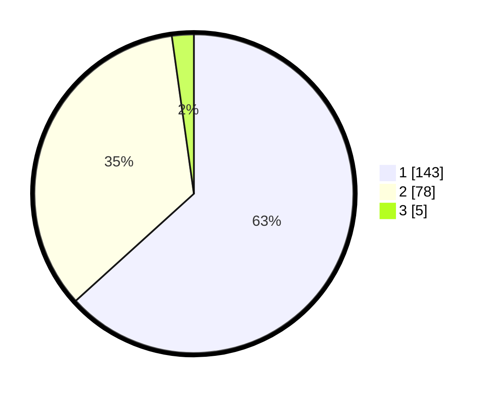

# Hasil

## Grafik

## Tabel

| No. | Nama Paslon    | Suara | Suara (raw) | Persentase |
|:--- |:-------------- | -----:| -----------:| ----------:|
| 1   | ANIES MUHAIMIN | 143   | [143][p-1]  | 63,27      |
| 2   | PRABOWO GIBRAN | 78    | [78][p-2]   | 34,51      |
| 3   | GANJAR MAHFUD  | 5     | [5][p-3]    | 2,21       |

[p-1]: https://github.com/gigit-pemilu/pemilu-2024-11-aceh/blob/main/pilpres/hitung-suara/sub/11-aceh/sub/74-kota-langsa/sub/05-langsa-baro/sub/2006-karang-anyar/sub/006-tps/sub/paslon-1.txt
[p-2]: https://github.com/gigit-pemilu/pemilu-2024-11-aceh/blob/main/pilpres/hitung-suara/sub/11-aceh/sub/74-kota-langsa/sub/05-langsa-baro/sub/2006-karang-anyar/sub/006-tps/sub/paslon-2.txt
[p-3]: https://github.com/gigit-pemilu/pemilu-2024-11-aceh/blob/main/pilpres/hitung-suara/sub/11-aceh/sub/74-kota-langsa/sub/05-langsa-baro/sub/2006-karang-anyar/sub/006-tps/sub/paslon-3.txt

## Foto C Plano

https://sirekap-obj-formc.kpu.go.id/7759/pemilu/ppwp/11/74/05/20/06/1174052006006-20240221-113417--d6f1d3af-bd2f-4f85-82bc-d3268e20e49e.jpg

https://sirekap-obj-formc.kpu.go.id/7759/pemilu/ppwp/11/74/05/20/06/1174052006006-20240221-113443--4b3455e4-a315-4615-9222-1699ee8c1048.jpg

https://sirekap-obj-formc.kpu.go.id/7759/pemilu/ppwp/11/74/05/20/06/1174052006006-20240221-113505--36a87b7c-e861-4381-b559-317df31ef743.jpg

## Metadata

| Key        | Value               |
| ---------- | ------------------- |
| Time Stamp | 2024-02-22 15:00:00 |

