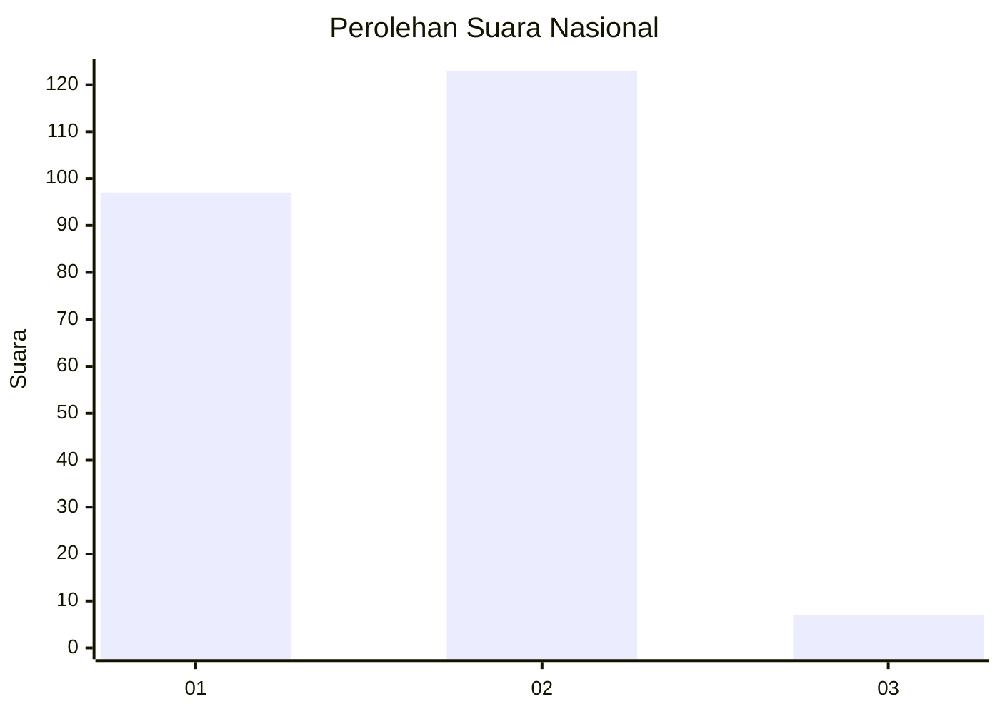
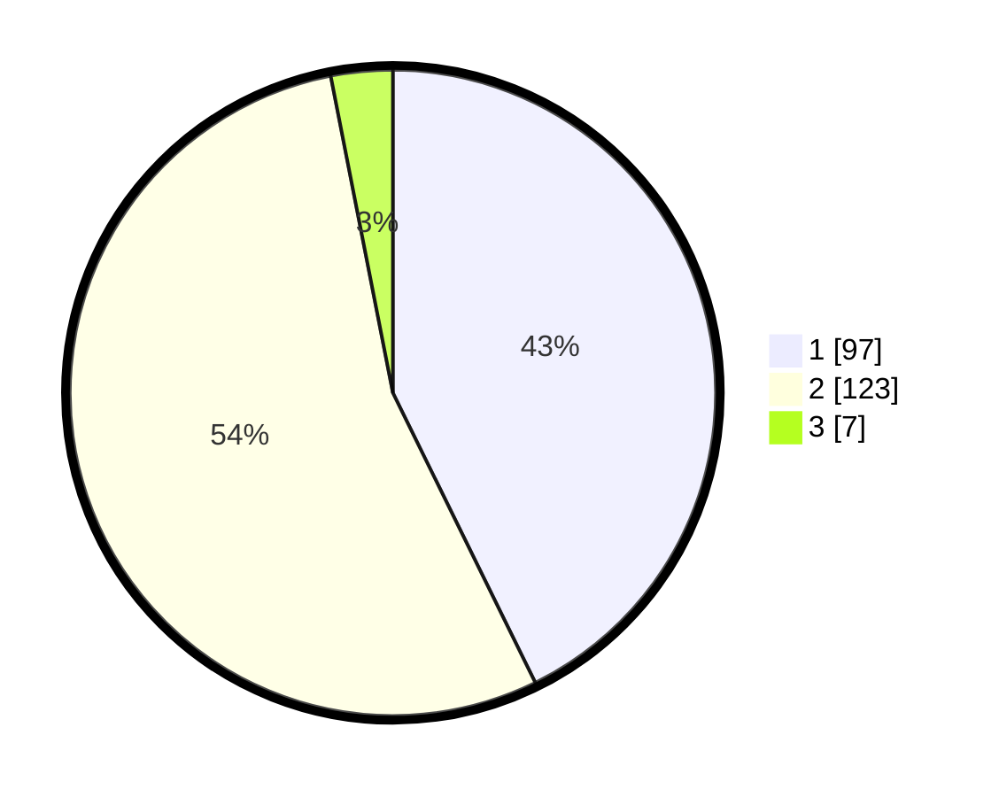

# Hasil

## Grafik

## Tabel

| No. | Nama Paslon    | Suara | Suara (raw) | Persentase |
|:--- |:-------------- | -----:| -----------:| ----------:|
| 1   | ANIES MUHAIMIN | 97    | [97][p-1]   | 42,73      |
| 2   | PRABOWO GIBRAN | 123   | [123][p-2]  | 54,19      |
| 3   | GANJAR MAHFUD  | 7     | [7][p-3]    | 3,08       |

[p-1]: https://github.com/gigit-pemilu/pemilu-2024/blob/main/pilpres/hitung-suara/sub/11-aceh/sub/74-kota-langsa/sub/05-langsa-baro/sub/2006-karang-anyar/sub/007-tps/sub/paslon-1.txt
[p-2]: https://github.com/gigit-pemilu/pemilu-2024/blob/main/pilpres/hitung-suara/sub/11-aceh/sub/74-kota-langsa/sub/05-langsa-baro/sub/2006-karang-anyar/sub/007-tps/sub/paslon-2.txt
[p-3]: https://github.com/gigit-pemilu/pemilu-2024/blob/main/pilpres/hitung-suara/sub/11-aceh/sub/74-kota-langsa/sub/05-langsa-baro/sub/2006-karang-anyar/sub/007-tps/sub/paslon-3.txt

## Foto C Plano

https://sirekap-obj-formc.kpu.go.id/1142/pemilu/ppwp/11/74/05/20/06/1174052006007-20240221-122736--5d4d89e2-acf4-4887-b150-4e30628fac0b.jpg

https://sirekap-obj-formc.kpu.go.id/1142/pemilu/ppwp/11/74/05/20/06/1174052006007-20240221-122758--1f311d24-2ff2-4e27-89d8-e87548fb7712.jpg

https://sirekap-obj-formc.kpu.go.id/1142/pemilu/ppwp/11/74/05/20/06/1174052006007-20240221-122820--3fe25b25-55ce-49bf-8229-b83f1e56e5ca.jpg

## Metadata

| Key        | Value               |
| ---------- | ------------------- |
| Time Stamp | 2024-02-22 15:00:00 |

