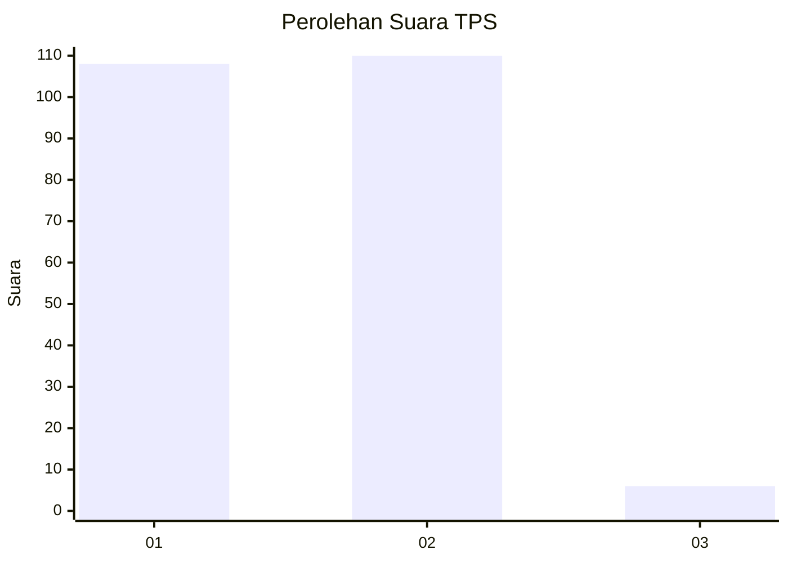
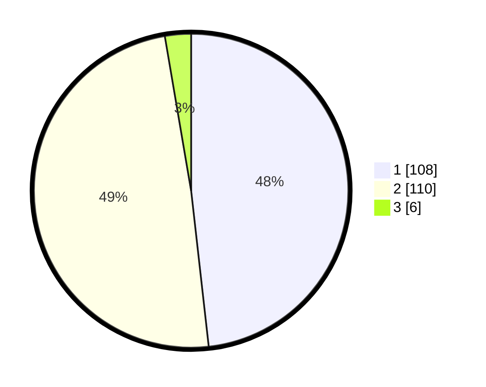

# Hasil

## Grafik

## Tabel

| No. | Nama Paslon    | Suara | Suara (raw) | Persentase |
|:--- |:-------------- | -----:| -----------:| ----------:|
| 1   | ANIES MUHAIMIN | 108   | [108][p-1]  | 48,21      |
| 2   | PRABOWO GIBRAN | 110   | [110][p-2]  | 49,11      |
| 3   | GANJAR MAHFUD  | 6     | [6][p-3]    | 2,68       |

[p-1]: https://github.com/gigit-pemilu/pemilu-2024-11-aceh/blob/main/pilpres/hitung-suara/sub/11-aceh/sub/74-kota-langsa/sub/05-langsa-baro/sub/2006-karang-anyar/sub/008-tps/sub/paslon-1.txt
[p-2]: https://github.com/gigit-pemilu/pemilu-2024-11-aceh/blob/main/pilpres/hitung-suara/sub/11-aceh/sub/74-kota-langsa/sub/05-langsa-baro/sub/2006-karang-anyar/sub/008-tps/sub/paslon-2.txt
[p-3]: https://github.com/gigit-pemilu/pemilu-2024-11-aceh/blob/main/pilpres/hitung-suara/sub/11-aceh/sub/74-kota-langsa/sub/05-langsa-baro/sub/2006-karang-anyar/sub/008-tps/sub/paslon-3.txt

## Foto C Plano

https://sirekap-obj-formc.kpu.go.id/1b44/pemilu/ppwp/11/74/05/20/06/1174052006008-20240221-135927--d244d55b-104d-4aa8-9912-3fa2f4f5b575.jpg

https://sirekap-obj-formc.kpu.go.id/1b44/pemilu/ppwp/11/74/05/20/06/1174052006008-20240221-140057--1a897854-72c9-4b23-ae47-83a3defa87f1.jpg

https://sirekap-obj-formc.kpu.go.id/1b44/pemilu/ppwp/11/74/05/20/06/1174052006008-20240221-140156--03c4b2d1-a568-434d-a365-eed86c125467.jpg

## Metadata

| Key        | Value               |
| ---------- | ------------------- |
| Time Stamp | 2024-02-22 15:00:00 |

