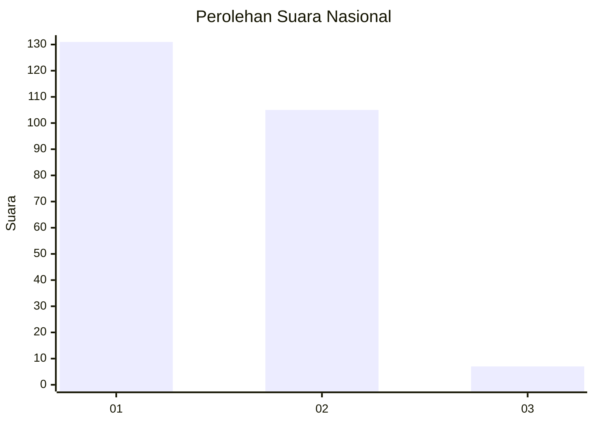
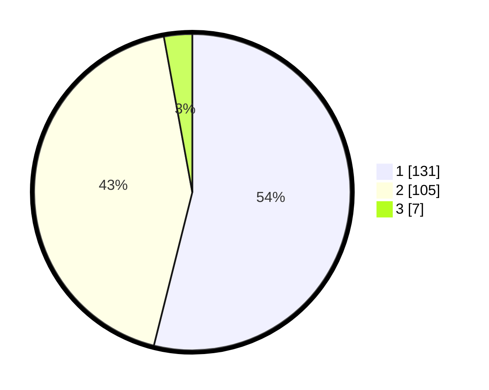

# Hasil

## Grafik

## Tabel

| No. | Nama Paslon    | Suara | Suara (raw) | Persentase |
|:--- |:-------------- | -----:| -----------:| ----------:|
| 1   | ANIES MUHAIMIN | 131   | [131][p-1]  | 53,91      |
| 2   | PRABOWO GIBRAN | 105   | [105][p-2]  | 43,21      |
| 3   | GANJAR MAHFUD  | 7     | [7][p-3]    | 2,88       |

[p-1]: https://github.com/gigit-pemilu/pemilu-2024/blob/main/pilpres/hitung-suara/sub/11-aceh/sub/74-kota-langsa/sub/05-langsa-baro/sub/2006-karang-anyar/sub/009-tps/sub/paslon-1.txt
[p-2]: https://github.com/gigit-pemilu/pemilu-2024/blob/main/pilpres/hitung-suara/sub/11-aceh/sub/74-kota-langsa/sub/05-langsa-baro/sub/2006-karang-anyar/sub/009-tps/sub/paslon-2.txt
[p-3]: https://github.com/gigit-pemilu/pemilu-2024/blob/main/pilpres/hitung-suara/sub/11-aceh/sub/74-kota-langsa/sub/05-langsa-baro/sub/2006-karang-anyar/sub/009-tps/sub/paslon-3.txt

## Foto C Plano

https://sirekap-obj-formc.kpu.go.id/8c94/pemilu/ppwp/11/74/05/20/06/1174052006009-20240221-153831--a5bdd6db-d721-4349-9c52-6eb931e23357.jpg

https://sirekap-obj-formc.kpu.go.id/8c94/pemilu/ppwp/11/74/05/20/06/1174052006009-20240221-153913--5e3b8d7b-d3fb-4dc8-9de8-c942122e7066.jpg

https://sirekap-obj-formc.kpu.go.id/8c94/pemilu/ppwp/11/74/05/20/06/1174052006009-20240221-153942--cd560945-4329-4899-b00d-b99e76d9051a.jpg

## Metadata

| Key        | Value               |
| ---------- | ------------------- |
| Time Stamp | 2024-02-22 15:00:00 |

