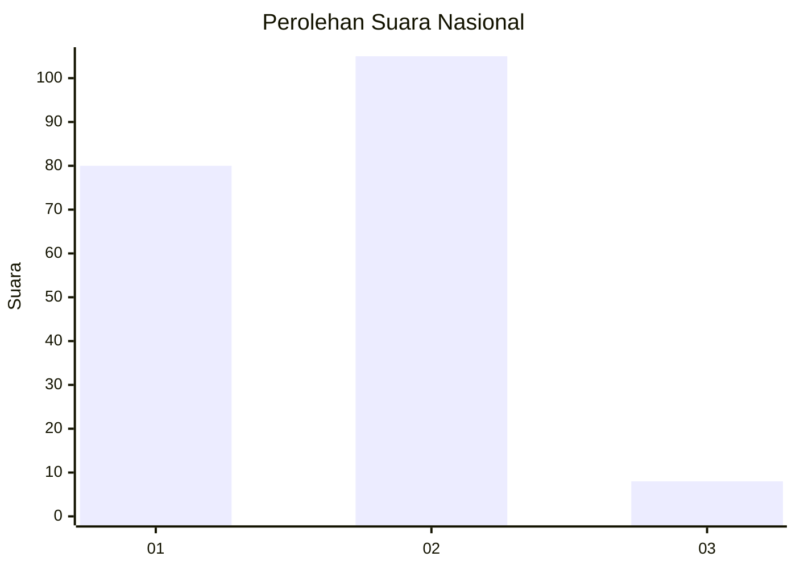
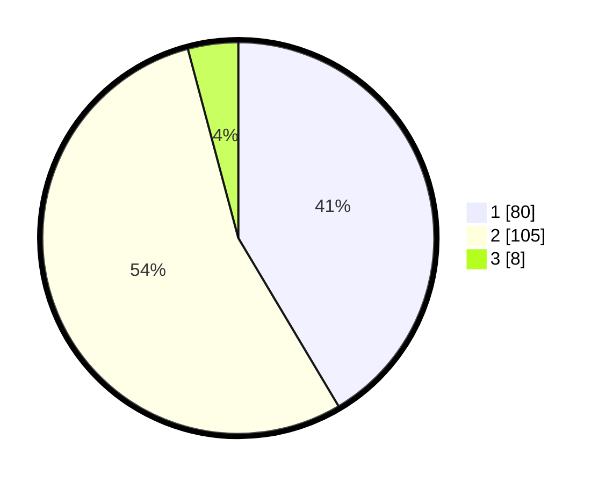

# Hasil

## Grafik

## Tabel

| No. | Nama Paslon    | Suara | Suara (raw) | Persentase |
|:--- |:-------------- | -----:| -----------:| ----------:|
| 1   | ANIES MUHAIMIN | 80    | [80][p-1]   | 41,45      |
| 2   | PRABOWO GIBRAN | 105   | [105][p-2]  | 54,40      |
| 3   | GANJAR MAHFUD  | 8     | [8][p-3]    | 4,15       |

[p-1]: https://github.com/gigit-pemilu/pemilu-2024/blob/main/pilpres/hitung-suara/sub/11-aceh/sub/74-kota-langsa/sub/05-langsa-baro/sub/2006-karang-anyar/sub/010-tps/sub/paslon-1.txt
[p-2]: https://github.com/gigit-pemilu/pemilu-2024/blob/main/pilpres/hitung-suara/sub/11-aceh/sub/74-kota-langsa/sub/05-langsa-baro/sub/2006-karang-anyar/sub/010-tps/sub/paslon-2.txt
[p-3]: https://github.com/gigit-pemilu/pemilu-2024/blob/main/pilpres/hitung-suara/sub/11-aceh/sub/74-kota-langsa/sub/05-langsa-baro/sub/2006-karang-anyar/sub/010-tps/sub/paslon-3.txt

## Foto C Plano

https://sirekap-obj-formc.kpu.go.id/c33c/pemilu/ppwp/11/74/05/20/06/1174052006010-20240221-174214--b1bb3877-803f-4367-9f0e-b70e25312703.jpg

https://sirekap-obj-formc.kpu.go.id/c33c/pemilu/ppwp/11/74/05/20/06/1174052006010-20240221-174246--488c1453-4def-4cb8-be92-d6261939d59b.jpg

https://sirekap-obj-formc.kpu.go.id/c33c/pemilu/ppwp/11/74/05/20/06/1174052006010-20240221-174313--83091d20-cff9-423b-8115-4e3ce2eba8a3.jpg

## Metadata

| Key        | Value               |
| ---------- | ------------------- |
| Time Stamp | 2024-02-22 15:00:00 |

