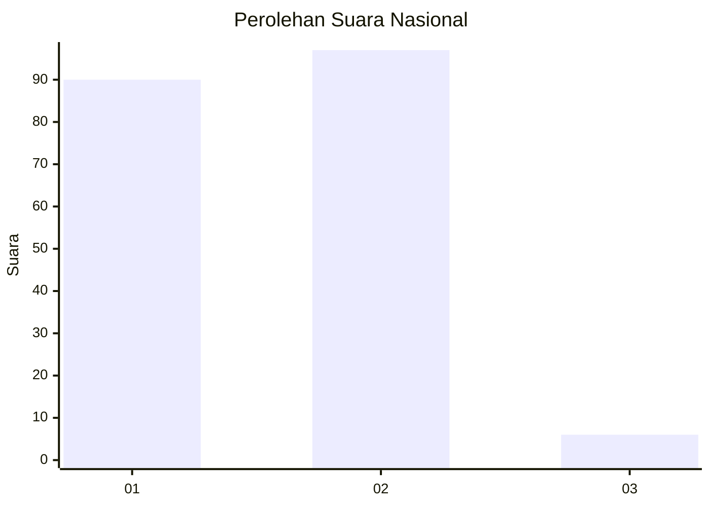
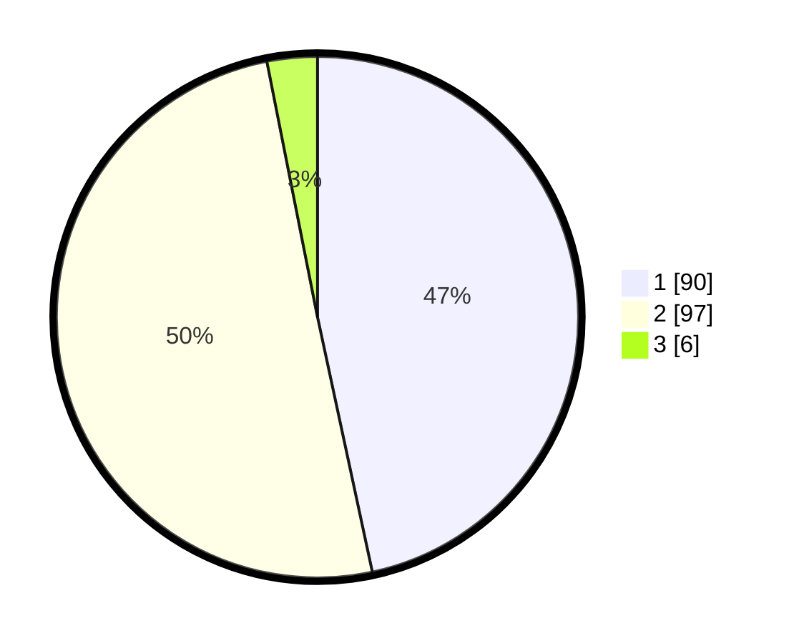

# Hasil

## Grafik

## Tabel

| No. | Nama Paslon    | Suara | Suara (raw) | Persentase |
|:--- |:-------------- | -----:| -----------:| ----------:|
| 1   | ANIES MUHAIMIN | 90    | [90][p-1]   | 46,63      |
| 2   | PRABOWO GIBRAN | 97    | [97][p-2]   | 50,26      |
| 3   | GANJAR MAHFUD  | 6     | [6][p-3]    | 3,11       |

[p-1]: https://github.com/gigit-pemilu/pemilu-2024/blob/main/pilpres/hitung-suara/sub/11-aceh/sub/74-kota-langsa/sub/05-langsa-baro/sub/2006-karang-anyar/sub/011-tps/sub/paslon-1.txt
[p-2]: https://github.com/gigit-pemilu/pemilu-2024/blob/main/pilpres/hitung-suara/sub/11-aceh/sub/74-kota-langsa/sub/05-langsa-baro/sub/2006-karang-anyar/sub/011-tps/sub/paslon-2.txt
[p-3]: https://github.com/gigit-pemilu/pemilu-2024/blob/main/pilpres/hitung-suara/sub/11-aceh/sub/74-kota-langsa/sub/05-langsa-baro/sub/2006-karang-anyar/sub/011-tps/sub/paslon-3.txt

## Foto C Plano

https://sirekap-obj-formc.kpu.go.id/ab6a/pemilu/ppwp/11/74/05/20/06/1174052006011-20240221-182129--e61fd9bd-3558-47e1-b88e-991cd3a7faab.jpg

https://sirekap-obj-formc.kpu.go.id/ab6a/pemilu/ppwp/11/74/05/20/06/1174052006011-20240221-182223--add31308-a6ed-49aa-96f6-9d614ea90d84.jpg

https://sirekap-obj-formc.kpu.go.id/ab6a/pemilu/ppwp/11/74/05/20/06/1174052006011-20240221-182248--735a2c93-c02c-415f-9e68-d88bad423b33.jpg

## Metadata

| Key        | Value               |
| ---------- | ------------------- |
| Time Stamp | 2024-02-22 15:00:00 |

