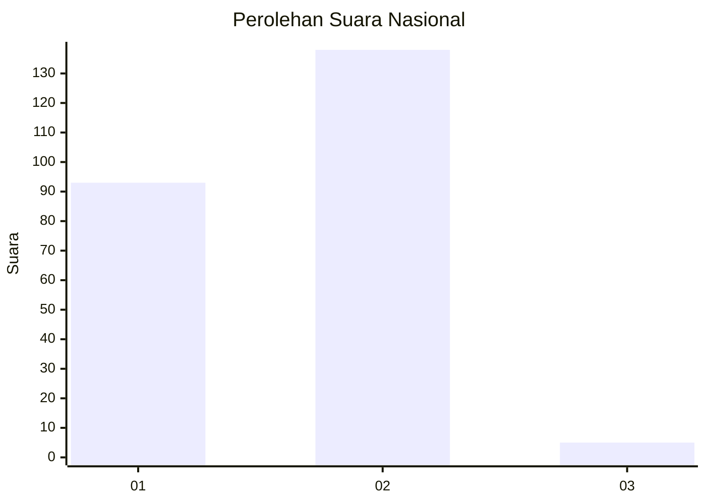
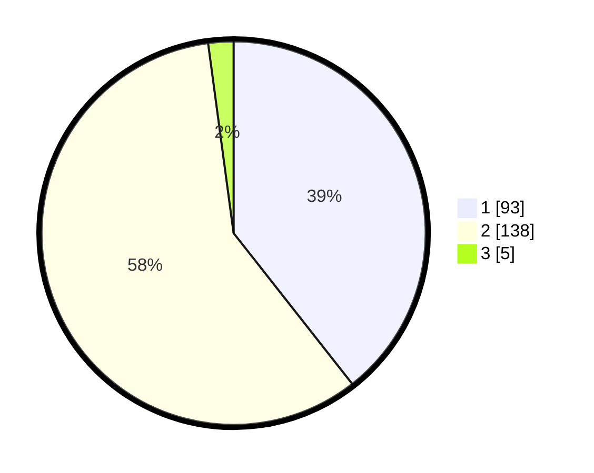

# Hasil

## Grafik

## Tabel

| No. | Nama Paslon    | Suara | Suara (raw) | Persentase |
|:--- |:-------------- | -----:| -----------:| ----------:|
| 1   | ANIES MUHAIMIN | 93    | [93][p-1]   | 39,41      |
| 2   | PRABOWO GIBRAN | 138   | [138][p-2]  | 58,47      |
| 3   | GANJAR MAHFUD  | 5     | [5][p-3]    | 2,12       |

[p-1]: https://github.com/gigit-pemilu/pemilu-2024/blob/main/pilpres/hitung-suara/sub/11-aceh/sub/74-kota-langsa/sub/05-langsa-baro/sub/2006-karang-anyar/sub/012-tps/sub/paslon-1.txt
[p-2]: https://github.com/gigit-pemilu/pemilu-2024/blob/main/pilpres/hitung-suara/sub/11-aceh/sub/74-kota-langsa/sub/05-langsa-baro/sub/2006-karang-anyar/sub/012-tps/sub/paslon-2.txt
[p-3]: https://github.com/gigit-pemilu/pemilu-2024/blob/main/pilpres/hitung-suara/sub/11-aceh/sub/74-kota-langsa/sub/05-langsa-baro/sub/2006-karang-anyar/sub/012-tps/sub/paslon-3.txt

## Foto C Plano

https://sirekap-obj-formc.kpu.go.id/4811/pemilu/ppwp/11/74/05/20/06/1174052006012-20240221-170416--e16401b2-1ed0-480e-ab1a-e46432407c2a.jpg

https://sirekap-obj-formc.kpu.go.id/4811/pemilu/ppwp/11/74/05/20/06/1174052006012-20240221-170513--3854de5a-4261-4b52-9e06-61ae4b01e589.jpg

https://sirekap-obj-formc.kpu.go.id/4811/pemilu/ppwp/11/74/05/20/06/1174052006012-20240221-170538--57d69d3a-b6f5-4f65-a916-499d4d60a32d.jpg

## Metadata

| Key        | Value               |
| ---------- | ------------------- |
| Time Stamp | 2024-02-22 15:00:00 |

