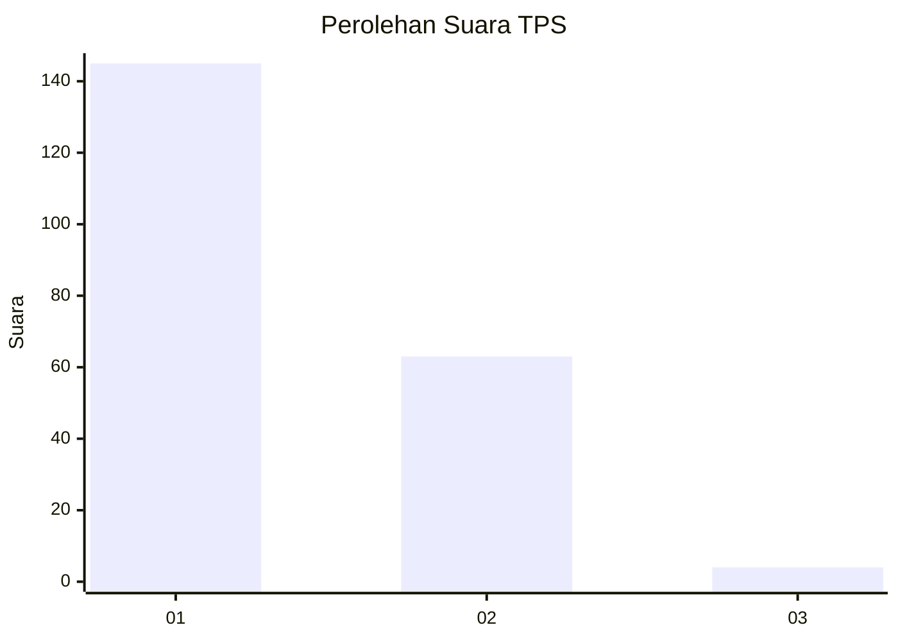
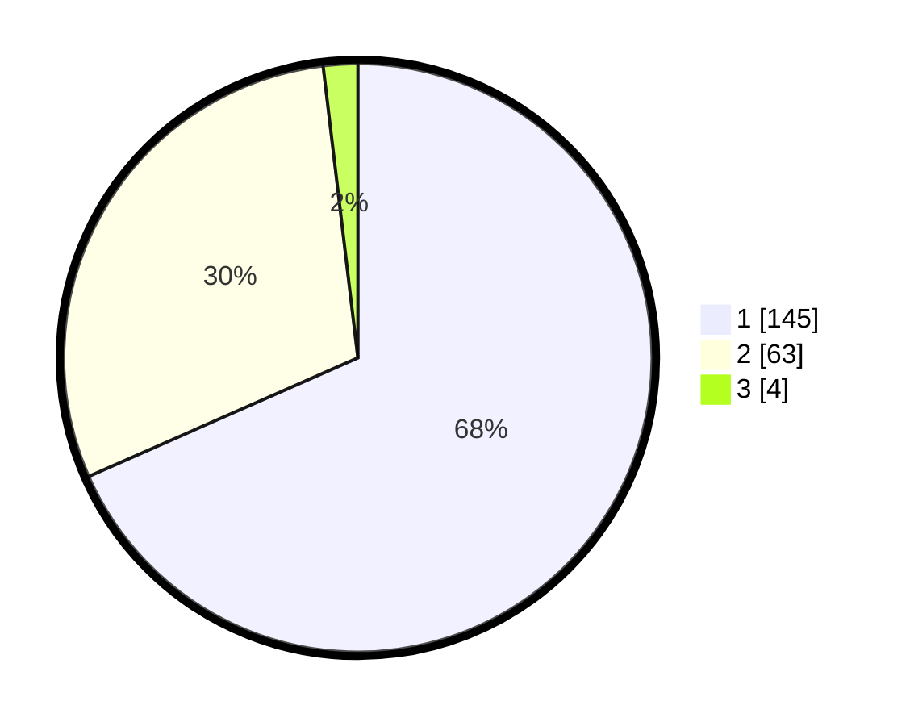

# Hasil

## Grafik

## Tabel

| No. | Nama Paslon    | Suara | Suara (raw) | Persentase |
|:--- |:-------------- | -----:| -----------:| ----------:|
| 1   | ANIES MUHAIMIN | 145   | [145][p-1]  | 68,40      |
| 2   | PRABOWO GIBRAN | 63    | [63][p-2]   | 29,72      |
| 3   | GANJAR MAHFUD  | 4     | [4][p-3]    | 1,89       |

[p-1]: https://github.com/gigit-pemilu/pemilu-2024-11-aceh/blob/main/pilpres/hitung-suara/sub/11-aceh/sub/74-kota-langsa/sub/05-langsa-baro/sub/2007-paya-bujok-tunong/sub/012-tps/sub/paslon-1.txt
[p-2]: https://github.com/gigit-pemilu/pemilu-2024-11-aceh/blob/main/pilpres/hitung-suara/sub/11-aceh/sub/74-kota-langsa/sub/05-langsa-baro/sub/2007-paya-bujok-tunong/sub/012-tps/sub/paslon-2.txt
[p-3]: https://github.com/gigit-pemilu/pemilu-2024-11-aceh/blob/main/pilpres/hitung-suara/sub/11-aceh/sub/74-kota-langsa/sub/05-langsa-baro/sub/2007-paya-bujok-tunong/sub/012-tps/sub/paslon-3.txt

## Foto C Plano

https://sirekap-obj-formc.kpu.go.id/3bd5/pemilu/ppwp/11/74/05/20/07/1174052007012-20240224-165103--2c043d10-8f71-4eac-95a6-31cc7d607203.jpg

https://sirekap-obj-formc.kpu.go.id/3bd5/pemilu/ppwp/11/74/05/20/07/1174052007012-20240224-221518--6756f732-254f-4c7d-8d17-ff9c8759c9f0.jpg

https://sirekap-obj-formc.kpu.go.id/3bd5/pemilu/ppwp/11/74/05/20/07/1174052007012-20240224-221716--6a062bca-e698-4f19-ad3f-059f30449c26.jpg

## Metadata

| Key        | Value               |
| ---------- | ------------------- |
| Time Stamp | 2024-02-25 17:00:00 |

