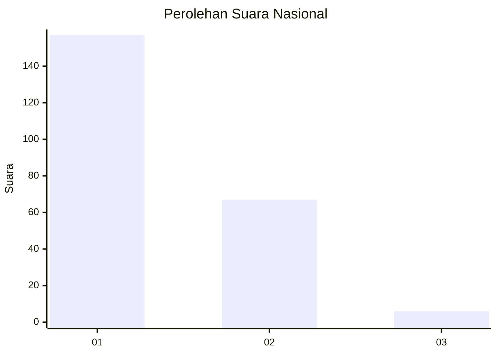
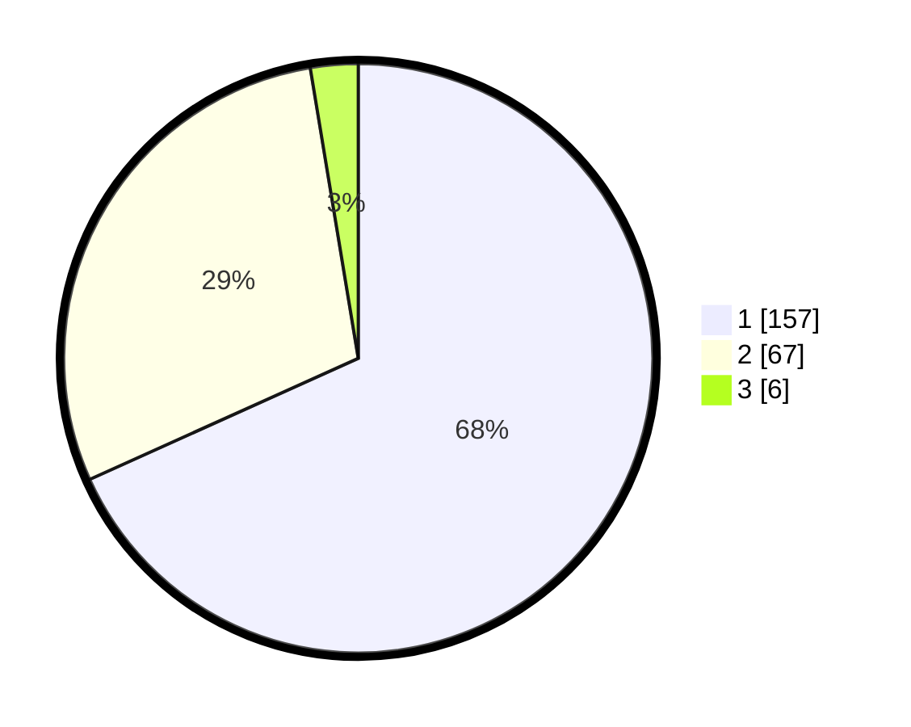

# Hasil

## Grafik

## Tabel

| No. | Nama Paslon    | Suara | Suara (raw) | Persentase |
|:--- |:-------------- | -----:| -----------:| ----------:|
| 1   | ANIES MUHAIMIN | 157   | [157][p-1]  | 68,26      |
| 2   | PRABOWO GIBRAN | 67    | [67][p-2]   | 29,13      |
| 3   | GANJAR MAHFUD  | 6     | [6][p-3]    | 2,61       |

[p-1]: https://github.com/gigit-pemilu/pemilu-2024/blob/main/pilpres/hitung-suara/sub/11-aceh/sub/74-kota-langsa/sub/05-langsa-baro/sub/2007-paya-bujok-tunong/sub/013-tps/sub/paslon-1.txt
[p-2]: https://github.com/gigit-pemilu/pemilu-2024/blob/main/pilpres/hitung-suara/sub/11-aceh/sub/74-kota-langsa/sub/05-langsa-baro/sub/2007-paya-bujok-tunong/sub/013-tps/sub/paslon-2.txt
[p-3]: https://github.com/gigit-pemilu/pemilu-2024/blob/main/pilpres/hitung-suara/sub/11-aceh/sub/74-kota-langsa/sub/05-langsa-baro/sub/2007-paya-bujok-tunong/sub/013-tps/sub/paslon-3.txt

## Foto C Plano

https://sirekap-obj-formc.kpu.go.id/296d/pemilu/ppwp/11/74/05/20/07/1174052007013-20240227-230022--a9914b8d-e27f-4d98-864a-bc77bae3c988.jpg

https://sirekap-obj-formc.kpu.go.id/296d/pemilu/ppwp/11/74/05/20/07/1174052007013-20240227-231925--e9da6f7c-4047-4bc9-8e47-ffd05e77b6ad.jpg

https://sirekap-obj-formc.kpu.go.id/296d/pemilu/ppwp/11/74/05/20/07/1174052007013-20240227-231631--4ca0418b-a347-4678-b6b2-5c1354811757.jpg

## Metadata

| Key        | Value               |
| ---------- | ------------------- |
| Time Stamp | 2024-02-28 00:00:00 |

## DATA PEMILIH TETAP

Jumlah pemilih dalam DPT: **295**.
 * L: **134**.
 * P: **161**.

## DATA PENGGUNA HAK PILIH

Jumlah pengguna hak pilih dalam DPT: **224**.
 * L: **97**.
 * P: **127**.

Jumlah pengguna hak pilih dalam DPTb: **224**.
 * L: **97**.
 * P: **127**.

Jumlah pengguna hak pilih dalam DPK: **0**.
 * L: **0**.
 * P: **0**.

Jumlah pengguna hak pilih: **224**.
 * L: **97**.
 * P: **127**.

## JUMLAH SUARA SAH DAN TIDAK SAH

JUMLAH SELURUH SUARA SAH: **24**.

JUMLAH SUARA TIDAK SAH: **47**.

JUMLAH SELURUH SUARA SAH DAN SUARA TIDAK SAH: **224**.

