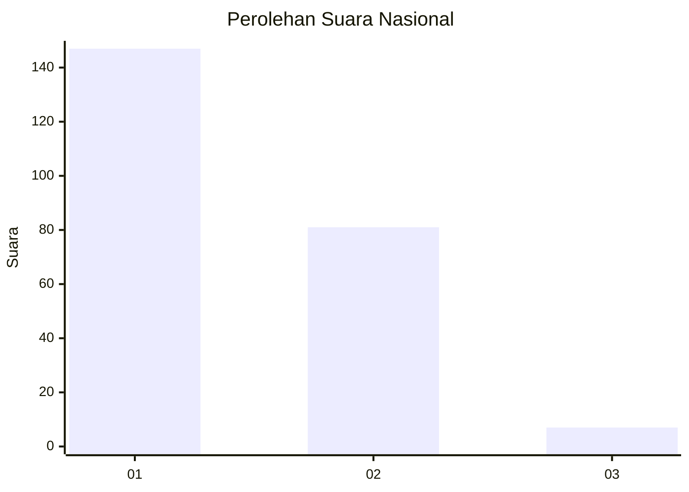
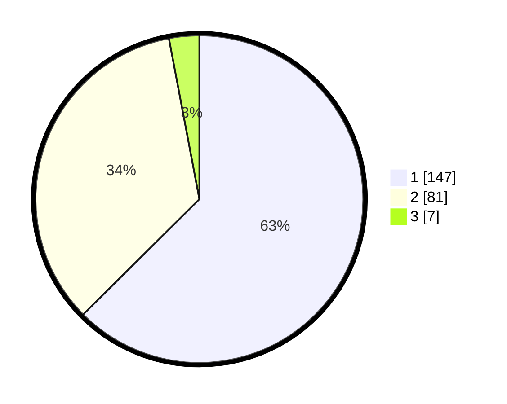

# Hasil

## Grafik

## Tabel

| No. | Nama Paslon    | Suara | Suara (raw) | Persentase |
|:--- |:-------------- | -----:| -----------:| ----------:|
| 1   | ANIES MUHAIMIN | 147   | [147][p-1]  | 62,55      |
| 2   | PRABOWO GIBRAN | 81    | [81][p-2]   | 34,47      |
| 3   | GANJAR MAHFUD  | 7     | [7][p-3]    | 2,98       |

[p-1]: https://github.com/gigit-pemilu/pemilu-2024/blob/main/pilpres/hitung-suara/sub/11-aceh/sub/74-kota-langsa/sub/05-langsa-baro/sub/2007-paya-bujok-tunong/sub/016-tps/sub/paslon-1.txt
[p-2]: https://github.com/gigit-pemilu/pemilu-2024/blob/main/pilpres/hitung-suara/sub/11-aceh/sub/74-kota-langsa/sub/05-langsa-baro/sub/2007-paya-bujok-tunong/sub/016-tps/sub/paslon-2.txt
[p-3]: https://github.com/gigit-pemilu/pemilu-2024/blob/main/pilpres/hitung-suara/sub/11-aceh/sub/74-kota-langsa/sub/05-langsa-baro/sub/2007-paya-bujok-tunong/sub/016-tps/sub/paslon-3.txt

## Foto C Plano

https://sirekap-obj-formc.kpu.go.id/1e5f/pemilu/ppwp/11/74/05/20/07/1174052007016-20240228-215423--33122e7f-c2b0-4ca7-9a34-675515d31ee0.jpg

https://sirekap-obj-formc.kpu.go.id/1e5f/pemilu/ppwp/11/74/05/20/07/1174052007016-20240228-215853--8df03245-3b11-43f6-9759-bc9d572a67a5.jpg

https://sirekap-obj-formc.kpu.go.id/1e5f/pemilu/ppwp/11/74/05/20/07/1174052007016-20240228-220134--d52e08b1-fab3-4105-8791-6f2c962acb9a.jpg

## Metadata

| Key        | Value               |
| ---------- | ------------------- |
| Time Stamp | 2024-03-10 23:00:00 |

## DATA PEMILIH TETAP

Jumlah pemilih dalam DPT: **0**.
 * L: **0**.
 * P: **0**.

## DATA PENGGUNA HAK PILIH

Jumlah pengguna hak pilih dalam DPT: **0**.
 * L: **0**.
 * P: **0**.

Jumlah pengguna hak pilih dalam DPTb: **240**.
 * L: **127**.
 * P: **353**.

Jumlah pengguna hak pilih dalam DPK: **523**.
 * L: **550**.
 * P: **505**.

Jumlah pengguna hak pilih: **22**.
 * L: **55**.
 * P: **52**.

## JUMLAH SUARA SAH DAN TIDAK SAH

JUMLAH SELURUH SUARA SAH: **235**.

JUMLAH SUARA TIDAK SAH: **11**.

JUMLAH SELURUH SUARA SAH DAN SUARA TIDAK SAH: **246**.

