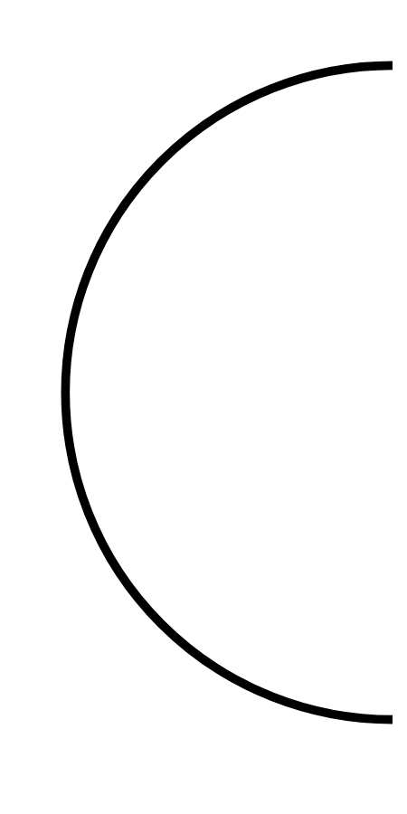

# Hasil

## Grafik

```mermaid
xychart-beta
    title "Perolehan Suara Nasional"
    x-axis []
    y-axis "Suara" 0 --> 0
    bar []
```



## Tabel

| No. | Nama Paslon | Suara | Suara (raw) | Persentase |
|:--- |:----------- | -----:| -----------:| ----------:|


[p-1]: https://github.com/gigit-pemilu/pemilu-2024/blob/main/pilpres/hitung-suara/sub/11-aceh/sub/74-kota-langsa/sub/05-langsa-baro/sub/2007-paya-bujok-tunong/sub/017-tps/sub/paslon-1.txt
[p-2]: https://github.com/gigit-pemilu/pemilu-2024/blob/main/pilpres/hitung-suara/sub/11-aceh/sub/74-kota-langsa/sub/05-langsa-baro/sub/2007-paya-bujok-tunong/sub/017-tps/sub/paslon-2.txt
[p-3]: https://github.com/gigit-pemilu/pemilu-2024/blob/main/pilpres/hitung-suara/sub/11-aceh/sub/74-kota-langsa/sub/05-langsa-baro/sub/2007-paya-bujok-tunong/sub/017-tps/sub/paslon-3.txt

## Foto C Plano

https://sirekap-obj-formc.kpu.go.id/2651/pemilu/ppwp/11/74/05/20/07/1174052007017-20240228-145723--04760a96-242a-4cbe-b64b-6e839b0e9881.jpg

https://sirekap-obj-formc.kpu.go.id/2651/pemilu/ppwp/11/74/05/20/07/1174052007017-20240228-144942--a5eea756-9b11-4f28-a08e-446049d8f7b8.jpg

https://sirekap-obj-formc.kpu.go.id/2651/pemilu/ppwp/11/74/05/20/07/1174052007017-20240228-150347--cb944156-c5b6-4c61-95f0-d2c9e6f4a9a4.jpg


## Metadata

| Key        | Value               |
| ---------- | ------------------- |
| Time Stamp | 2024-02-28 16:00:00 |


