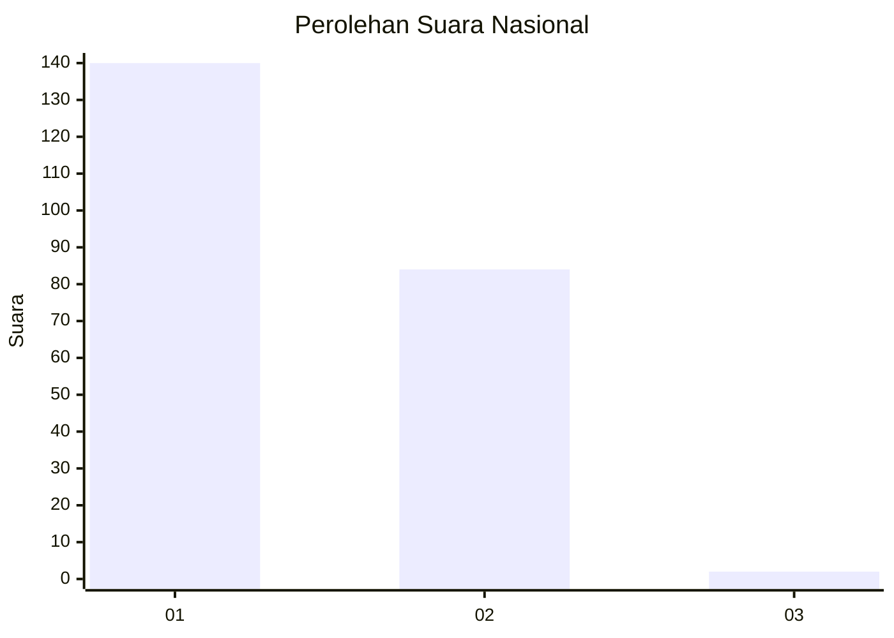
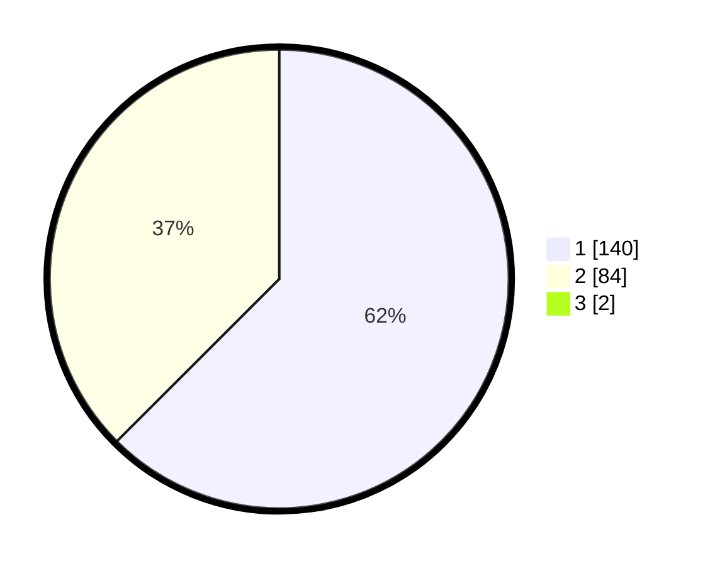

# Hasil

## Grafik

## Tabel

| No. | Nama Paslon    | Suara | Suara (raw) | Persentase |
|:--- |:-------------- | -----:| -----------:| ----------:|
| 1   | ANIES MUHAIMIN | 140   | [140][p-1]  | 61,95      |
| 2   | PRABOWO GIBRAN | 84    | [84][p-2]   | 37,17      |
| 3   | GANJAR MAHFUD  | 2     | [2][p-3]    | 0,88       |

[p-1]: https://github.com/gigit-pemilu/pemilu-2024/blob/main/pilpres/hitung-suara/sub/11-aceh/sub/74-kota-langsa/sub/05-langsa-baro/sub/2008-geudubang-jawa/sub/004-tps/sub/paslon-1.txt
[p-2]: https://github.com/gigit-pemilu/pemilu-2024/blob/main/pilpres/hitung-suara/sub/11-aceh/sub/74-kota-langsa/sub/05-langsa-baro/sub/2008-geudubang-jawa/sub/004-tps/sub/paslon-2.txt
[p-3]: https://github.com/gigit-pemilu/pemilu-2024/blob/main/pilpres/hitung-suara/sub/11-aceh/sub/74-kota-langsa/sub/05-langsa-baro/sub/2008-geudubang-jawa/sub/004-tps/sub/paslon-3.txt

## Foto C Plano

https://sirekap-obj-formc.kpu.go.id/5783/pemilu/ppwp/11/74/05/20/08/1174052008004-20240215-023343--ce7e431e-a252-474c-bb8f-78d6b653cc21.jpg

https://sirekap-obj-formc.kpu.go.id/5783/pemilu/ppwp/11/74/05/20/08/1174052008004-20240215-023132--080730f6-9f73-4c76-b384-779f703dcbde.jpg

https://sirekap-obj-formc.kpu.go.id/5783/pemilu/ppwp/11/74/05/20/08/1174052008004-20240215-023237--87627c5b-a84b-4959-a469-0f333d354733.jpg

## Metadata

| Key        | Value               |
| ---------- | ------------------- |
| Time Stamp | 2024-02-15 15:30:25 |

