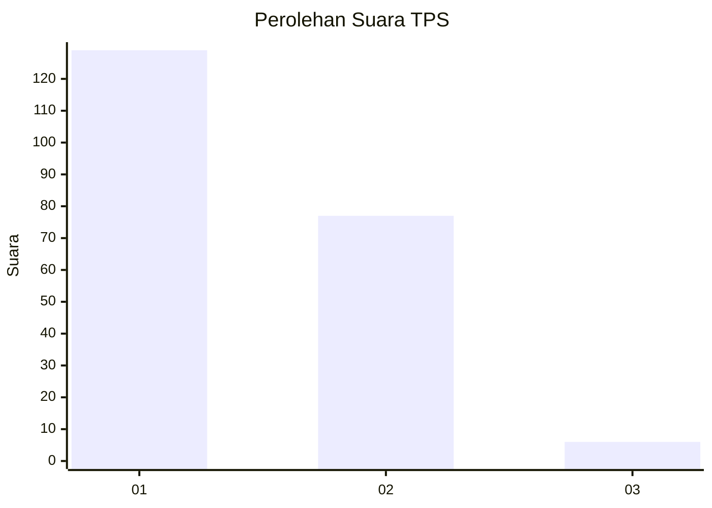
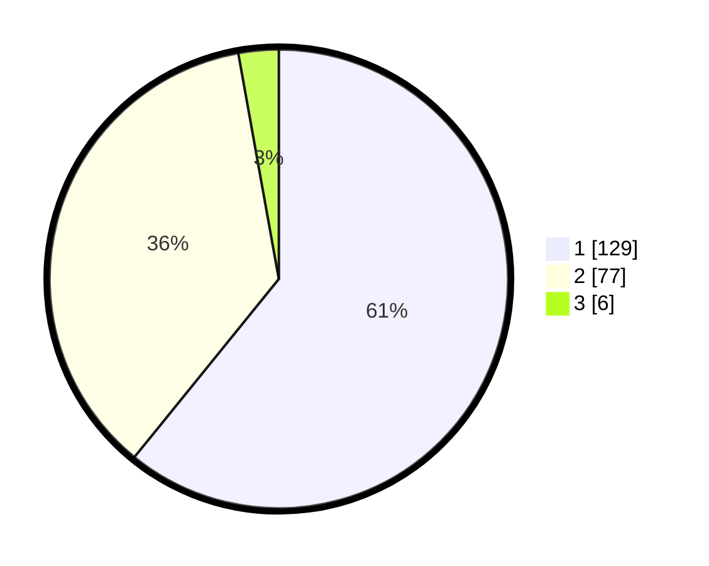

# Hasil

## Grafik

## Tabel

| No. | Nama Paslon    | Suara | Suara (raw) | Persentase |
|:--- |:-------------- | -----:| -----------:| ----------:|
| 1   | ANIES MUHAIMIN | 129   | [129][p-1]  | 60,85      |
| 2   | PRABOWO GIBRAN | 77    | [77][p-2]   | 36,32      |
| 3   | GANJAR MAHFUD  | 6     | [6][p-3]    | 2,83       |

[p-1]: https://github.com/gigit-pemilu/pemilu-2024-11-aceh/blob/main/pilpres/hitung-suara/sub/11-aceh/sub/74-kota-langsa/sub/05-langsa-baro/sub/2008-geudubang-jawa/sub/005-tps/sub/paslon-1.txt
[p-2]: https://github.com/gigit-pemilu/pemilu-2024-11-aceh/blob/main/pilpres/hitung-suara/sub/11-aceh/sub/74-kota-langsa/sub/05-langsa-baro/sub/2008-geudubang-jawa/sub/005-tps/sub/paslon-2.txt
[p-3]: https://github.com/gigit-pemilu/pemilu-2024-11-aceh/blob/main/pilpres/hitung-suara/sub/11-aceh/sub/74-kota-langsa/sub/05-langsa-baro/sub/2008-geudubang-jawa/sub/005-tps/sub/paslon-3.txt

## Foto C Plano

https://sirekap-obj-formc.kpu.go.id/f5fb/pemilu/ppwp/11/74/05/20/08/1174052008005-20240215-065914--7fd1b9cd-d01a-4a8b-aaba-1d5768495c10.jpg

https://sirekap-obj-formc.kpu.go.id/f5fb/pemilu/ppwp/11/74/05/20/08/1174052008005-20240215-065632--5ffdd3a9-98c7-4936-b6ad-c89777f524b6.jpg

https://sirekap-obj-formc.kpu.go.id/f5fb/pemilu/ppwp/11/74/05/20/08/1174052008005-20240215-065810--570fd70a-52f6-4675-a1de-3129fea261ce.jpg

## Metadata

| Key        | Value               |
| ---------- | ------------------- |
| Time Stamp | 2024-02-21 01:00:00 |

