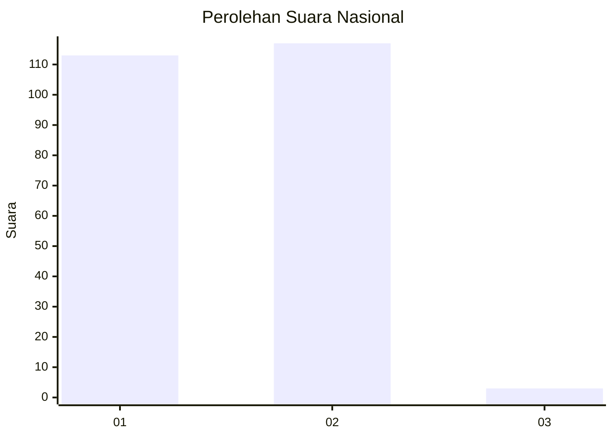
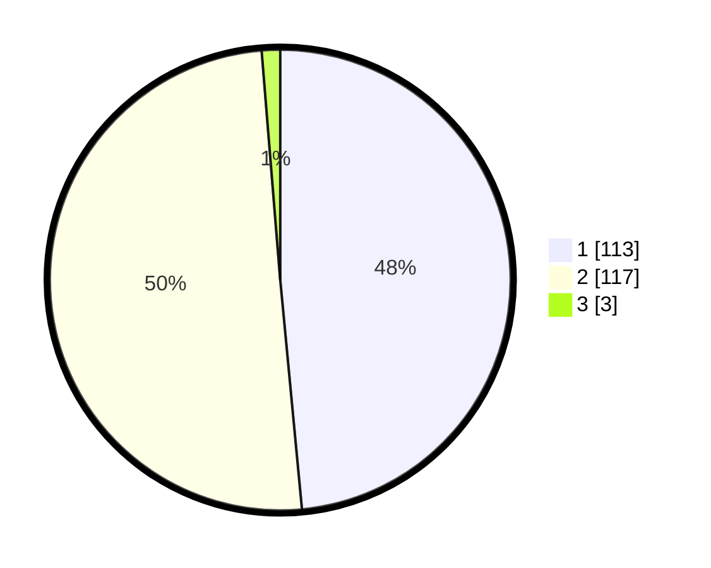

# Hasil

## Grafik

## Tabel

| No. | Nama Paslon    | Suara | Suara (raw) | Persentase |
|:--- |:-------------- | -----:| -----------:| ----------:|
| 1   | ANIES MUHAIMIN | 113   | [113][p-1]  | 48,50      |
| 2   | PRABOWO GIBRAN | 117   | [117][p-2]  | 50,21      |
| 3   | GANJAR MAHFUD  | 3     | [3][p-3]    | 1,29       |

[p-1]: https://github.com/gigit-pemilu/pemilu-2024/blob/main/pilpres/hitung-suara/sub/11-aceh/sub/74-kota-langsa/sub/05-langsa-baro/sub/2008-geudubang-jawa/sub/010-tps/sub/paslon-1.txt
[p-2]: https://github.com/gigit-pemilu/pemilu-2024/blob/main/pilpres/hitung-suara/sub/11-aceh/sub/74-kota-langsa/sub/05-langsa-baro/sub/2008-geudubang-jawa/sub/010-tps/sub/paslon-2.txt
[p-3]: https://github.com/gigit-pemilu/pemilu-2024/blob/main/pilpres/hitung-suara/sub/11-aceh/sub/74-kota-langsa/sub/05-langsa-baro/sub/2008-geudubang-jawa/sub/010-tps/sub/paslon-3.txt

## Foto C Plano

https://sirekap-obj-formc.kpu.go.id/1be1/pemilu/ppwp/11/74/05/20/08/1174052008010-20240227-174437--f06c1eda-0cbe-4093-bac3-cc8ef925af4b.jpg

https://sirekap-obj-formc.kpu.go.id/1be1/pemilu/ppwp/11/74/05/20/08/1174052008010-20240227-174920--fe4bf9b6-f273-4fc5-b1a0-6e477f864e26.jpg

https://sirekap-obj-formc.kpu.go.id/1be1/pemilu/ppwp/11/74/05/20/08/1174052008010-20240227-175402--947171f3-9113-4b3c-aac9-9acd11aaf3b9.jpg

## Metadata

| Key        | Value               |
| ---------- | ------------------- |
| Time Stamp | 2024-02-28 20:00:00 |

