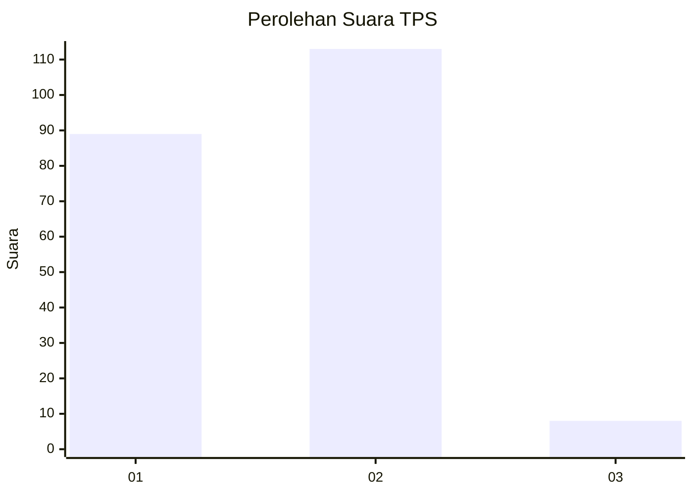
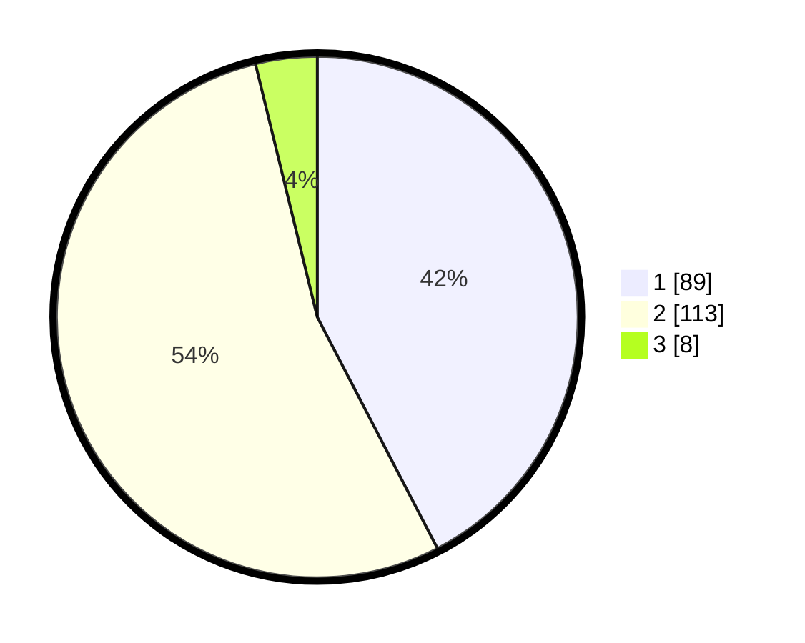

# Hasil

## Grafik

## Tabel

| No. | Nama Paslon    | Suara | Suara (raw) | Persentase |
|:--- |:-------------- | -----:| -----------:| ----------:|
| 1   | ANIES MUHAIMIN | 89    | [89][p-1]   | 42,38      |
| 2   | PRABOWO GIBRAN | 113   | [113][p-2]  | 53,81      |
| 3   | GANJAR MAHFUD  | 8     | [8][p-3]    | 3,81       |

[p-1]: https://github.com/gigit-pemilu/pemilu-2024-11-aceh/blob/main/pilpres/hitung-suara/sub/11-aceh/sub/74-kota-langsa/sub/05-langsa-baro/sub/2010-alue-dua-bakaran-batee/sub/005-tps/sub/paslon-1.txt
[p-2]: https://github.com/gigit-pemilu/pemilu-2024-11-aceh/blob/main/pilpres/hitung-suara/sub/11-aceh/sub/74-kota-langsa/sub/05-langsa-baro/sub/2010-alue-dua-bakaran-batee/sub/005-tps/sub/paslon-2.txt
[p-3]: https://github.com/gigit-pemilu/pemilu-2024-11-aceh/blob/main/pilpres/hitung-suara/sub/11-aceh/sub/74-kota-langsa/sub/05-langsa-baro/sub/2010-alue-dua-bakaran-batee/sub/005-tps/sub/paslon-3.txt

## Foto C Plano

https://sirekap-obj-formc.kpu.go.id/cec7/pemilu/ppwp/11/74/05/20/10/1174052010005-20240215-095135--12f4d742-7b65-4fc4-838c-d71a39f25226.jpg

https://sirekap-obj-formc.kpu.go.id/cec7/pemilu/ppwp/11/74/05/20/10/1174052010005-20240215-095410--267ccaa0-0511-4baa-b332-51d9091fd47a.jpg

https://sirekap-obj-formc.kpu.go.id/cec7/pemilu/ppwp/11/74/05/20/10/1174052010005-20240215-095557--56384a9d-2e0b-4f44-9c0d-038ab9c86c3d.jpg

## Metadata

| Key        | Value               |
| ---------- | ------------------- |
| Time Stamp | 2024-02-21 01:00:00 |

