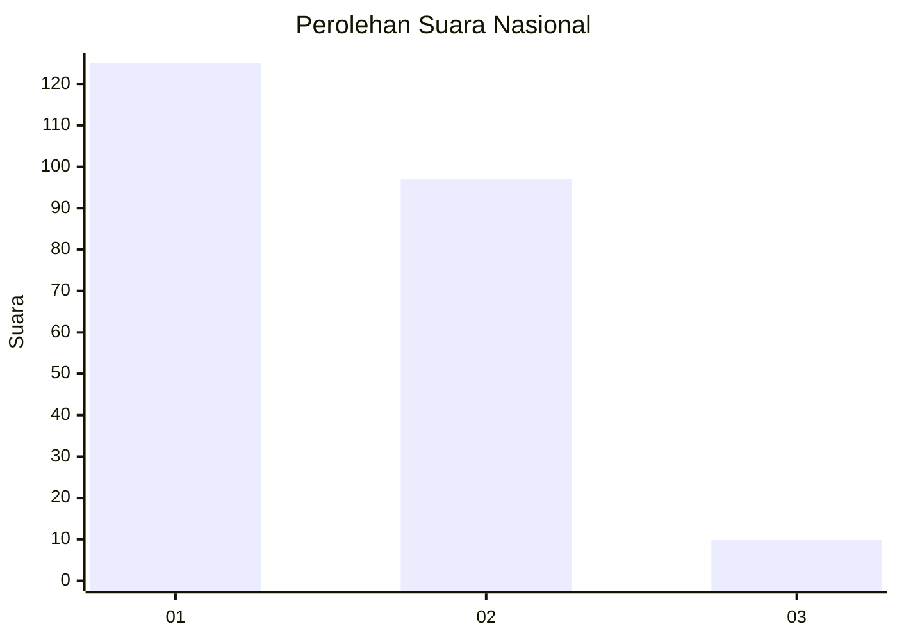
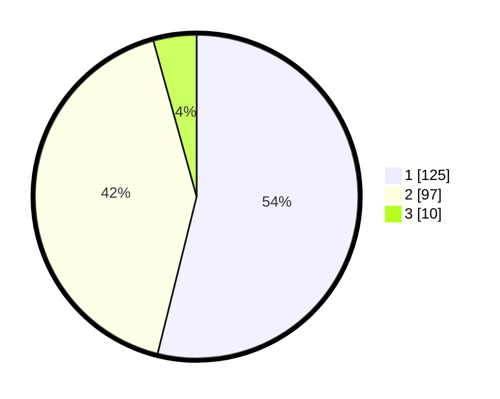

# Hasil

## Grafik

## Tabel

| No. | Nama Paslon    | Suara | Suara (raw) | Persentase |
|:--- |:-------------- | -----:| -----------:| ----------:|
| 1   | ANIES MUHAIMIN | 125   | [125][p-1]  | 53,88      |
| 2   | PRABOWO GIBRAN | 97    | [97][p-2]   | 41,81      |
| 3   | GANJAR MAHFUD  | 10    | [10][p-3]   | 4,31       |

[p-1]: https://github.com/gigit-pemilu/pemilu-2024/blob/main/pilpres/hitung-suara/sub/11-aceh/sub/74-kota-langsa/sub/05-langsa-baro/sub/2010-alue-dua-bakaran-batee/sub/006-tps/sub/paslon-1.txt
[p-2]: https://github.com/gigit-pemilu/pemilu-2024/blob/main/pilpres/hitung-suara/sub/11-aceh/sub/74-kota-langsa/sub/05-langsa-baro/sub/2010-alue-dua-bakaran-batee/sub/006-tps/sub/paslon-2.txt
[p-3]: https://github.com/gigit-pemilu/pemilu-2024/blob/main/pilpres/hitung-suara/sub/11-aceh/sub/74-kota-langsa/sub/05-langsa-baro/sub/2010-alue-dua-bakaran-batee/sub/006-tps/sub/paslon-3.txt

## Foto C Plano

https://sirekap-obj-formc.kpu.go.id/0bcb/pemilu/ppwp/11/74/05/20/10/1174052010006-20240215-060709--003ccc6c-6fc9-46a3-8245-e941ad74b6bf.jpg

https://sirekap-obj-formc.kpu.go.id/0bcb/pemilu/ppwp/11/74/05/20/10/1174052010006-20240215-060939--2735ddd4-ecfd-4dd0-81a1-c6c4ec153fbb.jpg

https://sirekap-obj-formc.kpu.go.id/0bcb/pemilu/ppwp/11/74/05/20/10/1174052010006-20240215-061104--4098e972-3a5a-403d-b52f-2f1086931e05.jpg

## Metadata

| Key        | Value               |
| ---------- | ------------------- |
| Time Stamp | 2024-02-21 01:00:00 |

