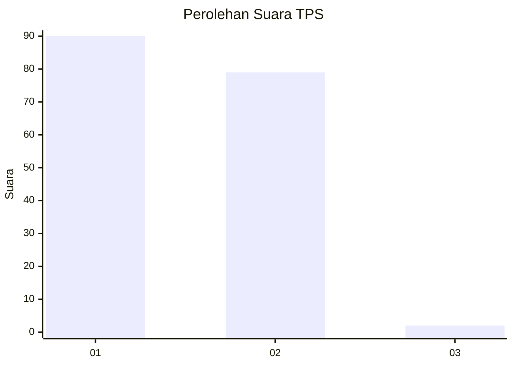
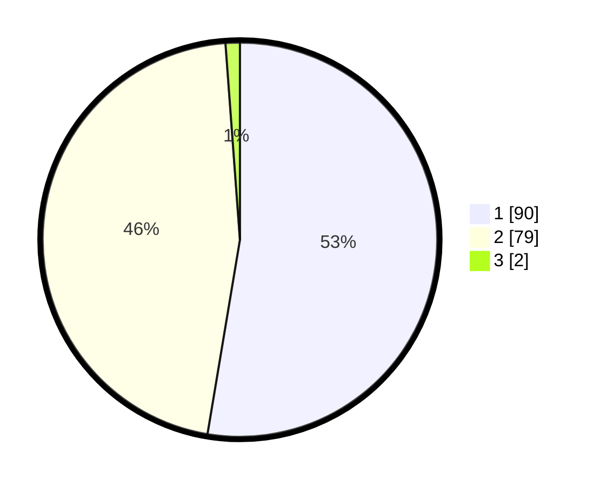

# Hasil

## Grafik

## Tabel

| No. | Nama Paslon    | Suara | Suara (raw) | Persentase |
|:--- |:-------------- | -----:| -----------:| ----------:|
| 1   | ANIES MUHAIMIN | 90    | [90][p-1]   | 52,63      |
| 2   | PRABOWO GIBRAN | 79    | [79][p-2]   | 46,20      |
| 3   | GANJAR MAHFUD  | 2     | [2][p-3]    | 1,17       |

[p-1]: https://github.com/gigit-pemilu/pemilu-2024-11-aceh/blob/main/pilpres/hitung-suara/sub/11-aceh/sub/74-kota-langsa/sub/05-langsa-baro/sub/2010-alue-dua-bakaran-batee/sub/008-tps/sub/paslon-1.txt
[p-2]: https://github.com/gigit-pemilu/pemilu-2024-11-aceh/blob/main/pilpres/hitung-suara/sub/11-aceh/sub/74-kota-langsa/sub/05-langsa-baro/sub/2010-alue-dua-bakaran-batee/sub/008-tps/sub/paslon-2.txt
[p-3]: https://github.com/gigit-pemilu/pemilu-2024-11-aceh/blob/main/pilpres/hitung-suara/sub/11-aceh/sub/74-kota-langsa/sub/05-langsa-baro/sub/2010-alue-dua-bakaran-batee/sub/008-tps/sub/paslon-3.txt

## Foto C Plano

https://sirekap-obj-formc.kpu.go.id/a9c6/pemilu/ppwp/11/74/05/20/10/1174052010008-20240215-132254--8d267588-f153-473c-9af8-20d7c603a513.jpg

https://sirekap-obj-formc.kpu.go.id/a9c6/pemilu/ppwp/11/74/05/20/10/1174052010008-20240215-132822--bf600745-7131-4b8f-96eb-bd99c3c67aa4.jpg

https://sirekap-obj-formc.kpu.go.id/a9c6/pemilu/ppwp/11/74/05/20/10/1174052010008-20240215-132956--181f9d72-e81a-47f3-b5dc-16394624044d.jpg

## Metadata

| Key        | Value               |
| ---------- | ------------------- |
| Time Stamp | 2024-02-21 01:00:00 |

