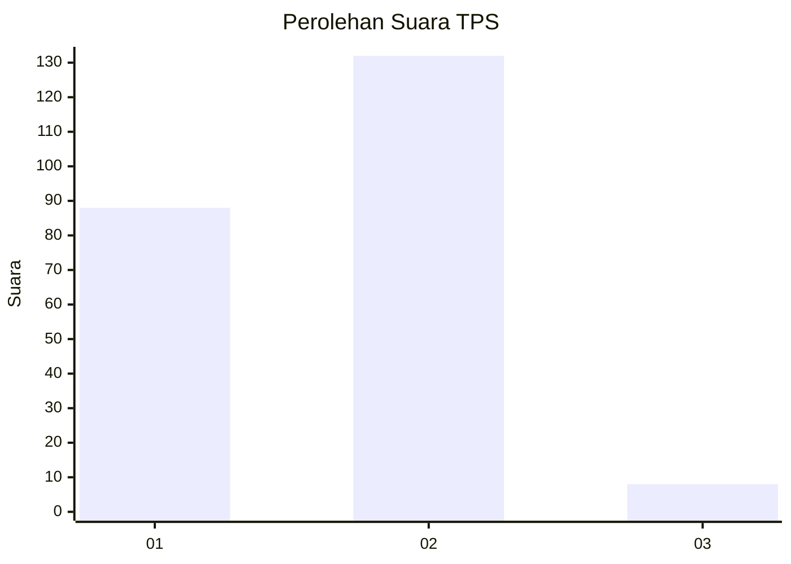
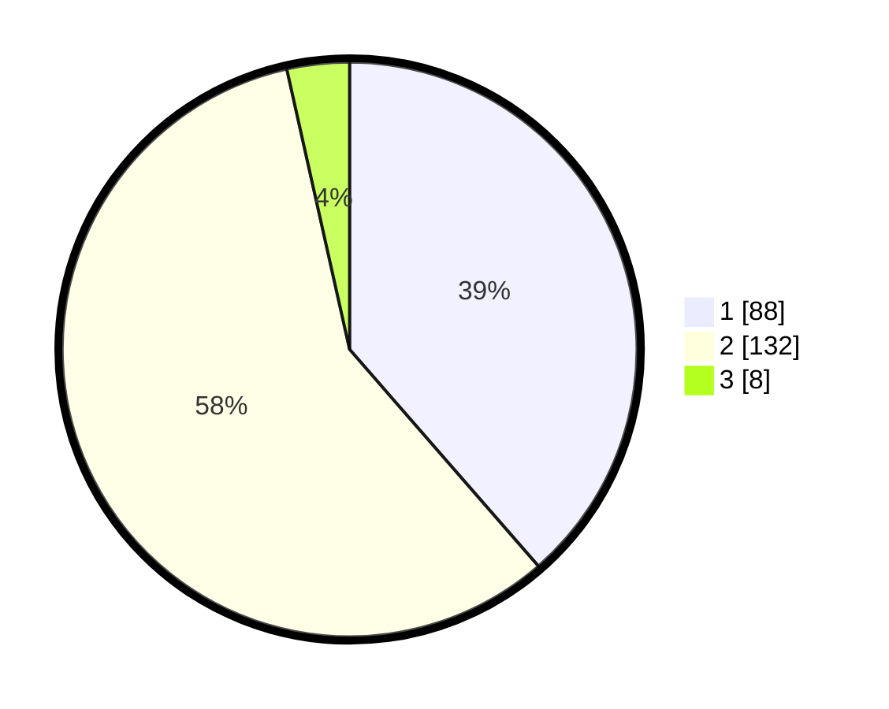

# Hasil

## Grafik

## Tabel

| No. | Nama Paslon    | Suara | Suara (raw) | Persentase |
|:--- |:-------------- | -----:| -----------:| ----------:|
| 1   | ANIES MUHAIMIN | 88    | [88][p-1]   | 38,60      |
| 2   | PRABOWO GIBRAN | 132   | [132][p-2]  | 57,89      |
| 3   | GANJAR MAHFUD  | 8     | [8][p-3]    | 3,51       |

[p-1]: https://github.com/gigit-pemilu/pemilu-2024-11-aceh/blob/main/pilpres/hitung-suara/sub/11-aceh/sub/74-kota-langsa/sub/05-langsa-baro/sub/2011-lengkong/sub/004-tps/sub/paslon-1.txt
[p-2]: https://github.com/gigit-pemilu/pemilu-2024-11-aceh/blob/main/pilpres/hitung-suara/sub/11-aceh/sub/74-kota-langsa/sub/05-langsa-baro/sub/2011-lengkong/sub/004-tps/sub/paslon-2.txt
[p-3]: https://github.com/gigit-pemilu/pemilu-2024-11-aceh/blob/main/pilpres/hitung-suara/sub/11-aceh/sub/74-kota-langsa/sub/05-langsa-baro/sub/2011-lengkong/sub/004-tps/sub/paslon-3.txt

## Foto C Plano

https://sirekap-obj-formc.kpu.go.id/db6c/pemilu/ppwp/11/74/05/20/11/1174052011004-20240214-223332--35a1fa96-aa9e-4c56-a607-530dd40bbe5a.jpg

https://sirekap-obj-formc.kpu.go.id/db6c/pemilu/ppwp/11/74/05/20/11/1174052011004-20240214-223415--66d65965-5bbf-409b-845c-7b8fe4a8db7e.jpg

https://sirekap-obj-formc.kpu.go.id/db6c/pemilu/ppwp/11/74/05/20/11/1174052011004-20240214-223503--6f23b3ed-28f5-42a4-b7ca-e91b91f34ef3.jpg

## Metadata

| Key        | Value               |
| ---------- | ------------------- |
| Time Stamp | 2024-02-19 19:00:00 |

