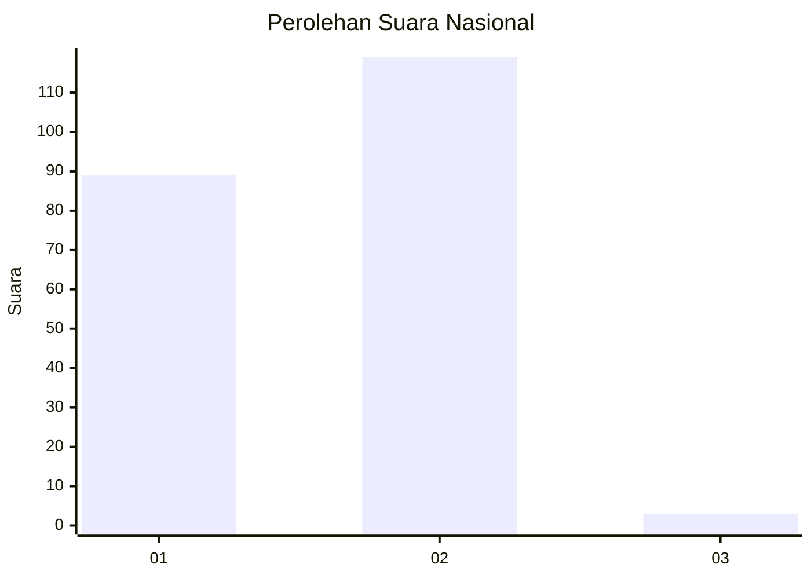
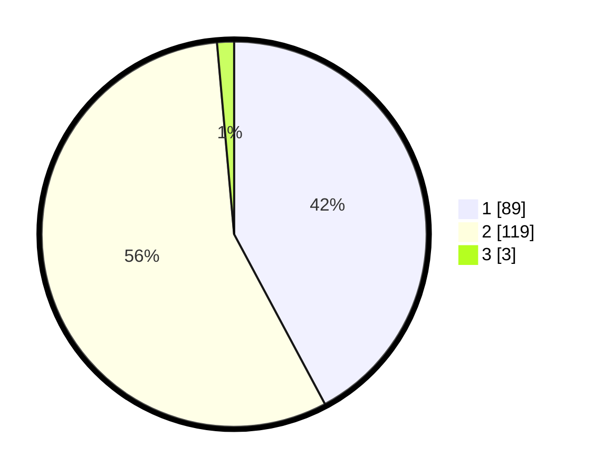

# Hasil

## Grafik

## Tabel

| No. | Nama Paslon    | Suara | Suara (raw) | Persentase |
|:--- |:-------------- | -----:| -----------:| ----------:|
| 1   | ANIES MUHAIMIN | 89    | [89][p-1]   | 42,18      |
| 2   | PRABOWO GIBRAN | 119   | [119][p-2]  | 56,40      |
| 3   | GANJAR MAHFUD  | 3     | [3][p-3]    | 1,42       |

[p-1]: https://github.com/gigit-pemilu/pemilu-2024/blob/main/pilpres/hitung-suara/sub/11-aceh/sub/74-kota-langsa/sub/05-langsa-baro/sub/2011-lengkong/sub/005-tps/sub/paslon-1.txt
[p-2]: https://github.com/gigit-pemilu/pemilu-2024/blob/main/pilpres/hitung-suara/sub/11-aceh/sub/74-kota-langsa/sub/05-langsa-baro/sub/2011-lengkong/sub/005-tps/sub/paslon-2.txt
[p-3]: https://github.com/gigit-pemilu/pemilu-2024/blob/main/pilpres/hitung-suara/sub/11-aceh/sub/74-kota-langsa/sub/05-langsa-baro/sub/2011-lengkong/sub/005-tps/sub/paslon-3.txt

## Foto C Plano

https://sirekap-obj-formc.kpu.go.id/4d9e/pemilu/ppwp/11/74/05/20/11/1174052011005-20240220-140121--af3b0d69-47c7-4fc3-bd24-aca2f0c6a135.jpg

https://sirekap-obj-formc.kpu.go.id/4d9e/pemilu/ppwp/11/74/05/20/11/1174052011005-20240220-140156--673425cf-a1be-40a6-b5df-8b3bf7813bd0.jpg

https://sirekap-obj-formc.kpu.go.id/4d9e/pemilu/ppwp/11/74/05/20/11/1174052011005-20240220-140222--45c8e0f4-439f-4159-b348-240de9719c85.jpg

## Metadata

| Key        | Value               |
| ---------- | ------------------- |
| Time Stamp | 2024-02-21 00:00:00 |

