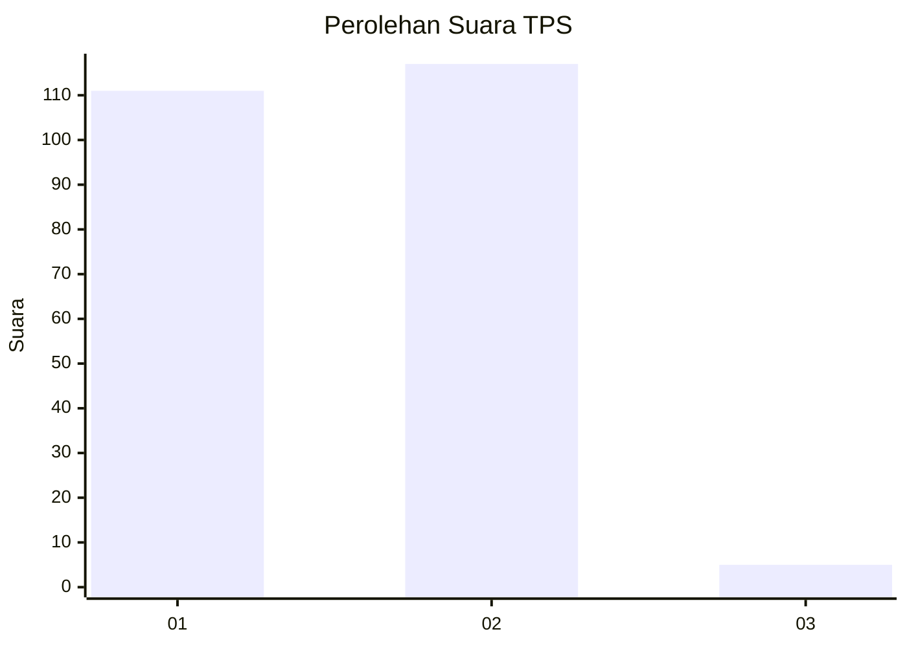
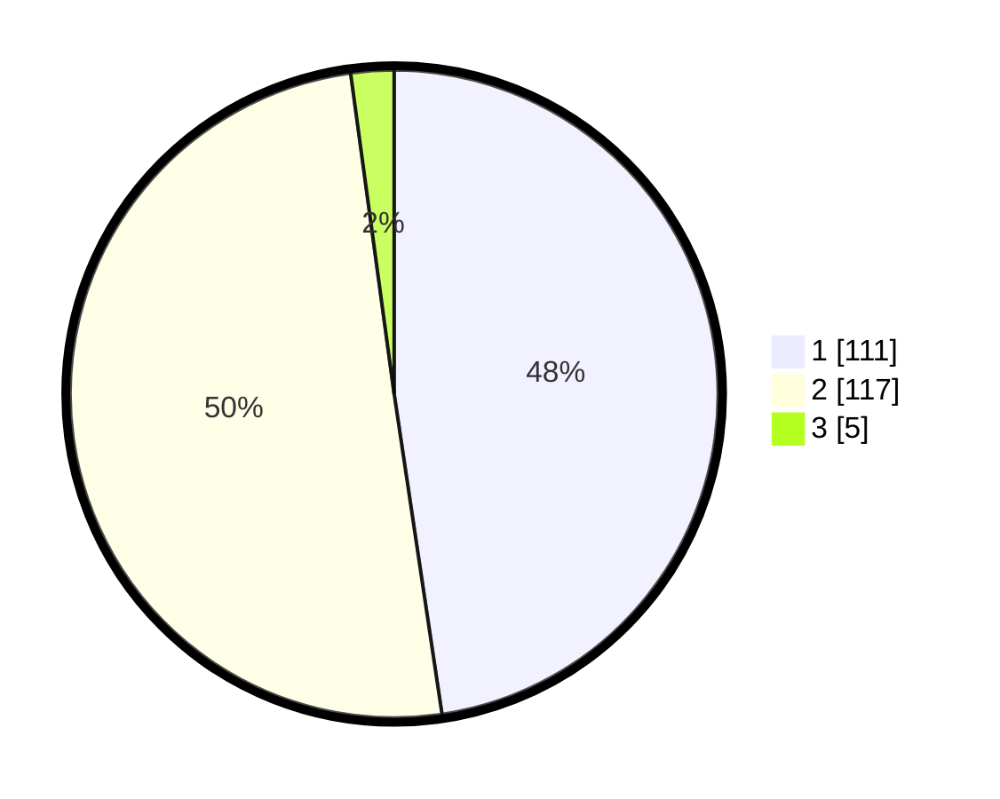

# Hasil

## Grafik

## Tabel

| No. | Nama Paslon    | Suara | Suara (raw) | Persentase |
|:--- |:-------------- | -----:| -----------:| ----------:|
| 1   | ANIES MUHAIMIN | 111   | [111][p-1]  | 47,64      |
| 2   | PRABOWO GIBRAN | 117   | [117][p-2]  | 50,21      |
| 3   | GANJAR MAHFUD  | 5     | [5][p-3]    | 2,15       |

[p-1]: https://github.com/gigit-pemilu/pemilu-2024-11-aceh/blob/main/pilpres/hitung-suara/sub/11-aceh/sub/74-kota-langsa/sub/05-langsa-baro/sub/2011-lengkong/sub/006-tps/sub/paslon-1.txt
[p-2]: https://github.com/gigit-pemilu/pemilu-2024-11-aceh/blob/main/pilpres/hitung-suara/sub/11-aceh/sub/74-kota-langsa/sub/05-langsa-baro/sub/2011-lengkong/sub/006-tps/sub/paslon-2.txt
[p-3]: https://github.com/gigit-pemilu/pemilu-2024-11-aceh/blob/main/pilpres/hitung-suara/sub/11-aceh/sub/74-kota-langsa/sub/05-langsa-baro/sub/2011-lengkong/sub/006-tps/sub/paslon-3.txt

## Foto C Plano

https://sirekap-obj-formc.kpu.go.id/3fdc/pemilu/ppwp/11/74/05/20/11/1174052011006-20240220-113835--521611a6-89da-497c-88f6-2da32db60280.jpg

https://sirekap-obj-formc.kpu.go.id/3fdc/pemilu/ppwp/11/74/05/20/11/1174052011006-20240220-114807--012e1e6c-32fa-41d3-a627-c9d0317a0dd8.jpg

https://sirekap-obj-formc.kpu.go.id/3fdc/pemilu/ppwp/11/74/05/20/11/1174052011006-20240220-114634--8dedd9e1-ff45-4a29-b760-4f4ed73fefa6.jpg

## Metadata

| Key        | Value               |
| ---------- | ------------------- |
| Time Stamp | 2024-02-20 13:00:00 |

