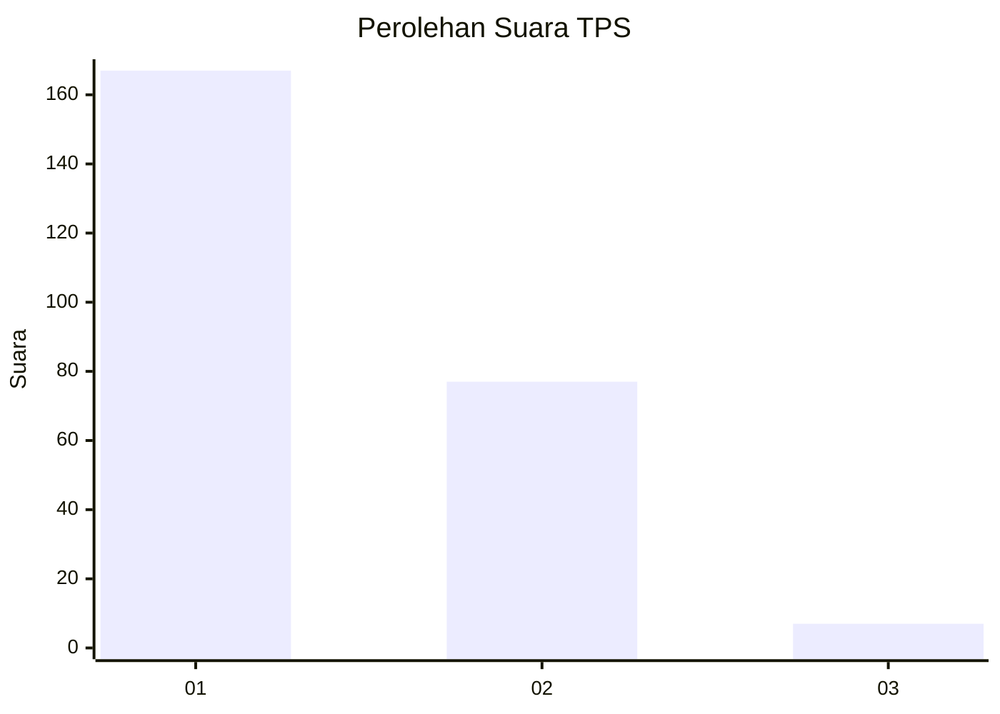
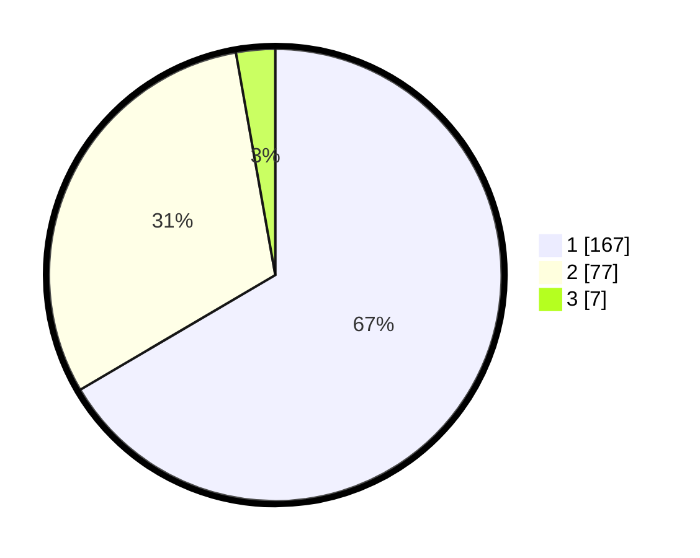

# Hasil

## Grafik

## Tabel

| No. | Nama Paslon    | Suara | Suara (raw) | Persentase |
|:--- |:-------------- | -----:| -----------:| ----------:|
| 1   | ANIES MUHAIMIN | 167   | [167][p-1]  | 66,53      |
| 2   | PRABOWO GIBRAN | 77    | [77][p-2]   | 30,68      |
| 3   | GANJAR MAHFUD  | 7     | [7][p-3]    | 2,79       |

[p-1]: https://github.com/gigit-pemilu/pemilu-2024-11-aceh/blob/main/pilpres/hitung-suara/sub/11-aceh/sub/75-kota-subulussalam/sub/01-simpang-kiri/sub/2001-subulussalam/sub/001-tps/sub/paslon-1.txt
[p-2]: https://github.com/gigit-pemilu/pemilu-2024-11-aceh/blob/main/pilpres/hitung-suara/sub/11-aceh/sub/75-kota-subulussalam/sub/01-simpang-kiri/sub/2001-subulussalam/sub/001-tps/sub/paslon-2.txt
[p-3]: https://github.com/gigit-pemilu/pemilu-2024-11-aceh/blob/main/pilpres/hitung-suara/sub/11-aceh/sub/75-kota-subulussalam/sub/01-simpang-kiri/sub/2001-subulussalam/sub/001-tps/sub/paslon-3.txt

## Foto C Plano

https://sirekap-obj-formc.kpu.go.id/db53/pemilu/ppwp/11/75/01/20/01/1175012001001-20240226-221638--2c7cafc0-1553-40ad-8477-f115d36f7dd7.jpg

https://sirekap-obj-formc.kpu.go.id/db53/pemilu/ppwp/11/75/01/20/01/1175012001001-20240226-221753--bb8692d5-3cfd-43ee-9a64-3403826e9f3b.jpg

https://sirekap-obj-formc.kpu.go.id/db53/pemilu/ppwp/11/75/01/20/01/1175012001001-20240226-221815--d7d5a768-fc35-4369-b0e8-b36ba6d5f813.jpg

## Metadata

| Key        | Value               |
| ---------- | ------------------- |
| Time Stamp | 2024-02-27 22:00:00 |

## DATA PEMILIH TETAP

Jumlah pemilih dalam DPT: **299**.
 * L: **136**.
 * P: **155**.

## DATA PENGGUNA HAK PILIH

Jumlah pengguna hak pilih dalam DPT: **242**.
 * L: **912**.
 * P: **130**.

Jumlah pengguna hak pilih dalam DPTb: **73**.
 * L: **557**.
 * P: **886**.

Jumlah pengguna hak pilih dalam DPK: **8**.
 * L: **0**.
 * P: **0**.

Jumlah pengguna hak pilih: **255**.
 * L: **219**.
 * P: **136**.

## JUMLAH SUARA SAH DAN TIDAK SAH

JUMLAH SELURUH SUARA SAH: **251**.

JUMLAH SUARA TIDAK SAH: **4**.

JUMLAH SELURUH SUARA SAH DAN SUARA TIDAK SAH: **255**.

