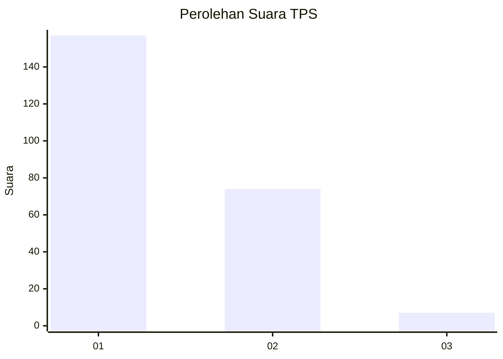
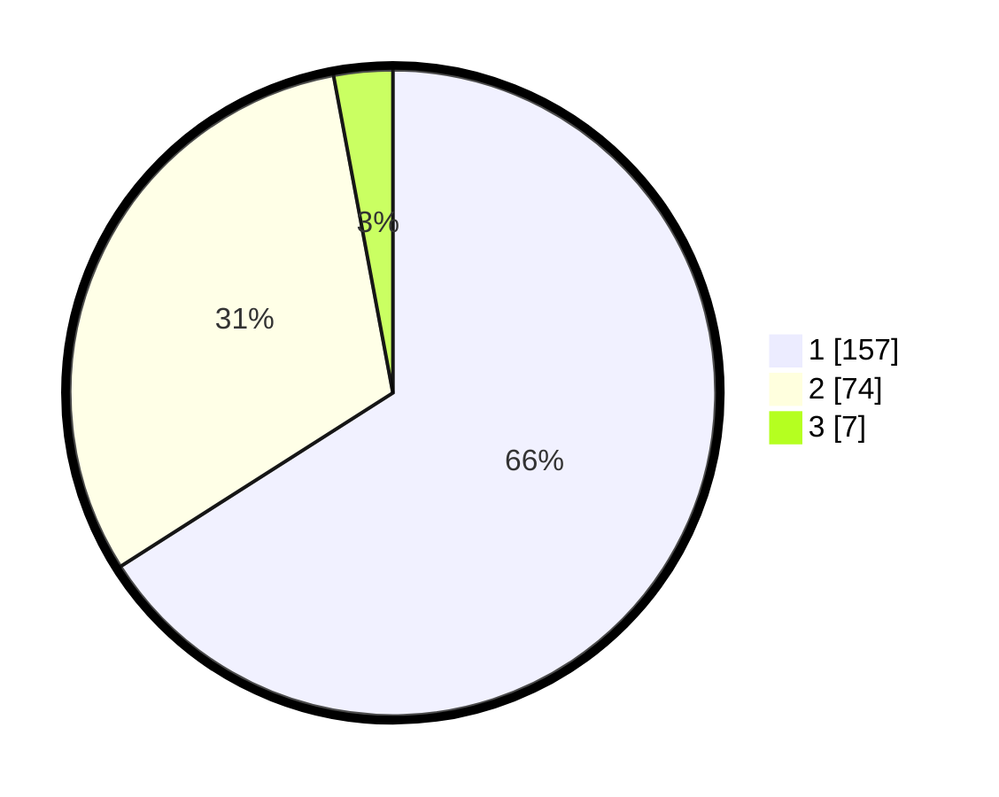

# Hasil

## Grafik

## Tabel

| No. | Nama Paslon    | Suara | Suara (raw) | Persentase |
|:--- |:-------------- | -----:| -----------:| ----------:|
| 1   | ANIES MUHAIMIN | 157   | [157][p-1]  | 65,97      |
| 2   | PRABOWO GIBRAN | 74    | [74][p-2]   | 31,09      |
| 3   | GANJAR MAHFUD  | 7     | [7][p-3]    | 2,94       |

[p-1]: https://github.com/gigit-pemilu/pemilu-2024-11-aceh/blob/main/pilpres/hitung-suara/sub/11-aceh/sub/75-kota-subulussalam/sub/01-simpang-kiri/sub/2001-subulussalam/sub/002-tps/sub/paslon-1.txt
[p-2]: https://github.com/gigit-pemilu/pemilu-2024-11-aceh/blob/main/pilpres/hitung-suara/sub/11-aceh/sub/75-kota-subulussalam/sub/01-simpang-kiri/sub/2001-subulussalam/sub/002-tps/sub/paslon-2.txt
[p-3]: https://github.com/gigit-pemilu/pemilu-2024-11-aceh/blob/main/pilpres/hitung-suara/sub/11-aceh/sub/75-kota-subulussalam/sub/01-simpang-kiri/sub/2001-subulussalam/sub/002-tps/sub/paslon-3.txt

## Foto C Plano

https://sirekap-obj-formc.kpu.go.id/10ba/pemilu/ppwp/11/75/01/20/01/1175012001002-20240227-092021--3e92360f-7aaa-4593-8ce9-e528d0110a7c.jpg

https://sirekap-obj-formc.kpu.go.id/10ba/pemilu/ppwp/11/75/01/20/01/1175012001002-20240227-092039--919a38c3-f451-4e34-8580-ae2347683139.jpg

https://sirekap-obj-formc.kpu.go.id/10ba/pemilu/ppwp/11/75/01/20/01/1175012001002-20240227-092148--bd266206-46e6-4826-863a-1cdd47e1e6c9.jpg

## Metadata

| Key        | Value               |
| ---------- | ------------------- |
| Time Stamp | 2024-02-27 10:00:00 |

## DATA PEMILIH TETAP

Jumlah pemilih dalam DPT: **282**.
 * L: **128**.
 * P: **154**.

## DATA PENGGUNA HAK PILIH

Jumlah pengguna hak pilih dalam DPT: **230**.
 * L: **604**.
 * P: **126**.

Jumlah pengguna hak pilih dalam DPTb: **10**.
 * L: **10**.
 * P: **0**.

Jumlah pengguna hak pilih dalam DPK: **10**.
 * L: **4**.
 * P: **6**.

Jumlah pengguna hak pilih: **250**.
 * L: **115**.
 * P: **132**.

## JUMLAH SUARA SAH DAN TIDAK SAH

JUMLAH SELURUH SUARA SAH: **248**.

JUMLAH SUARA TIDAK SAH: **2**.

JUMLAH SELURUH SUARA SAH DAN SUARA TIDAK SAH: **250**.

