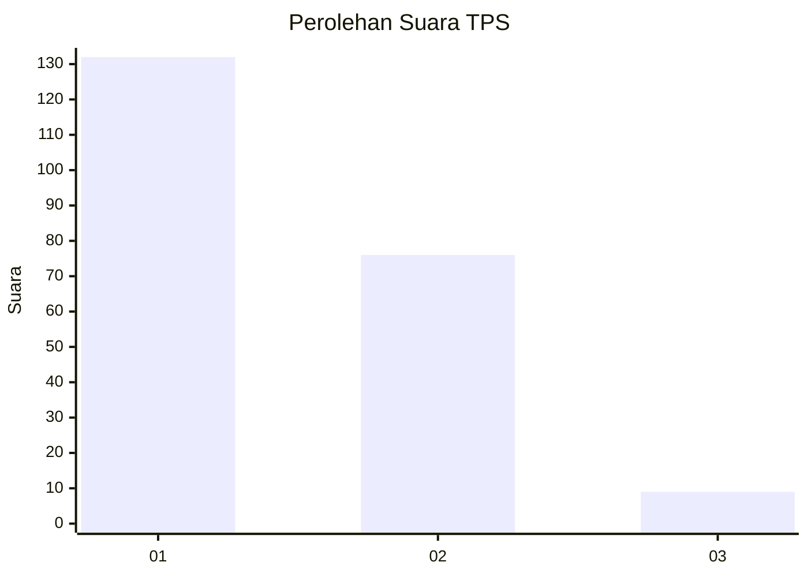
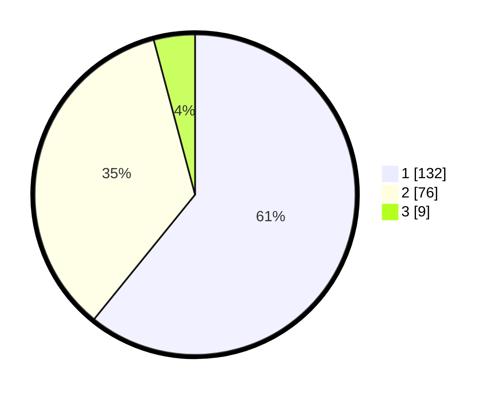

# Hasil

## Grafik

## Tabel

| No. | Nama Paslon    | Suara | Suara (raw) | Persentase |
|:--- |:-------------- | -----:| -----------:| ----------:|
| 1   | ANIES MUHAIMIN | 132   | [132][p-1]  | 60,83      |
| 2   | PRABOWO GIBRAN | 76    | [76][p-2]   | 35,02      |
| 3   | GANJAR MAHFUD  | 9     | [9][p-3]    | 4,15       |

[p-1]: https://github.com/gigit-pemilu/pemilu-2024-11-aceh/blob/main/pilpres/hitung-suara/sub/11-aceh/sub/75-kota-subulussalam/sub/01-simpang-kiri/sub/2001-subulussalam/sub/003-tps/sub/paslon-1.txt
[p-2]: https://github.com/gigit-pemilu/pemilu-2024-11-aceh/blob/main/pilpres/hitung-suara/sub/11-aceh/sub/75-kota-subulussalam/sub/01-simpang-kiri/sub/2001-subulussalam/sub/003-tps/sub/paslon-2.txt
[p-3]: https://github.com/gigit-pemilu/pemilu-2024-11-aceh/blob/main/pilpres/hitung-suara/sub/11-aceh/sub/75-kota-subulussalam/sub/01-simpang-kiri/sub/2001-subulussalam/sub/003-tps/sub/paslon-3.txt

## Foto C Plano

https://sirekap-obj-formc.kpu.go.id/3920/pemilu/ppwp/11/75/01/20/01/1175012001003-20240215-024224--df7817ed-be7e-482b-9dd8-e65d769e3a10.jpg

https://sirekap-obj-formc.kpu.go.id/3920/pemilu/ppwp/11/75/01/20/01/1175012001003-20240215-024354--e33bc09c-ab3b-423a-ba8f-da3d6a13a772.jpg

https://sirekap-obj-formc.kpu.go.id/3920/pemilu/ppwp/11/75/01/20/01/1175012001003-20240215-024727--429f0cc4-bbc9-4f72-a384-a80042206f86.jpg

## Metadata

| Key        | Value               |
| ---------- | ------------------- |
| Time Stamp | 2024-02-15 22:30:27 |

