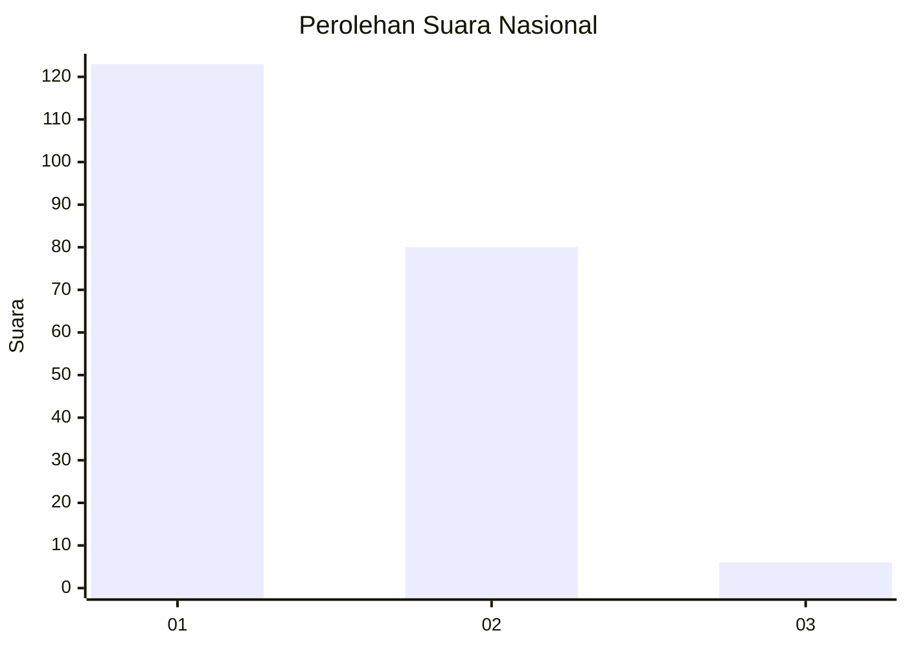
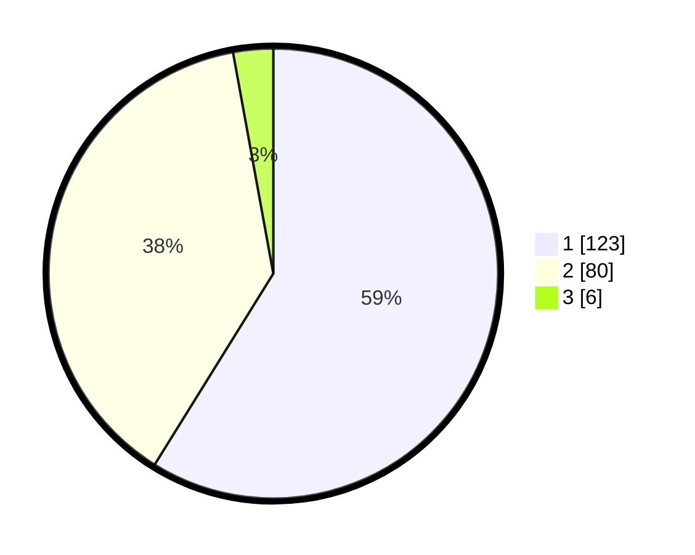

# Hasil

## Grafik

## Tabel

| No. | Nama Paslon    | Suara | Suara (raw) | Persentase |
|:--- |:-------------- | -----:| -----------:| ----------:|
| 1   | ANIES MUHAIMIN | 123   | [123][p-1]  | 58,85      |
| 2   | PRABOWO GIBRAN | 80    | [80][p-2]   | 38,28      |
| 3   | GANJAR MAHFUD  | 6     | [6][p-3]    | 2,87       |

[p-1]: https://github.com/gigit-pemilu/pemilu-2024/blob/main/pilpres/hitung-suara/sub/11-aceh/sub/75-kota-subulussalam/sub/01-simpang-kiri/sub/2001-subulussalam/sub/004-tps/sub/paslon-1.txt
[p-2]: https://github.com/gigit-pemilu/pemilu-2024/blob/main/pilpres/hitung-suara/sub/11-aceh/sub/75-kota-subulussalam/sub/01-simpang-kiri/sub/2001-subulussalam/sub/004-tps/sub/paslon-2.txt
[p-3]: https://github.com/gigit-pemilu/pemilu-2024/blob/main/pilpres/hitung-suara/sub/11-aceh/sub/75-kota-subulussalam/sub/01-simpang-kiri/sub/2001-subulussalam/sub/004-tps/sub/paslon-3.txt

## Foto C Plano

https://sirekap-obj-formc.kpu.go.id/9aaf/pemilu/ppwp/11/75/01/20/01/1175012001004-20240214-202049--b616cb56-0f10-4faf-b9cf-098c83e9ebb0.jpg

https://sirekap-obj-formc.kpu.go.id/9aaf/pemilu/ppwp/11/75/01/20/01/1175012001004-20240214-201829--cadc484f-43e9-4ac7-8cba-ff428a86c8b4.jpg

https://sirekap-obj-formc.kpu.go.id/9aaf/pemilu/ppwp/11/75/01/20/01/1175012001004-20240214-201912--c1be5b3c-e69a-4b79-8c2e-60152b48b280.jpg

## Metadata

| Key        | Value               |
| ---------- | ------------------- |
| Time Stamp | 2024-02-15 01:04:11 |

