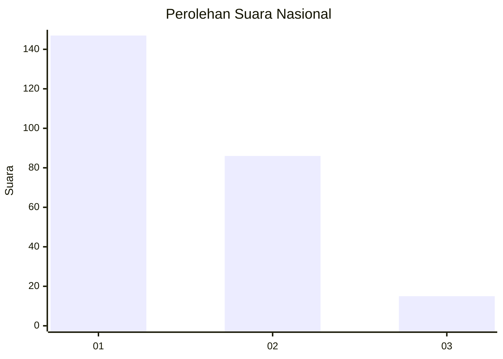
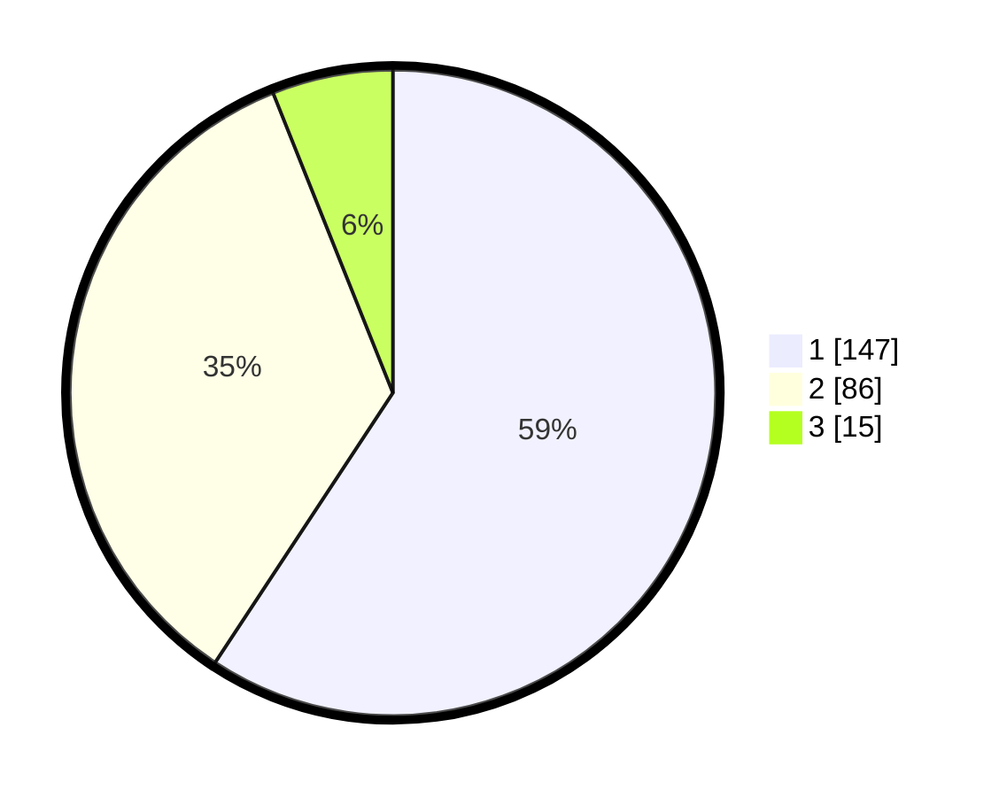

# Hasil

## Grafik

## Tabel

| No. | Nama Paslon    | Suara | Suara (raw) | Persentase |
|:--- |:-------------- | -----:| -----------:| ----------:|
| 1   | ANIES MUHAIMIN | 147   | [147][p-1]  | 59,27      |
| 2   | PRABOWO GIBRAN | 86    | [86][p-2]   | 34,68      |
| 3   | GANJAR MAHFUD  | 15    | [15][p-3]   | 6,05       |

[p-1]: https://github.com/gigit-pemilu/pemilu-2024/blob/main/pilpres/hitung-suara/sub/11-aceh/sub/75-kota-subulussalam/sub/01-simpang-kiri/sub/2001-subulussalam/sub/005-tps/sub/paslon-1.txt
[p-2]: https://github.com/gigit-pemilu/pemilu-2024/blob/main/pilpres/hitung-suara/sub/11-aceh/sub/75-kota-subulussalam/sub/01-simpang-kiri/sub/2001-subulussalam/sub/005-tps/sub/paslon-2.txt
[p-3]: https://github.com/gigit-pemilu/pemilu-2024/blob/main/pilpres/hitung-suara/sub/11-aceh/sub/75-kota-subulussalam/sub/01-simpang-kiri/sub/2001-subulussalam/sub/005-tps/sub/paslon-3.txt

## Foto C Plano

https://sirekap-obj-formc.kpu.go.id/31ea/pemilu/ppwp/11/75/01/20/01/1175012001005-20240215-093105--a97709c1-3006-42a9-9dae-c1230144db2c.jpg

https://sirekap-obj-formc.kpu.go.id/31ea/pemilu/ppwp/11/75/01/20/01/1175012001005-20240215-093150--21651398-69f9-4fa4-8516-78c870650812.jpg

https://sirekap-obj-formc.kpu.go.id/31ea/pemilu/ppwp/11/75/01/20/01/1175012001005-20240215-093232--d03ba31c-8a5a-484b-b83b-78f32000ac6d.jpg

## Metadata

| Key        | Value               |
| ---------- | ------------------- |
| Time Stamp | 2024-02-15 22:30:27 |

