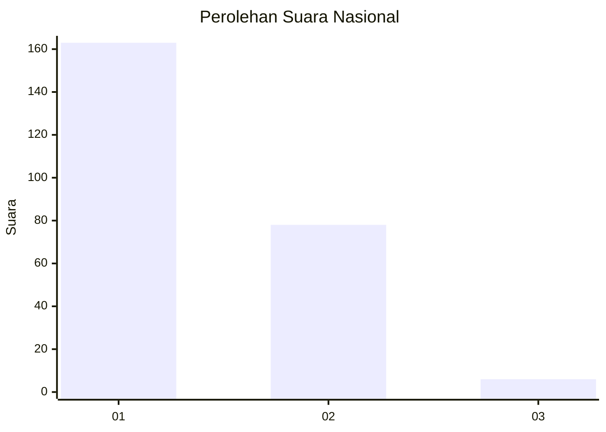
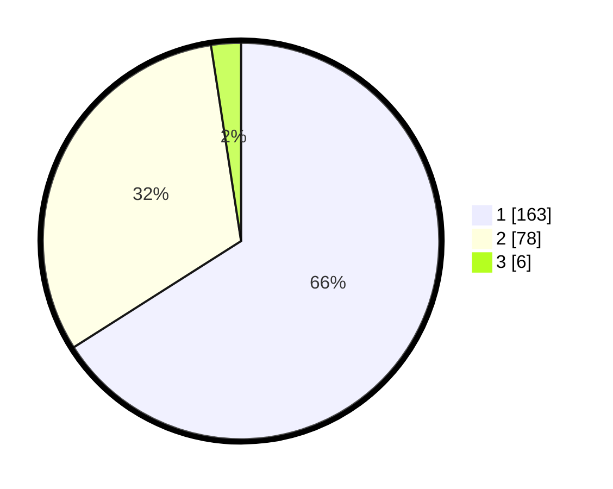

# Hasil

## Grafik

## Tabel

| No. | Nama Paslon    | Suara | Suara (raw) | Persentase |
|:--- |:-------------- | -----:| -----------:| ----------:|
| 1   | ANIES MUHAIMIN | 163   | [163][p-1]  | 65,99      |
| 2   | PRABOWO GIBRAN | 78    | [78][p-2]   | 31,58      |
| 3   | GANJAR MAHFUD  | 6     | [6][p-3]    | 2,43       |

[p-1]: https://github.com/gigit-pemilu/pemilu-2024/blob/main/pilpres/hitung-suara/sub/11-aceh/sub/75-kota-subulussalam/sub/01-simpang-kiri/sub/2001-subulussalam/sub/006-tps/sub/paslon-1.txt
[p-2]: https://github.com/gigit-pemilu/pemilu-2024/blob/main/pilpres/hitung-suara/sub/11-aceh/sub/75-kota-subulussalam/sub/01-simpang-kiri/sub/2001-subulussalam/sub/006-tps/sub/paslon-2.txt
[p-3]: https://github.com/gigit-pemilu/pemilu-2024/blob/main/pilpres/hitung-suara/sub/11-aceh/sub/75-kota-subulussalam/sub/01-simpang-kiri/sub/2001-subulussalam/sub/006-tps/sub/paslon-3.txt

## Foto C Plano

https://sirekap-obj-formc.kpu.go.id/2021/pemilu/ppwp/11/75/01/20/01/1175012001006-20240214-195352--8c87acc7-5dbd-4991-9ec4-7293af5c9b46.jpg

https://sirekap-obj-formc.kpu.go.id/2021/pemilu/ppwp/11/75/01/20/01/1175012001006-20240214-195513--36358fe4-4599-43f3-a2ef-8e8a4ee80c57.jpg

https://sirekap-obj-formc.kpu.go.id/2021/pemilu/ppwp/11/75/01/20/01/1175012001006-20240214-195631--16bee594-867d-47d3-8e39-9ff8dc4f1d9a.jpg

## Metadata

| Key        | Value               |
| ---------- | ------------------- |
| Time Stamp | 2024-02-15 22:00:27 |

