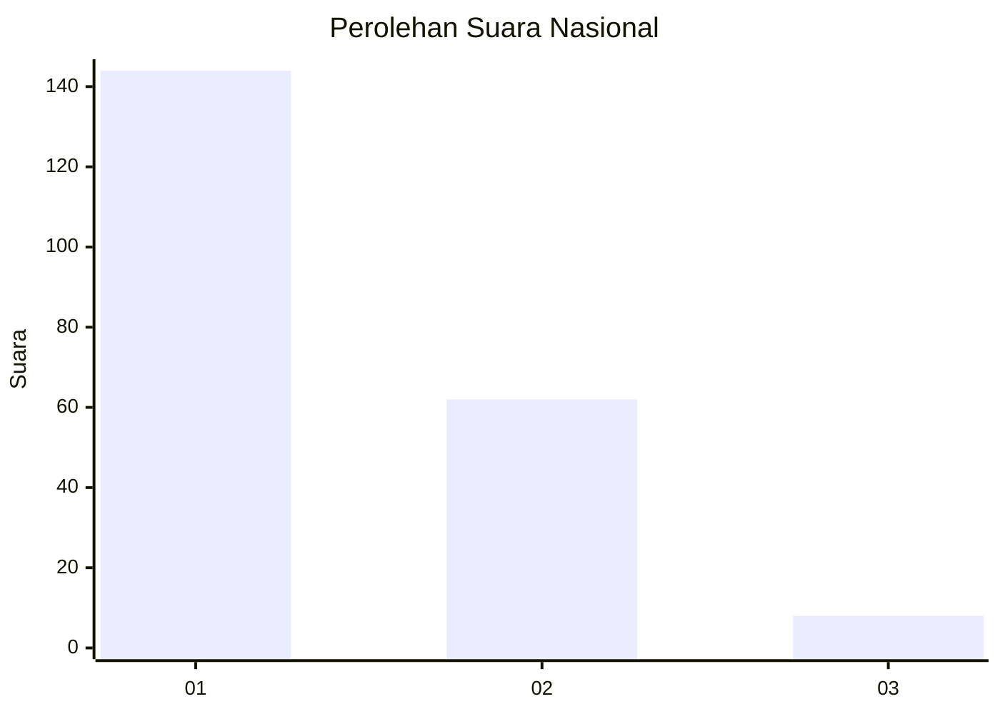
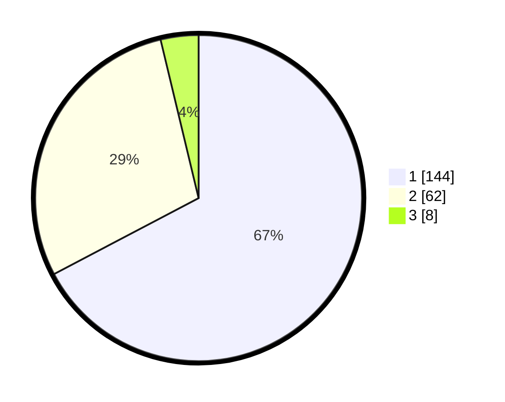

# Hasil

## Grafik

## Tabel

| No. | Nama Paslon    | Suara | Suara (raw) | Persentase |
|:--- |:-------------- | -----:| -----------:| ----------:|
| 1   | ANIES MUHAIMIN | 144   | [144][p-1]  | 67,29      |
| 2   | PRABOWO GIBRAN | 62    | [62][p-2]   | 28,97      |
| 3   | GANJAR MAHFUD  | 8     | [8][p-3]    | 3,74       |

[p-1]: https://github.com/gigit-pemilu/pemilu-2024/blob/main/pilpres/hitung-suara/sub/11-aceh/sub/75-kota-subulussalam/sub/01-simpang-kiri/sub/2001-subulussalam/sub/013-tps/sub/paslon-1.txt
[p-2]: https://github.com/gigit-pemilu/pemilu-2024/blob/main/pilpres/hitung-suara/sub/11-aceh/sub/75-kota-subulussalam/sub/01-simpang-kiri/sub/2001-subulussalam/sub/013-tps/sub/paslon-2.txt
[p-3]: https://github.com/gigit-pemilu/pemilu-2024/blob/main/pilpres/hitung-suara/sub/11-aceh/sub/75-kota-subulussalam/sub/01-simpang-kiri/sub/2001-subulussalam/sub/013-tps/sub/paslon-3.txt

## Foto C Plano

https://sirekap-obj-formc.kpu.go.id/b340/pemilu/ppwp/11/75/01/20/01/1175012001013-20240214-202448--2d25c6bc-99aa-4bde-bfcb-574a64cda3e7.jpg

https://sirekap-obj-formc.kpu.go.id/b340/pemilu/ppwp/11/75/01/20/01/1175012001013-20240214-190655--f363e634-d684-485f-a289-7df8c58f37d9.jpg

https://sirekap-obj-formc.kpu.go.id/b340/pemilu/ppwp/11/75/01/20/01/1175012001013-20240214-202535--250d9a9e-1fb7-4bae-b55e-d00b730f96b5.jpg

## Metadata

| Key        | Value               |
| ---------- | ------------------- |
| Time Stamp | 2024-02-15 06:00:23 |

