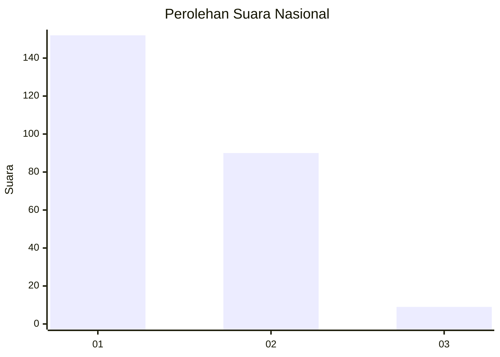
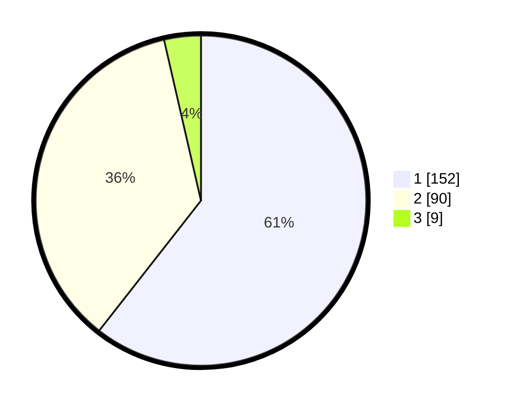

# Hasil

## Grafik

## Tabel

| No. | Nama Paslon    | Suara | Suara (raw) | Persentase |
|:--- |:-------------- | -----:| -----------:| ----------:|
| 1   | ANIES MUHAIMIN | 152   | [152][p-1]  | 60,56      |
| 2   | PRABOWO GIBRAN | 90    | [90][p-2]   | 35,86      |
| 3   | GANJAR MAHFUD  | 9     | [9][p-3]    | 3,59       |

[p-1]: https://github.com/gigit-pemilu/pemilu-2024/blob/main/pilpres/hitung-suara/sub/11-aceh/sub/75-kota-subulussalam/sub/01-simpang-kiri/sub/2003-sikalondang/sub/001-tps/sub/paslon-1.txt
[p-2]: https://github.com/gigit-pemilu/pemilu-2024/blob/main/pilpres/hitung-suara/sub/11-aceh/sub/75-kota-subulussalam/sub/01-simpang-kiri/sub/2003-sikalondang/sub/001-tps/sub/paslon-2.txt
[p-3]: https://github.com/gigit-pemilu/pemilu-2024/blob/main/pilpres/hitung-suara/sub/11-aceh/sub/75-kota-subulussalam/sub/01-simpang-kiri/sub/2003-sikalondang/sub/001-tps/sub/paslon-3.txt

## Foto C Plano

https://sirekap-obj-formc.kpu.go.id/2745/pemilu/ppwp/11/75/01/20/03/1175012003001-20240215-045626--6abb086e-c02f-4022-84f1-0328bfe63ef6.jpg

https://sirekap-obj-formc.kpu.go.id/2745/pemilu/ppwp/11/75/01/20/03/1175012003001-20240215-050009--9a6203cf-e20c-4ed4-97a3-ae5b084a98d3.jpg

https://sirekap-obj-formc.kpu.go.id/2745/pemilu/ppwp/11/75/01/20/03/1175012003001-20240215-050030--5934a9d1-e3e3-4887-b1cc-a1b1ad89d289.jpg

## Metadata

| Key        | Value               |
| ---------- | ------------------- |
| Time Stamp | 2024-02-15 22:40:13 |

